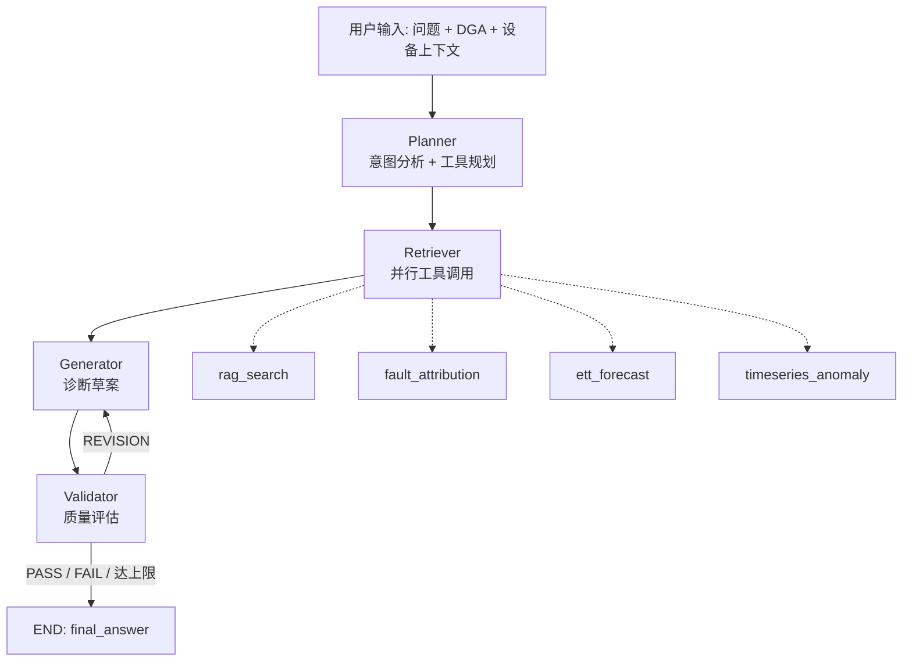

# 电力变压器故障诊断多智能体系统 —— 项目结构摘要

> 本文档面向 AI/新成员快速理解项目，覆盖：项目定位、架构、代码模块职责、数据体系、脚本用途、运行方式、当前状态与已知问题。
> 生成日期：2026-09-14。根目录：`/Users/ts/Desktop/thu/multi_Agent`

---

## 1. 项目定位

- 名称：`transformer-diagnosis-agent`（配置项 `project.name`）
- 领域：电力变压器故障诊断（DGA 油色谱、油温预测、知识检索）
- 性质：研究生课题/中期答辩项目，Python 实现，含 Streamlit 前端
- 核心思路：将专家诊断过程拆解为 4 个智能体（Planner → Retriever → Generator → Validator），用 LangGraph 编排，Validator 可触发 Generator 迭代重生成（最多 `max_iterations=3` 轮）
- 核心算法：贝叶斯网络（朴素独立近似） × DL/T 722-2014 三比值法 的混合故障归因；父子分块 RAG；线性回归油温预测

---

## 2. 目录结构（精简）

```
multi_Agent/
├── app.py                      # Streamlit 前端入口（524 行）
├── config.yaml                 # 全局配置：多 LLM / Milvus / 工具 / embedding / workflow
├── run_frontend.sh             # 启动脚本：streamlit run app.py --server.port 8501
├── PROJECT_OVERVIEW.md         # 本文档
├── src/
│   ├── agents/                 # 四个智能体
│   │   ├── planner.py          # PlannerAgent：意图分析 + 工具规划（Function Calling 优先）
│   │   ├── retriever.py        # RetrieverAgent：并行工具调用（ThreadPoolExecutor）
│   │   ├── generator.py        # GeneratorAgent：诊断草案生成 / 根据反馈修订
│   │   └── validator.py        # ValidatorAgent：PASS / REVISION / FAIL 三级判定
│   ├── graph/
│   │   ├── state.py            # AgentState dataclass（全局共享状态）
│   │   └── workflow.py         # LangGraph StateGraph 编排 + 串行降级
│   ├── tools/
│   │   ├── tool_registry.py    # TOOL_SPECS 单一数据源（4 个工具的 JSON Schema）
│   │   ├── fault_attribution.py# 贝叶斯网络 + 三比值法故障归因（747 行，核心）
│   │   ├── rag_engine.py       # Milvus/Zilliz 父子分块 RAG 检索
│   │   ├── ett_forecasting.py  # ETT 油温预测（线性回归 + 3σ 异常）
│   │   ├── ett_loader.py       # ETT 数据集加载/缓存
│   │   ├── timeseries.py       # 通用 3σ 异常检测（示例桩）
│   │   ├── mcp_client.py       # 极简 MCP 风格工具注册/调用
│   │   ├── milvus_setup.py     # 知识库建库入库脚本（980 行，支持 MinerU full.md 父子分块）
│   │   └── remove_references.py# 清理 md 中「参考文献」段
│   └── utils/
│       ├── config.py           # load_config / get_llm_config（按 agent 取 llms.{name}，回退 default）
│       ├── llm.py              # LLMClient（OpenAI 兼容，支持 tools、超时、重试、enable_thinking）
│       ├── embedding.py        # LocalEmbeddingModel（实际对接 DashScope text-embedding-v4）
│       ├── prompts.py          # 提示词兼容层（优先读 templates/，否则用内置默认）
│       ├── template_loader.py  # {{变量}} 模板渲染
│       ├── json_parse.py       # parse_llm_json：剥离 <think>/```json 等包装
│       └── logging.py          # rich 日志
├── templates/
│   └── planner/{system,user}.txt   # 仅 Planner 有外置模板（{{tools}} 占位符注入工具清单）
├── data/                       # 见第 5 节
├── scripts/                    # 数据生成 / 评测 / 参数学习 / 文档产出脚本，见第 6 节
└── docs/                       # 论文、技术报告、PPT、架构图，见第 7 节
```

---

## 3. 运行时架构与数据流



关键点：

- 工作流入口 `run_diagnosis_workflow()`（`src/graph/workflow.py`）内部调用 `run_langgraph_workflow()`；LangGraph 未安装时降级为 `_run_sequential_workflow()`（无迭代）。
- 所有智能体通过 `AgentState`（`src/graph/state.py`）传递数据，关键字段：`user_query, context, plan, retrieved_knowledge, tool_calls, draft_answer, validation_verdict, revision_feedback, iteration, max_iterations, errors, fallback_mode, reasoning_trace, final_answer, next_node`。
- Planner 输出的结构化 steps 写在 `state.reasoning_trace` 中（`agent=planner, type=llm_plan`），Retriever 从这里读取 `step.tool / step.arguments`；无 steps 时降级为固定调用 `rag_search + timeseries_anomaly`（`fallback_mode=True`）。
- Retriever 两阶段执行：独立工具并行（并发数 `workflow.parallel_tools=3`）；`fault_attribution` 未带 `dga_data` 时视为依赖 RAG，串行在后。
- Validator 路由：PASS → END；REVISION 且 `iteration < max_iterations` → generator；否则 END（附「已达上限」提示）；FAIL → END（输出失败说明）。
- 每个智能体都有 LLM 不可用时的降级：Planner 空计划、Generator 模板填充、Validator 规则校验（关键词「安全/保护/建议/处理」+ 长度评分）。

---

## 4. 工具层详解（`src/tools/tool_registry.py` 中 `TOOL_SPECS`）

| 工具名 | 实现 | 输入 | 输出要点 |
|---|---|---|---|
| `rag_search` | `RAGEngine.search`（真实 Milvus）或 `app.py::mock_rag_search`（基于 fault_cases.jsonl 字符匹配） | `query` | 列表，含 `text/score/metadata`，父子模式含 `child/parent` |
| `fault_attribution` | `fault_attribution()` → `FaultBayesianNetwork.infer()` | `dga_data{H2,CH4,C2H2,C2H4,C2H6}`、`evidence{...}`、`query` | `primary_fault(_name)`, `primary_probability`, `fault_ranking[]`, `dga_analysis{ratios, ratio_codes, matched_rules, interpretation}`, `report` |
| `ett_forecast` | `ett_forecast()`（`ETTSlidingForecaster` + `LinearRegressionOT`） | `dataset(ETTh1/h2/m1/m2), lookback=96, horizon=24, start_time, end_time, train_window_size=168` | `forecast{values, mean/min/max_predicted_ot}`, `history_summary{ot_mean, ot_std, r_squared}`, `anomalies{count}`, `text_report` |
| `timeseries_anomaly` | `app.py::mock_timeseries_anomaly`（读 TR-0001.csv OT 列近 168 点做 3σ）；`src/tools/timeseries.py::TimeSeriesTool` 为通用实现 | `signal[]` | `mean, std, anomaly_indices, series` |

故障归因引擎细节（`fault_attribution.py`）：

- 8 类故障 `FAULT_IDS`：winding_deformation, winding_short_circuit, core_grounding, bushing_fault, olc_fault, partial_discharge, overload_overheating, insulation_degradation
- 14 类征兆 `SYMPTOM_IDS`（H2/CH4/C2H2/C2H4/C2H6/CO/CO2 升高、油温/绕温/负载/振动、局放告警、产气速率、TDCG）
- 推理：`P(F|E) ∝ P(F) · ∏ P(e_i|F)`，再与三比值法规则融合 `0.7*bayes + 0.3*rule_confidence`，归一化后排序
- 注意值自动推征兆：H2>150, CH4>120, C2H2>5, C2H4>50, C2H6>65, C2H2>50 → gas_rate_rapid
- 参数来源：默认专家 CPT；若环境变量 `FAULT_ATTR_PARAMS` 指向 JSON（如 `data/real/dga/learned_params.json`），则加载数据学习的先验与 CPT

---

## 5. 数据体系（`data/`）

| 路径 | 内容 | 用途 |
|---|---|---|
| `data/ele_trans/` | 31 篇变压器故障分析中文 PDF 文献 | 知识库原始语料 |
| `data/fast_md/` | 182 个 MinerU 解析目录（每个含 `full.md`、`layout.json`、`images/`、原 PDF） | `milvus_setup.py --md-mode` 的入库来源（父子分块） |
| `data/manuals/` | ABB / Siemens 变压器运维手册 PDF | 知识库补充 |
| `data/ETT-small/` | ETTh1/ETTh2/ETTm1/ETTm2 .csv | `ett_forecast` 数据源 |
| `data/dga/` | Kaggle `dga_dataset.csv`(4150条, IEC标签) + `data.xlsx`(2321条) + `dataset_(589).xlsx` | 真实 DGA 原始数据 |
| `data/real/dga/` | `dga_records.csv/.jsonl`（5143 条，由 `convert_real_dga.py` 合并）+ `learned_params.json`（学习到的先验/CPT） | 数据驱动参数学习 |
| `data/synthetic/` | `SCHEMA.md`（4 类数据字段规范）、`EVALUATION.md`（评测方案）、`dga/`(3000条合成)、`timeseries/`(TR-0001~0020 + devices.json)、`cases/fault_cases.jsonl`(200条)、`eval/eval_set.jsonl`(120条) + 两份评测报告 | 模拟数据与评测集 |
| `data/external_transformer/` | `power_transformer_fault.csv`(1866条) | 备用外部数据 |
| `data/milvus_data/` | `docker-compose.yml`、Zilliz 连接测试脚本 | 本地 Milvus 部署辅助 |
| `data/rag.txt` | RAG 概念说明小文本 | 早期 txt 模式测试 |

`fault_label` 枚举与 `FAULT_IDS` 一致，另加 `normal`；`severity` 取 normal/attention/serious/critical。

---

## 6. 脚本（`scripts/`）

| 脚本 | 作用 |
|---|---|
| `generate_synthetic_data.py` | 纯标准库生成 4 类合成数据（按三比值法物理机理生成自洽 DGA） |
| `convert_real_dga.py` | 合并 3 个真实 DGA 数据源，统一标签映射为项目 9 类，输出 `data/real/dga/` |
| `learn_cpt.py` | 极大似然 + 拉普拉斯平滑（α=1.0）学习先验和 CPT，7:3 留出评估，输出 `learned_params.json` |
| `validate_dga_data.py` | 用 DGA 数据快速验证归因引擎 Top-1/Top-3 |
| `eval_fault_attribution.py` | 【评测一】归因引擎确定性评测 → `data/synthetic/eval/report_fault_attribution.md` |
| `eval_end2end.py` | 【评测二】端到端工作流评测（可注入 mock 工具）→ `report_end2end.md` |
| `make_figures.py` | matplotlib 绘制图 3-1 架构图、图 3-2 流程图 |
| `make_arch_pptx.py` / `make_vsdx.py` | 生成可编辑的架构图 pptx / Visio vsdx |
| `make_ppt.py` / `make_ppt_template.py` / `make_ppt_full.py` | 生成答辩/汇报 PPT（python-pptx） |
| `md_to_docx.py` | Markdown 报告转 Word（白底黑字修复版） |

---

## 7. 文档（`docs/`）

- `技术报告.md` / `电力变压器故障诊断多智能体系统技术报告.docx`：系统架构、算法原理、6 个创新点、待改进方向
- `已完成工作总结.md/.docx`：第三章「已完成工作总结」（3.1~3.6）
- `中期答辩论文.md/.docx`：中期答辩论文稿
- `研究进展汇报_整合版.pptx`：汇报 PPT
- `figures/`：`fig3_1_architecture.{png,pptx,vsdx}`、`fig3_2_workflow.png`

---

## 8. 配置要点（`config.yaml`）

- `llms.{default,planner,retriever,generator,validator}`：均为 OpenAI 兼容接口，当前指向阿里云百炼 DashScope `qwen3.5-35b-a3b`，`enable_thinking=false`，`timeout=60`，`max_retries=2`；各智能体可独立换模型
- `knowledge_base.milvus`：Zilliz Cloud `uri + token` 连接，collection `transformer_kb`，`metric_type=L2`，`nprobe=10`，`top_k=5`
- `embedding`：DashScope `text-embedding-v4`
- `tools.ett`：默认 ETTh1，lookback 96，horizon 24，train_window 168
- `workflow`：`max_iterations=3`，`parallel_tools=3`
- 安全提醒：config.yaml 中明文包含 API Key 与 Milvus token，分发前需脱敏

---

## 9. 运行方式

```bash
# 前端（默认 8501 端口）
bash run_frontend.sh
# 或
streamlit run app.py

# 知识库建库（MinerU markdown 父子分块模式）
python -m src.tools.milvus_setup --data-dir data/fast_md --md-mode

# 评测
python3 scripts/eval_fault_attribution.py
python3 scripts/eval_end2end.py

# 参数学习并启用
python3 scripts/learn_cpt.py
FAULT_ATTR_PARAMS=data/real/dga/learned_params.json streamlit run app.py
```

前端侧边栏可切换：启用 LLM、使用真实 Milvus（否则用本地案例 mock）、最大迭代轮次、DGA 五气体输入、设备编号/电压等级。结果分 7 个 Tab：诊断结论、质量验证、规划计划、工具调用、检索知识、推理轨迹、错误。

主要依赖：`streamlit, langgraph, openai, pymilvus, pandas, numpy, pyyaml, rich, python-pptx, python-docx, matplotlib`（项目内无 requirements.txt，需自行整理）。

---

## 10. 当前状态与已知问题

评测基线（合成数据，专家 CPT）：

- 归因引擎：Top-1 37.9%，Top-3 88.5%，Macro-F1 0.229，critical 召回 100%，serious 召回 32%
- 端到端（3 样本试跑）：完成率 100%，但 LLM 降级率 100%（API 不可用时），主故障命中率 0%

已知问题 / 待办：

1. `timeseries_anomaly` 仍是示例桩（Retriever 固定传 demo 信号），需接真实监测数据
2. 真实数据仅覆盖 5 类故障（partial_discharge, normal, winding_short_circuit, overload_overheating, insulation_degradation），其余 4 类先验被学到 ~0.0002，学习参数存在类别缺失
3. 端到端评测依赖 LLM 有效配额；Milvus `transformer_kb` 需先建库
4. 油温预测为线性回归，计划升级 LSTM/Transformer
5. `templates/` 仅有 planner 模板，generator/validator 提示词仍在 `prompts.py` 内置
6. 配置文件含明文密钥；缺少 `requirements.txt`、`.gitignore`、README

---

## 11. 快速定位索引

- 想改工作流路由 → `src/graph/workflow.py::_route_after_validator`、`src/agents/validator.py::run`
- 想新增工具 → 在 `src/tools/tool_registry.py::TOOL_SPECS` 加声明，在 `src/agents/retriever.py::_execute_single_tool` 加分支，在 `app.py::build_mcp` 注册实现
- 想改故障类型/CPT → `src/tools/fault_attribution.py` 顶部 `FAULT_IDS / _FAULT_SYMPTOM_CPT / _PRIOR_PROBS / _DGA_RULES`
- 想改提示词 → `templates/planner/*.txt`、`src/utils/prompts.py`
- 想改前端展示 → `app.py` 的 `render_*` 系列函数
- 想改评测指标 → `scripts/eval_fault_attribution.py`、`scripts/eval_end2end.py`
