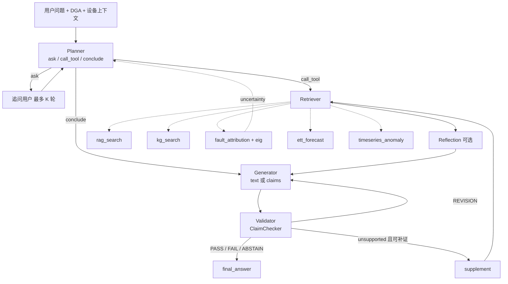

# 电力变压器故障诊断多智能体系统 —— 项目结构摘要

> 面向新成员 / AI 快速理解项目：定位、架构、模块职责、数据体系、脚本、运行方式与已知局限。
> 更新日期：2026-09-17（A / B / C / E-1 完成，D 阶段待百炼）。根目录：`/Users/ts/Desktop/thu/multi_Agent`。运行时架构与数据流的完整说明见 [README.md](README.md)「项目架构」，本文侧重目录、模块职责与快速定位。

---

## 1. 项目定位

- 名称：`transformer-diagnosis-agent`
- 领域：电力变压器故障诊断（DGA 油色谱归因、油温预测、文献与图谱检索）
- 性质：硕士学位论文课题（中期已过，2027-07 毕业），Python 实现，Streamlit 前端
- v2 论文主叙事：**证据可信的诊断智能体** —— 三条主线分别对应不确定性驱动的主动规划、声明级证据验证、以验证信号为奖励的 Planner 偏好优化（DPO）。详见 [PLAN_优化计划清单.md](PLAN_优化计划清单.md)
- 工程基座：Planner → Retriever → [Reflection] → Generator → Validator 五智能体（LangGraph 编排）+ 五种异构工具 + 五级增量系统模式评测框架

---

## 2. 目录结构

```
multi_Agent/
├── app.py                        # Streamlit 前端：五级模式切换、DGA 输入、轨迹 / 图谱 / 反思展示
├── config.example.yaml           # 配置模板（config.yaml 含密钥，已 gitignore）
├── reproduce.sh                  # 离线一键复现（不调用 LLM）
├── run_frontend.sh               # 启动前端
├── requirements.txt
├── PLAN_优化计划清单.md          # v2 三条主线的可执行任务清单（唯一进度源）
├── README.md                     # 快速上手、脚本索引、已知局限
├── src/
│   ├── agents/
│   │   ├── planner.py            # PlannerAgent：Function Calling 优先，参数严格校验；strategy free / active（ask / call_tool / conclude），planner_mode baseline / finetuned
│   │   ├── retriever.py          # RetrieverAgent：只执行校验通过的步骤，并行调用，写 state.trajectory
│   │   ├── reflection.py         # ReflectionModule：0-3 分评分过滤 + 邻块补召回 + 改写重检（LexicalScorer / LLMScorer）
│   │   ├── generator.py          # GeneratorAgent：output_mode text / claims，诊断草案与修订
│   │   ├── claims.py             # claims JSON 规范、渲染与解析（C-1）
│   │   ├── claim_checker.py      # ClaimChecker：DATA / EVIDENCE / APPLICABILITY / SAFETY 四类约束逐条核查（C-2）
│   │   └── validator.py          # ValidatorAgent：claim_check off / check / route，PASS / REVISION / FAIL / ABSTAIN
│   ├── graph/
│   │   ├── state.py              # AgentState 共享状态
│   │   ├── workflow.py           # LangGraph StateGraph：Validator 条件路由、inquiry 追问节点（B-4）、supplement 补证节点（C-3）
│   │   └── system_modes.py       # 五级系统模式（mode1-5）、resolve_mode 覆盖、tool_stack_spec、build_agents
│   ├── tools/
│   │   ├── tool_registry.py      # TOOL_SPECS 单一数据源（5 工具 JSON Schema）+ validate_arguments_strict
│   │   ├── fault_attribution.py  # 贝叶斯网络 × DL/T 722 三比值法混合归因；expert / calibrated 双参数集，负观测，uncertainty 块
│   │   ├── eig.py                # 期望信息增益：按征兆计算 EIG / VoI / 成本，产出追问推荐（B-2）
│   │   ├── local_kb.py           # 离线知识库：BM25 子块 + 锚点两路 RRF；预留稠密通道与重排接口
│   │   ├── kg_search.py          # 故障关系图谱多跳检索
│   │   ├── ett_forecasting.py    # ETT 油温线性回归预测 + 3σ
│   │   ├── ett_loader.py         # ETT 数据加载缓存
│   │   ├── timeseries.py         # 通用 3σ 异常检测（app / 评测脚本共用的唯一实现）
│   │   └── mcp_client.py         # 极简工具注册 / 调用
│   └── utils/
│       ├── config.py             # load_config / get_llm_config（llms.{agent} 回退 default）
│       ├── llm.py                # LLMClient：OpenAI 兼容 + dashscope provider，tools、重试、用量统计
│       ├── prompts.py            # 提示词层：优先 templates/，否则内置默认
│       ├── template_loader.py    # {{变量}} 模板渲染
│       ├── json_parse.py         # 剥离 <think> / ```json 包装
│       ├── data_guard.py         # assert_not_synthetic：合成数据不得进入评测 / 训练
│       └── logging.py
├── templates/{planner,generator}/{system,user}.txt
├── scripts/                      # 见第 6 节
├── training/planner_bailian/     # v2 主路线：百炼 SFT / DPO 提交脚本 submit_job.py 与说明
├── training/planner_sft/         # v1 魔搭 LoRA 路线（已降级为备选）
├── tests/                        # 13 个脚本式回归测试文件，608 项（逐文件 python3 运行）
├── data/                         # 见第 5 节
└── docs/                         # 技术报告 v2、速览卡、执行轨迹、数据与评测说明、各组件验收报告、论文章节素材
```

---

## 3. 运行时架构与数据流



- 入口 `run_diagnosis_workflow()`（`src/graph/workflow.py`）→ `run_langgraph_workflow(..., answer_fn)`；LangGraph 缺失时串行降级。`planner.strategy == "active"` 时启用 inquiry 节点，`answer_fn=None` 遇 ask 中断并留 `pending_questions`。
- Planner `free` 策略输出工具步骤列表写入 `state.reasoning_trace`；`active` 策略输出 `action + rationale`，据归因工具返回的 `uncertainty`（熵、margin、EIG 推荐）决定追问还是调用；LLM 不可用时回退 `eig_decide`。
- Retriever 区分 `exec_success`（未抛异常）与 `business_success`（返回非业务错误），全部写入 `state.trajectory`。
- Validator 路由：PASS / FAIL / ABSTAIN → END；REVISION 且 `iteration < max_iterations`（默认 3）→ generator；`claim_check=route` 时 unsupported 声明若可补证 → supplement 合成补证计划回 Retriever（最多 `claim_supplement_rounds` 轮）。
- 每个智能体在 LLM 不可用时降级（Planner `eig_decide` / 空计划、Generator 模板、Validator 规则），`reproduce.sh` 与全部回归可离线运行。
- 进程级开关：`configure_engine("expert"|"calibrated")` 与环境变量 `FAULT_ATTR_EIG` 由 `build_agents → apply_engine_settings(spec)` 统一设置，同一进程切换模式须重新 `build_agents`。

### 五级系统模式（`system_modes.py`，PLAN v2 §0.5 口径，E-1 已落地）

| 模式 | 名称 | 相对上一级新增的开关 | 对应主线 |
|---|---|---|---|
| mode1 | llm_only | 无任何工具，LLM 直接回答 | 参照 |
| mode2 | tool_base | 全部五个工具 + 两路检索 + 图谱 + 词法反思；归因 `expert`、无 EIG；Planner `free`；Generator `text`；Validator `off` | 工程基座 |
| mode3 | active_plan | 归因 `calibrated` + EIG 推荐；Planner `active` | 主线一 |
| mode4 | claim_verify | Generator `claims`；Validator `route` | 主线二 |
| mode5 | dpo_planner | Planner `finetuned`（百炼部署的 DPO 模型） | 主线三 |

相邻模式只差一组开关（`tests/test_p0_fixes.py` 断言 `to_dict` 差集）；`resolve_mode` 支持逐项覆盖做交叉对照；`tool_stack_spec(config)` 供组件级评测脚本按 config 控制开关。

---

## 4. 工具层

| 工具 | 实现 | 输入 | 输出要点 |
|---|---|---|---|
| `fault_attribution` | `FaultBayesianNetwork.infer()` | `dga_data{H2,CH4,C2H2,C2H4,C2H6}`、`evidence{...}` | `primary_fault`, `fault_ranking[]`, `dga_analysis{ratios, ratio_codes, matched_rules}`, `report` |
| `rag_search` | `local_kb_search(mode=naive|two_way|two_way_rerank)` | `query` | `[{text, score, metadata, chunk_id, channels}]` |
| `kg_search` | `kg_search()` | `query, relations[], hops, direction` | `matched_entities`, `paths[]（带文献支持数）`, `summary` |
| `ett_forecast` | `ETTSlidingForecaster + LinearRegressionOT` | `dataset, lookback, horizon, ...` | `forecast`, `history_summary`, `anomalies`, `text_report` |
| `timeseries_anomaly` | `src/tools/timeseries.py` | `signal[]`（必填） | `mean, std, anomaly_indices, series` |

归因引擎：8 类故障 × 14 类征兆，`P(F|E) ∝ P(F)·∏P(e_i|F)`，与三比值法按类别可学习权重融合；`configure_engine("expert")` 用专家 CPT，`configure_engine("calibrated")` 用 5143 条真实数据 5 折学得并校准的参数（ECE 0.101 → 0.055）；支持负观测（「未检测」）；输出 `uncertainty{entropy, margin, recommendations[]}`，推荐由 `eig.py` 按期望信息增益排序（`FAULT_ATTR_EIG=0` 关闭）。

---

## 5. 数据体系

| 路径 | 内容 | 角色 |
|---|---|---|
| `data/dga/`（gitignore） | 三份 DGA 汇编原始文件 | R1–R3 原始 |
| `data/real/dga/` | `dga_records.jsonl`（5143）、`learned_params.json` | 归因参数学习 / 校准 |
| `data/ETT-small/`（csv gitignore） | ETTh1/h2/m1/m2 | `ett_forecast` 数据源 |
| `data/fast_md/`（gitignore） | 182 篇文献 MinerU 解析目录 | 知识库原始语料 |
| `data/kb/` | 单元 / 分块 / 索引、1209 组检索评测集、反思 D9 298 对 | 知识库与其评测 |
| `data/kg/` | `graph.json`（90 节点 / 190 边）、同义词表、304 条问答评测、56 条精度抽检 | 图谱与其评测 |
| `data/planner/` | 3482 单轮种子 + 4538 条口语化改写 + 多轮轨迹；SFT 导出（百炼 ChatML train 7001 / dev 1301 本地不入库，test 四份封存入库 + `SEALED.md`）；`dpo/` D13 偏好对 demo | Planner 训练数据 |
| `data/eval/d10/` | 196 条端到端评测集、五级模式结果（`oracle_mode2.jsonl` 上界、`mode2_a1_baseline.jsonl` 基线） | 系统评测 |
| `data/eval/d11/` | 300 条故障注入评测集（四类各 50 + 干净 100） | 验证器对照 |
| `data/eval/d12/` | 1500 条部分观测模拟集（轻 / 中 / 重各 500） | 主动规划对照 |
| `data/synthetic/` | 合成 DGA / 时序 / 案例 / eval_set | 仅流程回归，`assert_not_synthetic` 阻止进入评测与训练 |
| `data/external_transformer/`（gitignore） | `power_transformer_fault.csv` | 来源未核实，未使用 |

来源、许可、文件格式与角色隔离规则见 [docs/data_and_evaluation.md](docs/data_and_evaluation.md)（第一部分；原 `data_inventory.md` 已并入）。

---

## 6. 脚本

| 目录 / 脚本 | 作用 |
|---|---|
| `scripts/convert_real_dga.py`、`learn_cpt.py` | DGA 三源合并、极大似然 + 拉普拉斯平滑学习先验 / CPT |
| `scripts/kb/` | 知识库：`build_units → build_chunks → build_index`，检索评测集、消融、RRF 权重网格、反思评测集与对比 |
| `scripts/kg/` | 图谱：规则抽取、建图、问答评测集、AI 预标注写回 |
| `scripts/planner_data/` | Planner 造数：单轮种子（真实执行）、多轮 / 错误恢复、口语化改写 `rewrite_queries.py`（已实跑，守卫过滤）、SFT 导出（`--format bailian`）、`check_sealed.py` 封存核对、`score_candidates.py` 候选打分配对（D13） |
| `scripts/sim/partial_obs_sim.py` | D12 部分观测模拟器（B-3） |
| `scripts/eval/` | `build_d10.py`、`eval_system_modes.py`（五级模式端到端，`--oracle-planner` / `--tag` 旁路）、`eval_planner_offline.py`（7 指标 × 8 类别）、`eig_sanity_check.py`、`eval_active_planning.py`（B-5）、`eval_claims_c1.py` / `eval_claim_checker_c2.py` / `eval_route_c3.py`、`build_d11_fault_injection.py`、`eval_validator.py`（C-5） |
| `training/planner_bailian/submit_job.py` | 百炼 upload / create / status / deploy 封装，默认 dry-run（D-1 / D-3） |
| `scripts/eval_fault_attribution.py` | 归因引擎确定性评测 |
| `scripts/eval_end2end.py` | 旧端到端接口（合成 eval_set 回归；正式评测已迁至 `eval_system_modes.py`） |
| `scripts/generate_synthetic_data.py` | 合成数据生成（仅流程回归） |
| `scripts/probe_llm_endpoint.py` | 探测对话 / function calling 接口 |
| `scripts/make_figures.py`、`make_arch_pptx.py`、`make_vsdx.py`、`make_ppt_full.py`、`md_to_docx.py` | 论文配图、可编辑架构图、汇报 PPT、Markdown 转 Word |
| `scripts/demo_traces.py` | 三条主线离线执行轨迹（`--write` 生成 `docs/walkthrough_traces.md`），零 LLM，用于快速理解数据流 |
| `training/planner_sft/` | v1 魔搭 ms-swift LoRA 训练脚本、加权损失插件、领域词典、预测脚本（已降级为备选） |

---

## 7. 运行方式

```bash
pip3 install -r requirements.txt
cp config.example.yaml config.yaml          # 填 api_key
python3 scripts/probe_llm_endpoint.py
bash reproduce.sh                           # 离线全流程（阶段：dga kb kg reflection planner_data d10 B C D E test）+ 608 项回归
bash run_frontend.sh                        # Streamlit，默认加载学习到的贝叶斯参数
python3 scripts/eval/eval_system_modes.py --modes all --limit 5 --no-llm --tag smoke   # 五级模式冒烟（旁路，不写主报告）
for t in tests/test_*.py; do python3 "$t" | tail -1; done   # 回归；脚本式测试，勿用 pytest
```

---

## 8. 完成状态与已知局限

完成状态以 [PLAN_优化计划清单.md](PLAN_优化计划清单.md) §0.6 进度表为准（2026-09-17：79 / 113 项）。概括：A 基线与改写、B 主线一、C 主线二、E-1 五级重定义全部完成并验收；D 主线三脚本与素材就绪，训练 / 部署 / 评测待百炼账号；E-2 正式五级评测待 LLM 费用与 D10 人工复核；F 收尾剩三份报告数字、架构 PNG、tag、论文初稿。

- 已产出的 LLM 数字仅 A-1 基线（`docs/baseline.md`）；M1 / M4 与五级模式正式数字未产出。
- DGA 5143 条为文献汇编标签，无法逐条追溯；`dga_dataset.csv` 来源未核实；`power_transformer_fault.csv` 来源未核实且未使用。
- 检索为 BM25 两路 RRF，无稠密向量与重排（v2 明确不做）；图谱为规则抽取，覆盖有限。
- 反思评分器为词法基线；D9 人工评分、D10 人工复核、图谱精度人工标注均未完成（A-3）。
- D12 只揭示气体征兆；D11 为自动注入而非真实错误；D13 偏好对由自动打分构造，100 对人工复核待做。
- 口语化改写模型（`qwen3.7-flash`）与 M0 基线同源。
- 历史提交中曾出现的百炼 API Key 待撤销重建（A-4）。

## 9. 快速定位

- 改工作流路由 → `src/graph/workflow.py::_route_after_validator` / `_route_after_planner_active` / `_decide_supplement_route`、`src/agents/validator.py::run`
- 改追问触发 → `src/tools/fault_attribution.py` 的 `uncertainty` 块、`src/tools/eig.py`、`src/agents/planner.py::eig_decide`
- 改声明核查规则 → `src/agents/claim_checker.py`；claims 格式 → `src/agents/claims.py`、`docs/claim_schema.md`
- 新增工具 → `tool_registry.py::TOOL_SPECS` 加声明，在 `app.py::build_mcp` 与 `scripts/eval/eval_system_modes.py::build_mcp` 注册实现
- 改故障类型 / CPT → `fault_attribution.py` 顶部 `FAULT_IDS / _FAULT_SYMPTOM_CPT / _PRIOR_PROBS / _DGA_RULES`
- 改提示词 → `templates/planner/*.txt`、`templates/generator/*.txt`、`src/utils/prompts.py`
- 改系统模式 → `src/graph/system_modes.py::SYSTEM_MODES`
