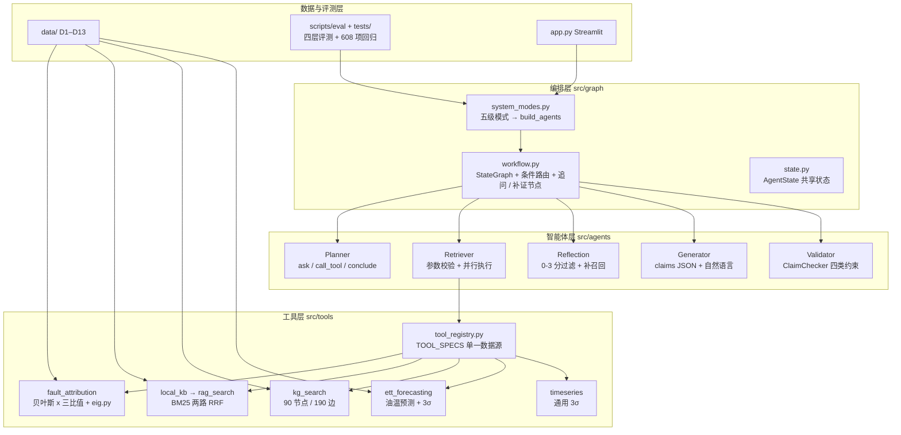
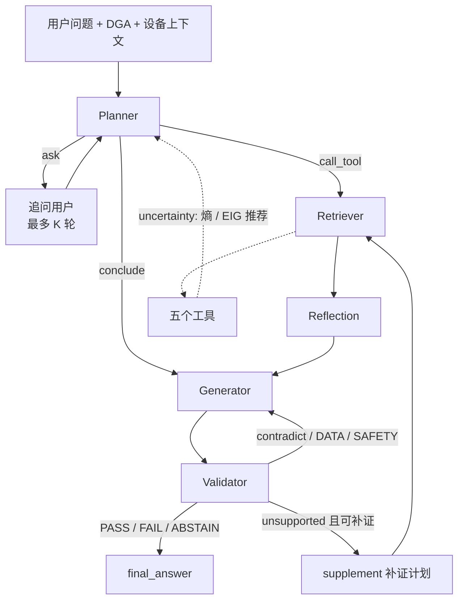

# 电力变压器故障诊断多智能体系统

Planner → Retriever → [Reflection] → Generator → Validator 五智能体（LangGraph 编排），工具层包含 DGA 贝叶斯归因、ETT 油温预测、时序异常检测、离线知识库两路检索（`rag_search`）、故障关系图谱多跳检索（`kg_search`）。规划模块支持用微调后的 Planner 替换（`planner_mode: finetuned`，v2 路线为百炼 `qwen3-8b` SFT + DPO），并提供五级系统模式用于增量归因。研究主线与任务清单见 [PLAN_优化计划清单.md](PLAN_优化计划清单.md)。

- 项目结构说明：[PROJECT_OVERVIEW.md](PROJECT_OVERVIEW.md)
- 完整计划与进度：[PLAN_优化计划清单.md](PLAN_优化计划清单.md)（§0.6「进度状态」表 + 各小节 `[ ]` 项）
- 阶段报告：`docs/`（见下文「报告索引」）
- 看不懂代号先查：[docs/design/术语与代号对照表.md](docs/design/术语与代号对照表.md)（R/D/S 数据编号、M0–M4、mode1–5、指标缩写）
- 快速入门：[docs/thesis/速览卡.md](docs/thesis/速览卡.md)（一页）→ [docs/eval/walkthrough_traces.md](docs/eval/walkthrough_traces.md)（三条主线真实执行轨迹）→ [docs/thesis/技术报告_v2.md](docs/thesis/技术报告_v2.md)

## 项目架构

### 分层总览

系统分四层：编排层（LangGraph 状态图）、智能体层（五个角色）、工具层（五个异构工具 + 统一注册表）、数据与评测层。论文的三条研究主线分别落在智能体层的 Planner、Validator 与 Planner 的训练数据上，工程基座（工具、检索、图谱、前端）不作论文贡献。



### 运行时数据流

一次诊断从用户问题（可带 DGA 五气体、设备上下文）进入 Planner，Planner 输出三种动作之一：`ask`（向用户追问某个征兆，最多 K 轮）、`call_tool`（工具调用计划）、`conclude`（信息足够，直接生成）。Retriever 只执行通过严格 JSON Schema 校验的步骤，结果写入 `state.trajectory`；Reflection 对检索块打 0-3 分过滤并补召回邻块；Generator 先输出带证据引用的结构化 `claims`，再渲染自然语言；Validator 内部的 ClaimChecker 逐条核对声明与证据，判定驱动三种路由：`PASS / FAIL / ABSTAIN` 结束，`contradict` 或 DATA / SAFETY 违规回 Generator 修订，`unsupported` 且可补证则合成补证计划回 Retriever。



归因工具除后验分布外还返回 `uncertainty` 块（熵、Top-1 与 Top-2 差、按期望信息增益排序的追问推荐），这是 Planner 决定「问还是查」的依据。每个智能体在 LLM 不可用时都有确定性降级路径（Planner 走 `eig_decide`、Generator 走模板、Validator 走规则），所以 `reproduce.sh` 与全部回归测试可离线运行。

### 五个智能体

| 智能体 | 文件 | 职责 | 论文对应 |
|---|---|---|---|
| Planner | `src/agents/planner.py` | Function Calling 优先；`strategy=free` 输出工具步骤列表，`strategy=active` 输出 `action + rationale`，据 `uncertainty` 决定追问；`planner_mode=finetuned` 时切换到百炼部署的 SFT / DPO 模型 | 主线一（决策）、主线三（训练对象） |
| Retriever | `src/agents/retriever.py` | 只执行校验通过的步骤，并行调用，区分 `exec_success` 与 `business_success`，全部写入轨迹 | 工程基座 |
| Reflection | `src/agents/reflection.py` | `LexicalScorer` / `LLMScorer` 0-3 分过滤，邻块补召回，改写重检 | 工程基座 |
| Generator | `src/agents/generator.py`、`claims.py` | `output_mode=text` 纯文本；`output_mode=claims` 先输出 `claims[]`（每条含 `type`、`evidence[]`），再渲染答案 | 主线二（输出侧） |
| Validator | `src/agents/validator.py`、`claim_checker.py` | `claim_check=off` 为 v1 整体评分；`check` 逐条核对 DATA / EVIDENCE / APPLICABILITY / SAFETY 四类约束；`route` 在核对基础上驱动修订 / 补证 / 弃答路由 | 主线二（核查侧） |

### 工具层

| 工具 | 实现 | 输入 | 输出要点 |
|---|---|---|---|
| `fault_attribution` | `src/tools/fault_attribution.py` + `eig.py` | `dga_data{H2,CH4,C2H2,C2H4,C2H6}`、`evidence{}`（支持「未检测」） | 8 类故障后验、三比值编码与匹配规则、`uncertainty{entropy, margin, recommendations[]}`；`configure_engine("expert"|"calibrated")` 切参数集 |
| `rag_search` | `src/tools/local_kb.py` | `query`、`mode` | 182 篇文献 5404 块，BM25 子块层 + 锚点层 RRF，返回块文本与 `chunk_id` 供 claims 引用 |
| `kg_search` | `src/tools/kg_search.py` | `query, relations[], hops, direction` | 故障关系图谱多跳路径，每条边带文献支持数 |
| `ett_forecast` | `src/tools/ett_forecasting.py`、`ett_loader.py` | `dataset, lookback, horizon` | ETT 油温滑窗线性回归预测 + 3σ 异常 |
| `timeseries_anomaly` | `src/tools/timeseries.py` | `signal[]` | 通用 3σ 异常检测 |

`tool_registry.py::TOOL_SPECS` 是五个工具 JSON Schema 的唯一数据源，Planner 的 function calling 声明、Retriever 的 `validate_arguments_strict`、评测脚本的参数正确率判定都从这里读取；新增工具只需在此加声明并在 `app.py::build_mcp` 与 `eval_system_modes.py::build_mcp` 注册实现。

### 五级增量系统模式

`src/graph/system_modes.py` 把上述开关组合成五级，相邻两级只差一组开关（单元测试断言配置差集恰为一组），用于论文第 6 章分离每条主线的贡献；`resolve_mode` 支持逐项覆盖以构造交叉对照（如 mode4 + 基座 Planner）。

| 模式 | 名称 | 相对上一级新增的开关 | 对应 |
|---|---|---|---|
| mode1 | `llm_only` | 无工具，LLM 直答 | 参照 |
| mode2 | `tool_base` | 五工具 + 两路检索 + 图谱 + 词法反思；归因 `expert`、无 EIG；Planner `free`；Generator `text`；Validator `off` | 工程基座 |
| mode3 | `active_plan` | 归因 `calibrated` + EIG 推荐；Planner `active` | 主线一 |
| mode4 | `claim_verify` | Generator `claims`；Validator `route` | 主线二 |
| mode5 | `dpo_planner` | Planner `finetuned`（百炼 DPO 模型） | 主线三 |

### 目录结构

```
multi_Agent/
├── app.py                     # Streamlit 前端：五级模式切换、DGA 输入、轨迹 / 图谱 / 反思 / 追问展示
├── reproduce.sh               # 离线一键复现（阶段：dga kb kg reflection planner_data d10 B C D E test）
├── run_frontend.sh            # 启动前端
├── config.example.yaml        # 配置模板（config.yaml 含密钥，已 gitignore）
├── README.md / PROJECT_OVERVIEW.md / PLAN_优化计划清单.md   # 上手 / 代码结构 / 任务清单（唯一进度源）
├── src/                       # 运行时代码
│   ├── agents/                # planner / retriever / reflection / generator / validator / claims / claim_checker
│   ├── graph/                 # state / workflow（LangGraph）/ system_modes（五级模式）
│   ├── tools/                 # tool_registry / fault_attribution / eig / local_kb / kg_search / ett_* / timeseries
│   └── utils/                 # config / llm（OpenAI 兼容 + dashscope）/ prompts / data_guard / json_parse
├── templates/                 # planner / generator 提示词模板
├── scripts/                   # 离线管线（按用途分子目录）
│   ├── data/                  # DGA 合并 convert_real_dga、参数学习 learn_cpt、合成数据 generate_synthetic_data
│   ├── kb/  kg/               # 知识库与图谱构建、评测集、消融
│   ├── planner_data/          # Planner 造数：种子 → 多轮 → 口语化改写 → SFT 导出 → 候选打分配对（DPO）
│   ├── sim/                   # D12 部分观测模拟器
│   ├── eval/                  # eval_system_modes（五级端到端）/ eval_planner_offline / 主线专项评测 / 归因评测
│   ├── report/                # 论文配图、架构图、PPT、md→docx、demo_traces 执行轨迹、progress_ppt 工程
│   └── dev/                   # probe_llm_endpoint 接口探测
├── training/planner_bailian/  # 百炼 SFT / DPO 提交脚本（submit_job.py）与请求体（v2 主路线）
├── training/planner_sft/      # v1 魔搭 LoRA 路线（备选）
├── tests/                     # 13 个脚本式回归测试，608 项（逐文件 python3 运行，勿用 pytest）
├── data/
│   ├── raw/                   # 原始输入（全部 gitignore）：dga / ETT-small / ele_trans / fast_md / manuals / external_transformer
│   ├── real/ synthetic/       # D1 真实 DGA 派生集 / 合成回归数据（带 SYNTHETIC_MARKER）
│   ├── kb/ kg/                # 知识库与图谱派生产物及其评测集
│   ├── planner/               # seeds / sft / dpo / predictions
│   └── eval/                  # d10 / d11 / d12 评测集与 results
├── docs/
│   ├── design/                # 规范与说明：data_and_evaluation、kg_schema、claim_schema、planner_training、术语与代号对照表
│   ├── eval/                  # 脚本生成的评测报告（md + json）与执行轨迹 walkthrough_traces
│   ├── thesis/                # 论文与汇报交付物：技术报告、速览卡、章节素材、答辩论文、PPT、docx
│   ├── progress/              # 阶段进展报告
│   └── figures/               # 论文配图
└── archive/                   # 历史日志与遗留 Milvus 配置（gitignore）
```

## 环境

```bash
python3 --version          # 3.9+（3.9 环境下运行时注解不使用 X | None）
pip3 install -r requirements.txt   # openai langgraph streamlit rank-bm25 jieba pyyaml numpy pandas rich graphviz
cp config.example.yaml config.yaml # 填 llms.*.api_key / base_url / model_name（config.yaml 已 gitignore）
python3 scripts/dev/probe_llm_endpoint.py   # 探测对话与 function calling 是否可用
```

训练：v2 主路线走百炼平台 SFT / DPO（无需本地 GPU）；v1 魔搭 ms-swift 路线见 [docs/design/planner_training.md](docs/design/planner_training.md)（备选）。

## 一键复现（离线，不调用 LLM）

```bash
bash reproduce.sh                # 全部：DGA → 知识库 → 图谱 → 反思 → 规划数据 → D10 → 评测自检 → 回归测试
bash reproduce.sh kb kg          # 只跑指定阶段
SKIP_EXISTING=1 bash reproduce.sh
for t in tests/test_*.py; do python3 "$t" | tail -1; done   # 回归测试：13 个文件共 608 项（脚本式测试，勿用 pytest）
```

各阶段对应脚本：

| `reproduce.sh` 阶段 | 脚本 | 产物 |
|---|---|---|
| `dga` DGA 合并 / 参数学习 | `scripts/data/convert_real_dga.py`、`scripts/data/learn_cpt.py` | `data/real/dga/dga_records.jsonl`（5143）、`learned_params.json` |
| `kb` 知识库 | `scripts/kb/build_units.py` → `build_chunks.py` → `build_index.py`；`build_retrieval_evalset.py`；`eval_retrieval.py --ablation`；`ablation_chunking.py` | `data/kb/{units,chunks}.jsonl`、`data/kb/index/`、`data/kb/eval/retrieval_seed.jsonl`（1209）、`docs/eval/kb_ablation_test.md` |
| `kg` 图谱 | `scripts/kg/extract_rules.py` → `build_graph.py` → `build_kg_eval.py` | `data/kg/graph.json`（90 节点 / 190 边）、`data/kg/eval/`（304 条问答 + 56 条精度抽检） |
| `reflection` 反思 | `scripts/kb/build_reflection_evalset.py --n 300`；`eval_reflection_recall.py` | `data/kb/eval/reflection/d9_pairs.jsonl`（298 对）、`docs/eval/reflection_eval.md` |
| `planner_data` 规划数据 | `scripts/planner_data/build_task_seeds.py --execute` → `build_multi_turn.py` → `export_sft.py`（存在 `task_seeds_rewritten.jsonl` 时用改写种子）；`rewrite_queries.py` 改写需 LLM，不在离线阶段 | `data/planner/seeds/`（3482 种子 + 4538 条改写）、`data/planner/sft/`（百炼 ChatML train 7001 / dev 1301，本地不入库；test 四份封存入库，`SEALED.md`）、`DATA_CARD.md` |
| `d10` 端到端评测集 | `scripts/eval/build_d10.py` | `data/eval/d10/end2end_eval.jsonl`（196） |
| `B` 主线一 | `scripts/data/learn_cpt.py --kfold 5`（在 `dga` 阶段）、`scripts/eval/eig_sanity_check.py`、`scripts/sim/partial_obs_sim.py --build`、`scripts/eval/eval_active_planning.py` | `docs/eval/attribution_calibration.md`、`docs/eval/eig_sanity_check.md`、`data/eval/d12/`（1500）、`docs/eval/active_planning_eval.md` |
| `C` 主线二 | `scripts/eval/eval_claims_c1.py`、`eval_claim_checker_c2.py`、`eval_route_c3.py`、`build_d11_fault_injection.py`、`eval_validator.py` | `docs/eval/claims_acceptance.md`、`claim_checker_acceptance.md`、`route_acceptance.md`、`data/eval/d11/`（300）、`docs/eval/validator_eval.md` |
| `D` 主线三（离线部分） | `scripts/planner_data/score_candidates.py --synthetic-demo`；`training/planner_bailian/submit_job.py` dry-run | `data/planner/dpo/d13_{exec,full}_demo.jsonl`、`DATA_CARD.md`；正式训练需百炼账号，见 `training/planner_bailian/README.md` |
| `E` 五级模式 | `scripts/eval/eval_system_modes.py --modes all --no-llm --tag smoke`；`--oracle-planner` 上界 | `data/eval/d10/results/`、`docs/eval/end2end_eval.md`（正式数字待 LLM） |
| `test` 回归 | `tests/test_*.py` 逐文件运行 | 13 个文件 608 项 |
| 基线（需 LLM，不在 `reproduce.sh`） | `scripts/kb/eval_retrieval.py`、`training/planner_sft/predict.py --stratified 100` + `scripts/eval/eval_planner_offline.py`、`eval_system_modes.py --modes mode2 --limit 50 --tag a1_baseline` | `docs/eval/baseline.md`、`docs/eval/planner_eval.md` M0 列 |
| v1 备选训练路线 | `training/planner_sft/train.sh`、`run_matrix.sh` | 已降级，见 `docs/design/planner_training.md` |

## 运行前端

```bash
bash run_frontend.sh                      # 默认加载学习到的贝叶斯参数
USE_LEARNED_CPT=0 bash run_frontend.sh    # 专家默认 CPT 对照
```

侧边栏「系统模式（五级增量）」：mode1 `llm_only`（无工具）/ mode2 `tool_base`（全工具 + 知识库 + 图谱 + 词法反思，专家 CPT，自由规划）/ mode3 `active_plan`（+ 校准归因与 EIG 主动追问）/ mode4 `claim_verify`（+ 声明级输出、约束核查与补证路由）/ mode5 `dpo_planner`（+ DPO 微调 Planner）；「高级」可逐项覆盖 Planner 模型、归因参数、规划策略、Generator 输出、Validator 模式与反思开关。标签页展示规划计划、工具调用轨迹、检索块、图谱链路、反思评分、追问过程。

## 报告索引

| 报告 | 内容 | 状态 |
|---|---|---|
| `docs/thesis/技术报告_v2.md` | 阶段技术报告：背景、三条主线设计与已验证数字、完成状态、预期目标与量化目标、创新点、已知局限（v1 `技术报告.md` 已被取代） | 2026-09-16 |
| `docs/thesis/速览卡.md` | 一页速览：一句话、一张图、十个已验证数字、五个待办、三个风险 | 2026-09-16 |
| `docs/design/术语与代号对照表.md` | 全部代号、缩写与内部代称的全称及指代（含三组易混编号辨析） | 2026-09-17 |
| `docs/eval/walkthrough_traces.md` | 三条主线「从输入到答案」的真实执行轨迹（`scripts/report/demo_traces.py --write` 生成，零 LLM） | 2026-09-16 |
| `docs/design/data_and_evaluation.md` | 数据来源、许可与已知问题（R1–R11）、派生谱系与文件格式（D1–D13）、合成数据守卫、角色隔离规则、四层评测体系与指标口径 | 完成 |
| `docs/eval/kb_ablation_test.md` | 分块 α 网格、切分方式、检索通道消融（Recall@k） | 离线通道版本；稠密向量 + 重排待接口 |
| `data/kg/eval/report.md`、`docs/design/kg_schema.md` | 图谱 schema、304 条问答评测、精度抽检 | 规则抽取版本；LLM 抽取待接口 |
| `docs/eval/reflection_eval.md` | 有 / 无反思检索对比、D9 评分分布 | LexicalScorer；LLMScorer Kappa 待人工分 |
| `docs/design/planner_training.md` | v1 微调路线（魔搭 LoRA → 百炼导入）、百炼约束 | 已降级为备选；v2 走百炼 SFT + DPO |
| `docs/eval/baseline.md` | A-1 三组基线：检索 Recall@k、M0 Planner 7 指标（100 条）、mode2 端到端（50 条）与失败模式归因 | 已产出（2026-09-16） |
| `docs/eval/planner_eval.md` | Planner 七项指标分类别（v2 矩阵：M0 / M1 / M4-exec / M4-full） | M0 列已产出；M1 / M4 待百炼训练 |
| `docs/eval/end2end_eval.md` | 五级模式任务成功率 / 忠实度 / 调用次数 / 延迟 / Token | 框架就位，正式数字待 Planner 真实调用 |
| `docs/thesis/chapter3_active_planning_material.md`、`docs/thesis/chapter4_claim_verification_material.md`、`docs/thesis/chapter5_planner_dpo_material.md` | 论文第 3-5 章素材：定义表、流程图、消融设计、相关工作差异、可引用数字 | 第 3-4 章数字齐全；第 5 章数字待百炼训练 |
| `docs/progress/progress_*.md` | 阶段进展报告 | 持续更新 |

## 数据与安全约束

- `data/synthetic/` 下的合成数据只用于流程回归（`--purpose dev_regression`），`assert_not_synthetic` 强制阻止其进入评测集与训练集。
- 训练 / 验证 / 测试按 `group_key`（来源块 / 实体对 / DGA 记录 / ETT 片段）分组切分，test 封存，跨集泄漏 0。
- `config.yaml` 含密钥不入库；训练产物 `output/`、模型预测 `data/planner/predictions/` 不入库。

## 已知局限

- DGA 数据集（5143 条）由三份文献汇编来源合并去重而来：`dga_dataset.csv`（4150 行，来源未核实，非 Kaggle）与 `alan-456/transformer-fault-dataset` 的两份文件（2321 + 589 行，未声明许可）。IEC 故障标签为文献汇编标签，无法逐条追溯原始检修记录；`fault_label` 是 IEC 标签到本系统故障类型的工程映射，评测使用 `raw_label`；CO / CO2 为 0 填充，不是真实测量；`device_id` 为循环生成，不能作为设备维度分析依据。
- ETT 数据集（ETDataset, CC BY-ND 4.0，以原仓库 LICENSE 为准）是电力变压器油温公开数据，负载特征（HUFL 等）单位未知；ETTh 与 ETTm 疑似同源，切分时按同组处理；预测模型为线性回归，仅用于工具调用行为研究，不代表预测 SOTA。
- `power_transformer_fault.csv`（1866 行）来源尚未核实，公开数据站点检索未匹配，未进入任何训练 / 评测集。
- 知识库文献存在重复与 MinerU 解析噪声，图片仅有路径、表格无标题，多模态转文本依赖 LLM 尚未完成；当前检索为 BM25 子块 + 锚点两路 RRF，无稠密向量与重排器。
- 图谱由规则抽取（显式因果触发词），90 节点 / 190 边，覆盖有限，精度抽检 83%（严格）/ 95.7%（宽松）。
- 反思评分器目前是词法基线，LLMScorer 与人工评分的一致性尚未测量；D9 人工 `human_score` 未填写。
- 规划训练数据问法由模板生成后经 `qwen3.7-flash` 口语化改写（A-2，2026-09-16 完成，守卫过滤 961 条、人工抽检 50 条），改写模型与 M0 基线同源；多轮样本的 assistant thought 为规则模板文本。
- 端到端评测的「答案忠实度」在离线模式下使用证据锚点代理，LLM 裁判与 10% 人工复核未执行；D10 标注 `status=auto`，人工复核（A-3）待做。
- 已产出的 LLM 数字仅限 A-1 基线（检索 Recall@k、M0 Planner 100 条、mode2 端到端 50 条，见 `docs/eval/baseline.md`）；M1 / M4 对照与五级模式 E-2 正式数字待百炼训练（`training/planner_bailian/submit_job.py`）与 LLM 评测，进度见 `PLAN_优化计划清单.md` §0.6。
