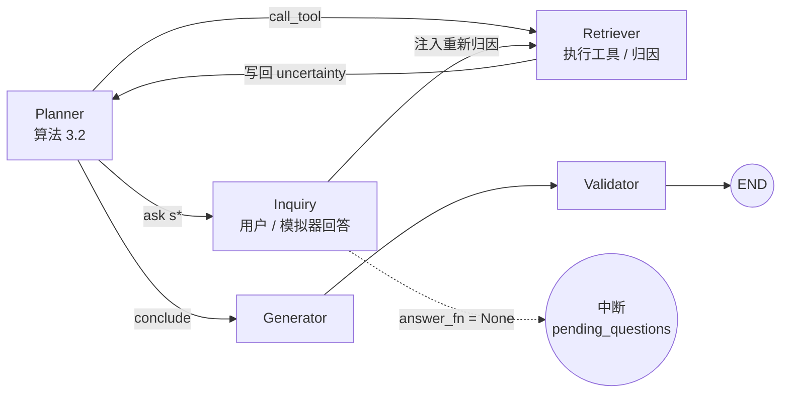

# 第 3 章素材：不确定性驱动的主动诊断规划（B-6）

> 对应计划 B-6；数字来自 `docs/attribution_calibration.md`（B-1）、`docs/eig_sanity_check.md`（B-2）、`data/eval/d12/DATA_CARD.md`（B-3）、`docs/active_planning_eval.md`（B-5）。代码锚点：`src/tools/fault_attribution.py`、`src/tools/eig.py`、`src/agents/planner.py`、`src/graph/workflow.py`、`scripts/sim/partial_obs_sim.py`、`scripts/eval/eval_active_planning.py`。

## 1. 符号表

| 符号 | 含义 | 代码对应 |
|---|---|---|
| $\mathcal{F}$ | 故障类型集合，$|\mathcal{F}| = 8$ | `FAULT_IDS` |
| $\mathcal{S}$ | 征兆集合，$|\mathcal{S}| = 14$，其中 7 个可由 DGA 数值直接派生 | `SYMPTOM_IDS`、`GAS_DERIVED_SYMPTOMS` |
| $E$ | 当前证据：$E = \{(s, v)\}$，$v \in \{\text{true}, \text{false}\}$；`false` 为负观测 | `evidence: dict[str, bool]` |
| $\mathcal{U}(E)$ | 未观测且可获取的征兆集合 | `unobserved_symptoms()` 去掉 `asked / unavailable` |
| $\pi(F)$ | 故障先验 | `prior`（`learned_params.json`，Laplace 平滑 α=1） |
| $\theta_{F,s} = P(s = \text{true} \mid F)$ | 条件概率表 CPT | `CPTRow.p_true` |
| $P(F \mid E)$ | 后验（融合 + 温度缩放后） | `posterior_only()["probs"]` |
| $P_{\text{NB}}(F \mid E)$ | 纯朴素贝叶斯后验 | `posterior_only()["bayes_probs"]` |
| $w_F$ | 规则 / 贝叶斯融合权重（按故障类别学习） | `fusion_weights` |
| $T$ | 温度缩放参数（$T = 1.22$） | `temperature` |
| $H(F \mid E)$ | 后验香农熵（bit） | `entropy_bits()` |
| $\mathrm{EIG}(s)$ | 征兆 $s$ 的期望信息增益 | `eig_for_symptom()` |
| $c(s)$ | 征兆获取成本（0 / 1 / 3） | `symptom_cost.json` |
| $\lambda$ | 成本权重（0.05） | `lambda_default` |
| $\mathrm{VoI}(s)$ | 信息价值 $\mathrm{EIG}(s) - \lambda c(s)$ | `recommendations[i]["voi"]` |
| $\tau_H, \varepsilon, K$ | 停止阈值：熵阈值 0.8 bit、VoI 阈值 0.02、最大轮数 3 | `stop` 配置 |
| $a_t \in \{\texttt{ask}, \texttt{call\_tool}, \texttt{conclude}\}$ | 第 $t$ 轮 Planner 动作 | `planner_action` |

## 2. 模型

### 2.1 校准的朴素贝叶斯归因（B-1）

$$P_{\text{NB}}(F \mid E) \propto \pi(F) \prod_{(s, v) \in E} \theta_{F,s}^{\,[v = \text{true}]} (1 - \theta_{F,s})^{\,[v = \text{false}]}$$

负观测项 $(1 - \theta_{F,s})$ 是 B-1 补入的：此前 `false` 被跳过，导致「已排除的征兆」不进入推理。

三比值规则融合（仅在五种气体齐全时匹配规则，缺气体不代 0，避免伪规则）：

$$\tilde P(F \mid E) = w_F \, P_{\text{NB}}(F \mid E) + (1 - w_F)\, r_F(E), \qquad r_F(E) = \max_{\rho \in \mathcal{R}(E),\, F \in \rho} \text{conf}(\rho)$$

温度缩放后归一化：

$$P(F \mid E) = \frac{\tilde P(F \mid E)^{1/T}}{\sum_{F'} \tilde P(F' \mid E)^{1/T}}$$

$T$ 在 5 折验证集上按 NLL 最小网格搜索得到 $T = 1.22 > 1$，对应朴素贝叶斯独立假设造成的过度自信。校准结果（5143 条真实 DGA，5 折 held-out）：ECE 0.101 → 0.055，Top-1 0.635 → 0.665。

### 2.2 期望信息增益（B-2）

对 $s \in \mathcal{U}(E)$：

$$P(s = v \mid E) = \sum_{F} P(s = v \mid F)\, P(F \mid E)$$

$$\mathrm{EIG}(s) = H(F \mid E) - \sum_{v \in \{\text{true}, \text{false}\}} P(s = v \mid E)\, H(F \mid E \cup \{(s, v)\})$$

以 $P_{\text{NB}}$ 为计算基时 $\mathrm{EIG}(s) = I(F; s \mid E) \ge 0$ 严格成立；以融合 + 缩放后的 $P$ 为计算基（默认，与 Planner 看到的分布一致）时不是严格贝叶斯更新，可能出现极小负值，实现中裁剪到 0。

信息价值与停止准则：

$$\mathrm{VoI}(s) = \mathrm{EIG}(s) - \lambda\, c(s), \qquad s^* = \arg\max_{s \in \mathcal{U}(E)} \mathrm{VoI}(s)$$

$$\text{stop} \iff H(F \mid E) < \tau_H \;\lor\; \mathrm{VoI}(s^*) < \varepsilon \;\lor\; t \ge K \;\lor\; \mathcal{U}(E) = \varnothing$$

## 3. 算法伪代码

### 算法 3.1 EIG 推荐（`eig.recommend`）

```
输入: 证据 E, 气体上下文 ctx, 引擎 θ, 成本表 c, λ, 阈值 (τ_H, ε, K), 已用轮数 t
输出: 推荐列表 R, 建议动作 a, 停止原因
 1. P ← Posterior(θ, E, ctx);  H0 ← H(P)
 2. R ← ∅
 3. for s in U(E):                                  # 未观测征兆
 4.     p_t ← Σ_F θ_{F,s} · P(F)                      # 预测 s 为真的概率
 5.     H_t ← H(Posterior(θ, E ∪ {(s,true)}, ctx))
 6.     H_f ← H(Posterior(θ, E ∪ {(s,false)}, ctx))
 7.     EIG ← max(0, H0 − p_t·H_t − (1−p_t)·H_f)
 8.     R ← R ∪ {(s, EIG, c(s), EIG − λ·c(s), how_to_obtain(s))}
 9. R ← sort R by VoI desc, then cost asc
10. if H0 < τ_H:        return R, conclude, entropy_below_tau
11. if R = ∅:           return R, conclude, no_candidates
12. if R[0].VoI < ε:    return R, conclude, voi_below_eps
13. if t ≥ K:           return R, conclude, max_rounds
14. a ← call_tool if R[0].how_to_obtain 以 "call_tool:" 开头 else ask
15. return R, a, ∅
```

复杂度：每轮 $O(|\mathcal{U}| \cdot |\mathcal{F}| \cdot |E|)$，14 个征兆、8 个故障，单轮在 CPU 上毫秒级；1500 条 × 4 策略 × 7 步的全量评测 2.6 s。

### 算法 3.2 Planner 动作选择（`PlannerAgent.eig_decide` / `_validate_action`）

```
输入: 上下文 ctx（dga, evidence, uncertainty, asked, unavailable）, 允许工具集 A
输出: 动作 a 与载荷
 1. if ctx.uncertainty = ∅:                        # 首轮，尚未归因
 2.     if dga ≠ ∅ or evidence ≠ ∅: return call_tool(fault_attribution, dga 去 None)
 3.     else:                        return conclude
 4. if uncertainty.suggested_action = conclude:    return conclude(stop_reason)
 5. for r in uncertainty.recommendations:          # 已按 VoI 排序
 6.     if r.symptom ∈ asked ∪ unavailable: continue
 7.     if r.how_to_obtain = call_tool:τ:
 8.         if τ ∈ A and ValidateSteps(τ, ctx) 通过: return call_tool(τ)
 9.         else: continue                         # 越权或参数不满足则跳过
10.     else: return ask(r.symptom, r.ask_hint, r.eig, r.voi, r.cost)
11. return conclude(no_candidates)
```

当 `decision=llm` 时第 4–11 步由 LLM 依据 `system_active.txt` 完成，输出 `{action, symptom, question, rationale, steps}`；`_validate_action` 强制：`ask` 必须携带推荐列表内且未问过的 `symptom` 与 `question`，`call_tool` 必须携带步骤；致命错误回退到本算法（`decision_source = eig_fallback`）。

### 算法 3.3 追问循环（`workflow.py` active 路径）

```
状态: S（context, evidence, asked, unavailable, inquiry_rounds t=0, inquiry_log）
 1. planner: a ← Decide(S)                         # 算法 3.2
 2. if a = call_tool:
 3.     retriever 执行工具；若为 fault_attribution 则把 uncertainty / evidence_used / negative 写回 S.context
 4.     log(t, call_tool, H, top1, R);  goto 1
 5. if a = ask:
 6.     v ← AnswerFn(symptom)                       # 用户 / 模拟器；可返回 {answer, dga, evidence, cost}
 7.     S.evidence[s] ← v；若 v = None 则 s → unavailable；合并附带 dga / evidence；t ← t+1；累计成本
 8.     log(t, ask, s, v, cost, H, R)
 9.     注入合成计划 call_tool(fault_attribution) → 3   # 回答后必重新归因
10. if a = conclude:
11.     log(t, conclude, stop_reason);  generator → validator → END
守卫: t ≥ K 时强制 conclude；LangGraph recursion_limit = 25 + 6K；工具轮数 > 2K+2 时强制进入 generator
交互式: AnswerFn = None 时在第 6 步中断，留 pending_questions，前端回答后 resume_after_answer 从第 7 步续跑
```



## 4. 实验设置摘要

| 项 | 设定 |
|---|---|
| 数据 | D12：5143 条真实 DGA 中非 normal 的 3729 条分层抽样，遮蔽 1 / 2 / 3 种气体各 500 条，共 1500 条，seed 20260915，sha256 `9e2a35b3…` |
| 标签 | 过载过热 600 / 局部放电 429 / 匝间短路 264 / 绝缘老化 207（引擎 8 类中另 4 类无正样本） |
| 可询问征兆 | 12 个 `ask_user` 类；油温、负载为 `call_tool` 类需时序信号，D12 不含，不参与 |
| 模拟器 | `PartialObsEnv.answer(s)`：气体征兆揭示真值（成本 0）并同时更新派生征兆；现场征兆返回「不可获取」并计成本 |
| 对照策略 | random、fixed（IEC 60599 / DL/T 722 顺序）、eig_greedy（λ=0）、eig_cost（本文）；llm_free 需 LLM，后置 |
| 协议 | A 固定预算 $q = 0..6$；B 自适应停止（$\tau_H = 0.8$，$\varepsilon = 0.02$，$K = 3$，$\lambda = 0.05$） |
| 检验 | 问询次数：配对符号翻转置换检验（20000 次）；Top-1：McNemar 精确检验 |

## 5. 主要结果（写作用数字）

| 策略 | Top-1 | Top-3 | 平均问询 | 平均成本 | 命中率@2 | ECE |
|---|---:|---:|---:|---:|---:|---:|
| 无追问 q=0 | 0.592 | 0.956 | 0 | 0 | – | 0.039 |
| random | 0.641 | 0.975 | 2.84 | 2.63 | 0.306 | 0.026 |
| fixed | 0.661 | 0.980 | 2.79 | 0.85 | 0.623 | 0.041 |
| eig_greedy | 0.661 | 0.979 | 2.64 | 1.78 | 0.762 | 0.036 |
| eig_cost（本文） | 0.660 | 0.980 | 2.04 | 0.26 | 1.000 | 0.042 |

- eig_cost vs fixed：问询 −0.754 次（−27%，p < 0.0001），成本 0.26 vs 0.85，Top-1 差 −0.001（McNemar p = 0.77，无显著差异）。
- eig_cost vs random：问询 −0.807（p < 0.0001），Top-1 +1.9 个点（McNemar p = 0.017）。
- 固定预算 q = 1：eig_cost 0.642 > fixed 0.635 > random 0.617；熵 1.265 < 1.374 < 1.403 bit。
- 停止原因：eig_cost 73% 因 VoI < ε 提前停止，仅 9% 达轮数上限；fixed / random 85–90% 达上限。
- 分档：light 档 eig_cost 1.22 问 vs fixed 2.64 问（Top-1 均 0.660）；heavy 档差距缩小到 2.76 vs 2.94。
- 校准消融：专家 CPT 下 eig_cost Top-1 0.383、ECE 0.130；校准后 0.660 / 0.042。校准是 EIG 有效的前提。
- 成本消融：eig_greedy 会去问成本 3 的局放检测，成本 1.78 vs 0.26，Top-1 无差异。
- $\tau_H$ 扫描：0.8 → 1.0 问询 2.04 → 1.86 且 Top-1 不降；1.5 时问询降至 0.85 但 Top-1 降到 0.639。
- 完整 LangGraph 工作流（decision=eig）与轻量模拟 30 条 Top-1 结论逐条一致 30/30。

结论表述：在 D12 上，成本感知 EIG 策略以与固定顺序问询相同的准确率把平均问询次数降低 27%、获取成本降低 69%，并在同等预算下更快降低后验熵；准确率增益主要来自「问对征兆」而非「问更多」。

## 6. 与相关工作的差异

| 工作 | 后验 / 信念来源 | 候选问题 | 目标函数 | 成本 | 领域 |
|---|---|---|---|---|---|
| Active Task Disambiguation（ICLR 2025） | LLM 采样候选解集合 | LLM 生成 | 候选解集合上的 EIG 近似 | 无 | 通用任务澄清 |
| BED-LLM（2025） | LLM 采样估计假设分布 | LLM 生成 | 贝叶斯实验设计 EIG，采样估计 | 无 | 多轮信息收集（20 问等） |
| When Should AI Ask（2026） | LLM 置信度 | LLM 生成 | VoI：澄清收益 − 沟通成本 | 统一沟通成本 | 通用 / 医疗对话 |
| InfoGatherer（2026） | Dempster–Shafer 证据网络 | 模板 + LLM | 证据不确定性减少 | 无 | 法律 / 医疗 |
| 本文 | 领域朴素贝叶斯归因引擎（5143 条真实 DGA 学习 + 温度校准） | 14 个工程征兆的封闭集合，`how_to_obtain` 区分追问 / 调工具 | 精确 EIG（闭式枚举二值征兆），VoI = EIG − λ·cost | 分级工程获取成本（0 / 1 / 3） | 变压器故障诊断 |

差异要点（供正文使用）：

1. 后验来源不同。上述工作用 LLM 采样近似假设空间与后验，EIG 是蒙特卡洛估计，方差与提示词敏感；本文的假设空间是封闭的 8 类故障、14 个二值征兆，EIG 由校准后的概率模型闭式枚举，确定性、可复现、毫秒级，且校准（ECE 0.042）保证熵可作为停止信号。B-5 消融显示未校准时同一算法 Top-1 仅 0.383，说明「EIG 有用」依赖「后验可信」，这是采样式方法难以单独验证的。
2. 动作空间不同。已有工作只有「问用户」一种获取动作；本文的 `how_to_obtain` 把征兆映射到「追问用户」或「调用工具」（如油温 → `ett_forecast`、负载 → `timeseries_anomaly`），EIG 统一驾驭对话与工具调用两类补证动作。
3. 成本模型不同。When Should AI Ask 用统一沟通成本，其余无成本；本文按工程可得性分级（DGA 派生 0、现场询问 1、额外试验 3），B-5 显示成本项把平均成本从 1.78 降到 0.26 而准确率不变。
4. 可解释性。推荐征兆附带图谱 `INDICATES / DETECTED_BY` 边的文献原句作为追问理由，追问话术可追溯到规程文本。
5. 局限（正文需明确）。本文方法依赖显式的领域概率模型，迁移到新设备类型需重新学习 CPT；朴素贝叶斯独立假设需温度缩放修正；评测在气体征兆空间内进行，现场征兆的价值只能通过成本表体现，未经真实数据验证；与 LLM 自由追问的对照尚未完成（需 LLM，计划 A-1 补跑）。

## 7. 图表清单

| 编号 | 文件 | 说明 |
|---|---|---|
| 图 3-1 | `docs/figures/fig_b1_reliability.png` | 校准前后可靠性图（5 折 held-out） |
| 图 3-2 | 本文第 3 节 Mermaid | 追问循环状态图 |
| 图 3-3 | `docs/figures/fig_b5_acc_vs_queries.png` | 固定预算下 Top-1 随问询次数变化 |
| 图 3-4 | `docs/figures/fig_b5_entropy_curve.png` | 固定预算下平均后验熵下降曲线 |
| 表 3-1 | 本文第 1 节 | 符号表 |
| 表 3-2 | `docs/eig_sanity_check.md` | 20 条手工样例推荐一致率 90% / 95%，κ 敏感性 |
| 表 3-3 | 本文第 5 节 | 协议 B 主结果 |
| 表 3-4 | `docs/active_planning_eval.md` §3 | 配对检验 |
| 表 3-5 | `docs/active_planning_eval.md` §5 | 校准 / 成本 / τ_H 消融 |
| 表 3-6 | 本文第 6 节 | 相关工作差异 |
