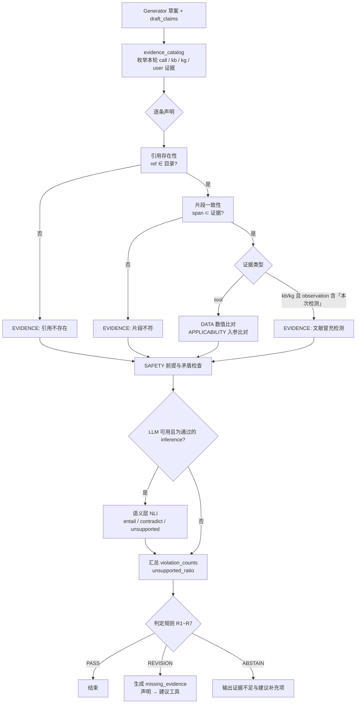
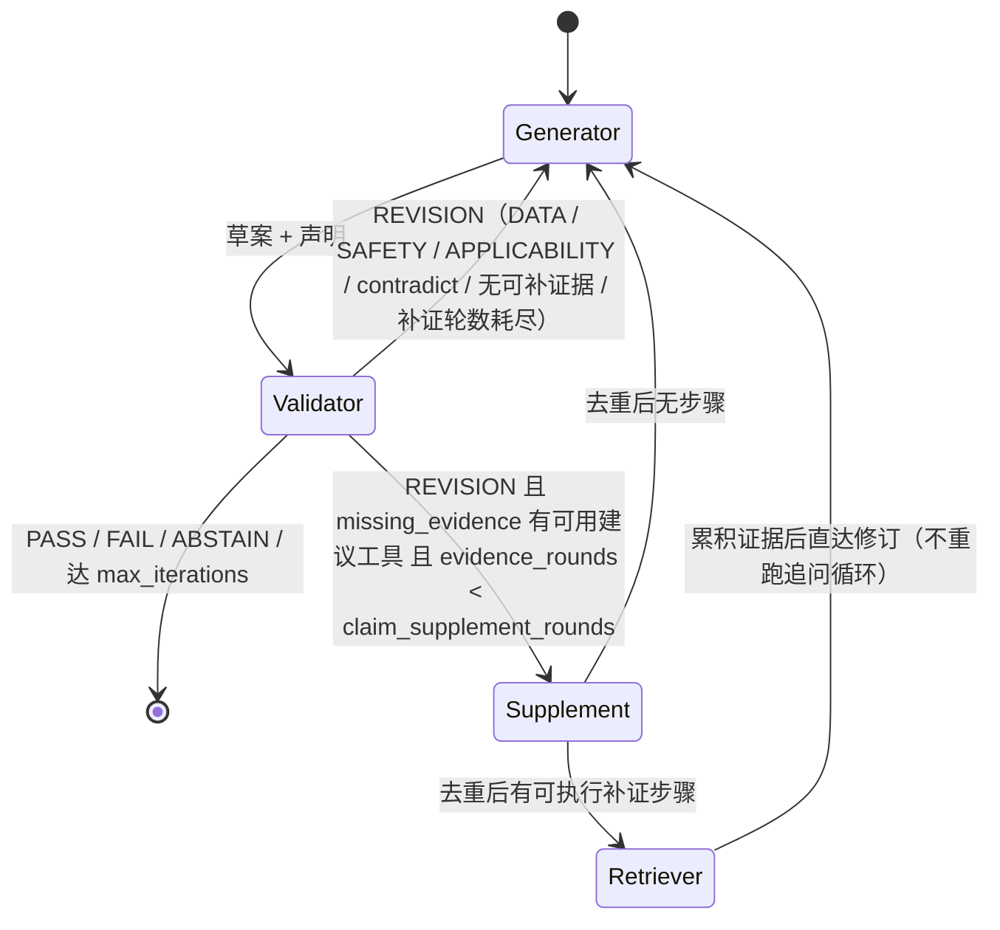

# 第 4 章素材：声明级证据约束验证（C-6）

> 本文件汇总主线二（C-1 ~ C-5）可直接进入论文第 4 章的素材：约束类型定义表、核查流程图、路由状态机、与相关工作的差异说明、以及可引用的实验数字。所有数字均取自本仓库产出的报告与数据卡片，引用位置见文末。

## 4.1 问题定义

诊断草案 $A$ 被拆解为声明序列 $\{c_i\}$，每条声明 $c_i = (\text{id}, \text{text}, \text{type}, E_i)$，其中 $E_i$ 为证据引用集合，每条引用 $(\text{source}, \text{ref}, \text{span})$ 指向本轮真实产生的四类证据源之一：工具调用（`call:<i>`）、知识库片段（`kb:<chunk_id>`）、图谱关系链（`kg:<path>`）、用户输入（`user:<round>`）。验证器对每条声明输出判定 $y_i \in \{\text{pass}, \text{violated}, \text{unsupported}, \text{contradict}\}$ 与违反约束集合 $V_i \subseteq \{\text{DATA}, \text{EVIDENCE}, \text{APPLICABILITY}, \text{SAFETY}\}$，再按判定规则聚合为草案级结论 $\{\text{PASS}, \text{REVISION}, \text{ABSTAIN}\}$，并在 REVISION 时产出补证建议 `missing_evidence`。

与整体评分式 Validator（v1，给全文一个分数并写一段评语）的区别在于：核查对象是可独立核对的最小陈述单元；核查依据是本轮真实证据而非模型自身知识；输出可定位到具体声明与具体约束，因此能驱动有针对性的修订与补证。

## 4.2 声明类型与约束类型定义

### 表 4-1 声明类型

| 类型 | 含义 | 典型来源 | 证据要求 |
|---|---|---|---|
| `observation` | 直接复述工具输出或用户提供的事实 | DGA 入参、后验概率、预测值、异常点数、用户确认的征兆 | 数值与证据完全一致、保留单位；引用无效直接触发 REVISION（C-5 修订） |
| `inference` | 由观测推出的判断 | 主要故障类型、置信等级、因果解释、图谱关系链 | 引用支撑其观测的工具结果或图谱关系 |
| `recommendation` | 检测 / 处理建议 | 知识库规程片段、图谱关系、工具结果 | 引用知识库、图谱或工具结果 |
| `safety` | 停电、吊罩、更换、退出运行等高风险处置 | 归因引擎高危结论 | 必须同时引用支撑该处置的检测结果 |

### 表 4-2 约束类型定义（确定性层）

| 约束 | 定义 | 核查子项（实现于 `ClaimChecker`） | 违反示例 | 硬约束 |
|---|---|---|---|---|
| DATA | 声明中的数值与所引工具输出不一致 | 气体浓度（相对容差 2%、绝对 0.05）；百分比 / 概率（±0.15 pp）；油温（仅比对 `ett_forecast` 的 `*ot*` 字段）；`horizon` / `lookback` 整数相等；后验熵 ±0.011；三比值编码三元组；异常点数；故障名与概率错位 | 「C2H2 = 125 ppm」而入参为 12.5；「低温过热 63.2%、高温过热 21.0%」两者互换 | 是 |
| EVIDENCE | 引用不存在、片段与证据不符、以文献冒充本次检测 | `ref` 不在本轮证据目录；`span` 非工具 JSON 叶值 / 文本子串；`observation` 含「本次 / 检测结果」却只引用 `kb` | `call:9` 而本轮仅 3 次调用；引用真实 chunk 但 span 编造 | 否（占比阈值）；`observation` 类例外为硬约束 |
| APPLICABILITY | 证据的数据集、设备、时间窗与当前任务不匹配 | 声明数据集名 ≠ 工具入参 `dataset`；声明设备号不在入参 `device_id / transformer_id / equipment_id` 中 | 「基于 ETTm1 预测」而入参 ETTh1；「#1 主变」而入参 #2 | 是（C-5 修订纳入） |
| SAFETY | 高风险处置缺前提或与检测结果矛盾 | `safety / recommendation` 类含高风险处置词但无工具证据或 observation 支撑；归因为正常 / 低风险却建议停电吊罩；「无需处理」但归因高危（概率 ≥ 0.4 且严重度高风险或放电 / 短路类） | 「建议立即停电吊罩」仅引用 `user:0`；「可继续运行」而 `arc_discharge` 0.78 | 是 |

说明：`recommendation` 类若高风险处置词全部出自所引知识库 / 图谱原文（文献转述），不触发 SAFETY 前提检查，避免把规程引用误判为系统自身处置建议。

### 表 4-3 判定规则（C-2，C-5 修订）

| 序号 | 条件 | 草案级结论 | 配置项 |
|---|---|---|---|
| R1 | 草案无任何声明 | REVISION | 无 |
| R2 | 任一硬约束（默认 SAFETY / DATA / APPLICABILITY）违反 ≥ 1 条 | REVISION | `claim_hard_constraints` |
| R3 | `observation` 声明存在 EVIDENCE 违反 | REVISION | `claim_strict_observation` |
| R4 | 无依据 / 矛盾声明占比 > 0.3 | REVISION | `claim_unsupported_threshold` |
| R5 | 语义层任一声明 NLI 判定为 contradict | REVISION | `claim_semantic_layer`（需 LLM） |
| R6 | R1 ~ R5 命中且已到第 3 次评估 | ABSTAIN | `claim_abstain_after` |
| R7 | 均未命中 | PASS | 无 |

R2 中 APPLICABILITY 与 R3 由 C-5 首轮评测结果驱动加入：此前 `dataset_swap / device_swap` 30 条与 17 条 `observation` 伪引用因单条声明占比未超 0.3 被稀释而通过，v2_check 错误通过率 23%；修订后降为 3%。

## 4.3 核查流程

`missing_evidence` 的建议工具由声明文本的领域词映射：含 ppm / 气体 / 三比值 / 故障概率 → `fault_attribution`；含油温 / 预测 / ℃ → `ett_forecast`；含关系 / 机理 / 图谱 → `kg_search`；`recommendation / safety` 类 → `rag_search`。

## 4.4 补证与重规划路由状态机

路由要点：Supplement 为规则节点，不调用 LLM；去重签名为工具名 + 规范化参数，跳过原因记录为 `duplicate_of_existing_call / duplicate_in_plan / no_tool / tool_disabled / no_entity_in_kg`；每次路由写入 `state.route_log`（触发原因、目标节点、补证工具、额外 Token 与耗时），可作为论文中「验证成本」的度量来源。

## 4.5 与相关工作的差异

### 表 4-4 对照

| 维度 | MAST 验证失效分类（Cemri et al., 2025） | RT4CHART（Yu et al., 2026） | 本文 |
|---|---|---|---|
| 性质 | 失效模式分类学：FM-3.1 过早终止、FM-3.2 无 / 不完整验证、FM-3.3 错误验证；用 LLM-as-judge 事后标注轨迹 | 检测框架：将 RAG 答案拆为原子声明，对检索上下文做局部到全局分层验证，输出 entailed / contradicted / baseless 并回映到答案片段 | 在线验证器：Generator 直接产出带引用的结构化声明，Validator 逐条核查并驱动修订 / 补证 / 弃答 |
| 证据源 | 不限定（面向通用 MAS 轨迹） | 单一检索上下文 $C$，严格 context-only | 异构：工具结构化输出（归因引擎、预测、异常检测）、知识库文献片段、知识图谱关系链、用户追问回答 |
| 约束类型 | 无显式约束，只区分「有没有验、验得对不对」 | 上下文忠实性三分类 | 四类面向电力工程的约束：DATA（数值一致）、EVIDENCE（引用真实）、APPLICABILITY（设备 / 数据集 / 时间窗匹配）、SAFETY（高风险处置前提） |
| 核查方式 | LLM 判定 | LLM 分层判定 | 确定性层优先（数值容差、JSON 叶值比对、入参比对、处置词典）+ 可选 LLM 语义层；确定性层零 Token |
| 判定粒度与后果 | 轨迹级标签，用于诊断系统设计 | 声明级标签 + 答案级聚合（任一非 entailed 即幻觉），用于审计 | 声明级标签 + 硬约束 / 占比阈值分级判定 + 三态结论（PASS / REVISION / ABSTAIN）+ 缺证声明到建议工具的映射，用于闭环修订 |
| 与生成端的关系 | 事后分析 | 事后检测，声明由 LLM 从自由文本分解 | 生成端按 schema 输出声明与引用（LLM 不可用时规则拼装），避免分解误差；引用只能从本轮证据目录选取 |

### 差异说明（可直接改写入论文）

第一，MAST 将「验证失效」作为多智能体系统三大失效类之一（占 23.5%），并指出现有验证器多为表面检查（如只检查编译或注释），提出需要多层级验证并用外部知识校验；但它是分类与诊断工具，不给出验证器的构造方法。本文的 ClaimChecker 可视为对 FM-3.2 / FM-3.3 的一种针对性设计：用「引用只能来自本轮证据目录」消除无验证，用「数值 / 入参 / 处置词典的确定性比对」减少错误验证，并用 D11 故障注入集直接测量验证器自身的漏检与误报。

第二，RT4CHART 与本文同为声明级、证据落地的核查，但其证据源是单一检索上下文，标签是语义蕴含三分类，且声明由 LLM 从自由文本分解。变压器诊断场景的证据大部分是工具的结构化数值输出（浓度、概率、预测值、编码），语义蕴含判定对「12.5 与 125」「ETTh1 与 ETTm1」这类差异并不敏感，而且错误后果具有工程语义（安全处置前提）。因此本文把约束按工程含义分为四类，把数值与适用性检查交给确定性层，只在 inference 类声明上保留 NLI 语义层；同时让 Generator 在生成时就按 schema 给出引用，把「分解」误差前移消除。

第三，两者都停留在检测 / 审计，本文进一步把核查结果转为控制信号：硬约束违反回 Generator 修订，缺证声明按建议工具触发规则补证（Supplement 节点，去重、限轮），连续未通过则弃答并列出需补充的证据。C-5 的 E2 设定显示，这一步使无依据结论率从 18.7%（只核查）降到 7.2%（核查 + 补证），弃答率从 63% 降到 3%。

## 4.6 可引用的实验数字

数据集 D11（`data/eval/d11/`，seed 20260915）：300 条 = 200 注入（篡改数值、伪造引用、换设备 / 数据集、删安全前提各 50，共 15 子类）+ 100 干净底稿；底稿由 D10 196 条真实工具运行 + 规则声明生成。

对照实验（`scripts/eval/eval_validator.py`，Token 0，10.5 s）：

| 指标 | 设定 | v1 整体评分 | v2_check 声明核查 | v2_route 核查 + 补证 |
|---|---|---|---|---|
| 错误通过率 | E1 | 100% | 3% | 3% |
| 分类型检出率 | E1 | 0% | 四类 100% | 四类 100% |
| 干净样本误报率 | E1 | 0% | 0% | 0% |
| 无依据结论率 | E1 | 5.0% | 0.2% | 0.2% |
| 约束违反率 | E1 | 66.7% | 2.0% | 2.0% |
| 平均 Generator 轮次 | E1 | 1.00 | 1.65 | 1.65 |
| 无依据结论率 | E2 | 36.4% | 18.7% | 7.2% |
| 缺证声明仍无据 | E2 | 100% | 100% | 24.8% |
| 弃答率 | E2 | 0% | 63% | 3% |
| 约束违反率 | E2 | 100% | 100% | 35.7% |
| 额外工具调用 / 样本 | E2 | 0 | 0 | 1.60 |
| 平均耗时 | E2 | 0.03 ms | 2.87 ms | 13.66 ms |

E1 残余 3% 错误通过为 `inference / recommendation` 类伪造引用在多声明底稿中占比未超 0.3 阈值；这是「非硬约束用占比阈值」的设计权衡，若把 EVIDENCE 全部提升为硬约束可归零，但会提高对少量引用瑕疵的修订触发频率。

后置项（需 LLM）：语义层 NLI 与人工一致率、LLM 路径 JSON 合法率、LLM 重规划去重效果；论文写作时需标注确定性层与语义层的结果边界。

## 4.7 素材来源

- 声明 schema 与约束正反例：[claim_schema.md](/Users/ts/Desktop/thu/multi_Agent/docs/claim_schema.md)
- 核查器实现：[claim_checker.py](/Users/ts/Desktop/thu/multi_Agent/src/agents/claim_checker.py)；集成：[validator.py](/Users/ts/Desktop/thu/multi_Agent/src/agents/validator.py)；路由：[workflow.py](/Users/ts/Desktop/thu/multi_Agent/src/graph/workflow.py)
- C-2 确定性层验收：[claim_checker_acceptance.md](/Users/ts/Desktop/thu/multi_Agent/docs/claim_checker_acceptance.md)
- C-3 路由验收：[route_acceptance.md](/Users/ts/Desktop/thu/multi_Agent/docs/route_acceptance.md)
- D11 数据卡片：[DATA_CARD.md](/Users/ts/Desktop/thu/multi_Agent/data/eval/d11/DATA_CARD.md)
- C-5 对照实验：[validator_eval.md](/Users/ts/Desktop/thu/multi_Agent/docs/validator_eval.md)，图 [fig_c5_detection_by_type.png](/Users/ts/Desktop/thu/multi_Agent/docs/figures/fig_c5_detection_by_type.png)、[fig_c5_pass_vs_cost.png](/Users/ts/Desktop/thu/multi_Agent/docs/figures/fig_c5_pass_vs_cost.png)
- 相关工作：Cemri M. et al. Why Do Multi-Agent LLM Systems Fail? arXiv:2503.13657（MAST，NeurIPS 2025 D&B）；Yu B. et al. Retromorphic Testing with Hierarchical Verification for Hallucination Detection in RAG (RT4CHART). arXiv:2603.27752
