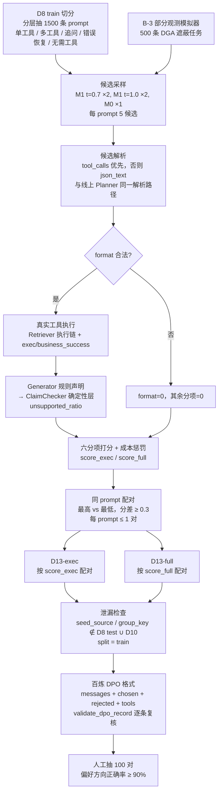

# 第 5 章素材：以验证信号为偏好的 Planner 优化（D-5）

> 本文件汇总主线三（D-1 ~ D-4）可直接进入论文第 5 章的素材：偏好构造流程图、打分函数定义表、消融设计说明、与相关工作的差异说明。所有已实现的口径均取自本仓库代码与数据卡片，引用位置见文末。**训练与对照数字（M1 / M4）依赖百炼平台执行，本文件在 D-3 / D-4 完成后补填第 5.6 节。**

## 5.1 问题定义

Planner 是诊断流程的第一个 LLM 节点，输入用户问题与对话历史，输出结构化计划 $\pi = (\text{intent}, \{(\text{tool}_j, \text{args}_j)\}_{j=1}^{n}, \text{ask})$：要调用哪些工具、用什么参数，或者不调用工具而向用户追问缺失信息。Planner 的错误会以两种形式向下游传播：其一是「无效调用」，工具选错、参数不合 Schema 或业务失败，浪费成本且引入噪声证据；其二是「无依据结论」，Planner 没有取到足够证据，Generator 只能靠参数化知识作答，被主线二的声明核查器判为 unsupported。

主线三的目标是把主线二产出的**验证信号**转回 Planner 的训练信号：对同一 prompt 采样多个候选计划，在真实工具环境执行并送入 Generator + ClaimChecker，用「候选计划最终能支撑多少声明」为其打分，再用偏好优化让 Planner 学会更少的无效调用与更少的无依据结论。

与仅用工具执行结果做奖励的方法（ToolRL、ARTIST）相比，本文的奖励多了一个下游维度：一个格式合法、参数正确、业务成功的调用，如果没有为最终诊断提供可核查的证据，仍不是好计划。

## 5.2 训练路线

| 阶段 | 模型 | 训练方式 | 数据 | 说明 |
|---|---|---|---|---|
| M0 | `qwen3-8b` 基座 | 无 | — | 对照：未微调 Planner，prompt 与 M1 一致 |
| M1 | M0 + LoRA | 百炼 `efficient_sft`，`n_epochs=3`、`batch_size=16`、`max_length=4096` | D8 train 3181 / dev 583（单轮 + 多轮合并，百炼 ChatML，`tool_calls` 风格） | SFT 基线；同时作为 D-2 候选采样器 |
| M4-exec | M1 + LoRA | 百炼 `dpo_lora`，`n_epochs=2`、`batch_size=16`、`max_length=4096`、`dpo_beta=0.1` | D13-exec | 偏好只来自执行信号（4 项） |
| M4-full | M1 + LoRA | 同上 | D13-full | 偏好加入验证信号（6 项 + 成本） |

基座选择 `qwen3-8b` 而非 v1 的 Qwen3-VL-8B：Planner 无视觉输入，且百炼对 `qwen3-8b` 同时开放 SFT 与 DPO LoRA，避免两阶段换基座。M1 与两个 M4 各跑 2 个 seed（百炼任务重复提交）取均值。

选 DPO 而非 GRPO 的原因：百炼平台只提供离线偏好优化接口，不开放在线 rollout 与自定义奖励函数；DPO 的偏好对可以在本地用真实工具环境与验证器离线构造，训练侧不需要环境交互。这一约束同时决定了本文的奖励是「构造偏好对时的打分函数」而非「训练时的在线奖励」。

## 5.3 偏好对构造流程（D-2）

流程要点：

- 候选来源混合 M1 两个温度与 M0，保证同一 prompt 内既有「接近金标」也有「明显偏离」的候选，配对分差才可能超过阈值。
- 候选执行走线上同一条 Retriever 执行链，`exec_success` 与 `business_success` 分离记录，与 D10 端到端评测口径一致。
- 声明忠实度分项复用主线二：候选轨迹送 Generator 生成规则声明，再由 ClaimChecker 确定性层核查，取 $1 - \text{unsupported\_ratio}$。整个打分链路零 LLM Token，可复现。
- 配对只取同 prompt 内的最高与最低候选，并要求分差 $\ge 0.3$，避免把「都差不多」的候选对送进 DPO 造成噪声；每 prompt 最多 1 对，避免同一 prompt 被重复放大。

## 5.4 打分函数定义

### 表 5-1 分项定义（`score_candidates.py`）

| 分项 | 取值 | 定义 | 依赖 | 属于 |
|---|---|---|---|---|
| `format` | {0, 1} | 候选可解析为合法计划：`steps` 为列表、`tool` 为字符串、`arguments` 为对象；不合法时其余分项全部为 0 | 解析器 | exec / full |
| `tool` | {0, 1} | 候选工具多重集与金标一致；金标为 ask_user / direct_answer 时候选须不调用工具 | 金标 | exec / full |
| `schema` | {0, 1} | 所有步骤通过 `validate_arguments_strict`；金标要求工具而候选为空记 0，金标无需工具而候选为空记 1 | 工具注册表 | exec / full |
| `business` | {0, 1} | 真实执行后所有调用 `business_success`；空计划的处理同 `schema` | 真实工具 | exec / full |
| `faith` | [0, 1] | $1 - \text{unsupported\_ratio}$，候选轨迹 → Generator 规则声明 → ClaimChecker；无声明记 0；空计划的处理同 `schema` | 主线二核查器 | full |
| `ask` | {0, 1} | 金标 ask_user 时候选须追问且命中缺失项（词面 / 2-gram Jaccard $\ge 0.3$）；金标非 ask_user 时候选不得追问 | 金标 `missing` | full |
| 成本惩罚 | $0.1 \times \max(0, n_{\text{cand}} - n_{\text{gold}})$ | 多余调用数线性惩罚 | 金标调用数 | full |

### 表 5-2 总分

$$
\text{score}_{\text{exec}} = \frac{1}{4}\left(\text{format} + \text{tool} + \text{schema} + \text{business}\right)
$$

$$
\text{score}_{\text{full}} = \max\!\left(0,\ \frac{1}{6}\left(\text{format} + \text{tool} + \text{schema} + \text{business} + \text{faith} + \text{ask}\right) - 0.1 \times \text{extra\_calls}\right)
$$

权重当前为等权（`WEIGHTS_EXEC` / `WEIGHTS_FULL` 可配），成本系数 `COST_PENALTY = 0.1`，配对阈值 `PAIR_MIN_GAP = 0.3`。等权是有意的保守选择：不预设「哪个信号更重要」，把「验证信号是否有用」交给 D13-exec 与 D13-full 的对照实验回答。

### 表 5-3 打分函数在金标扰动候选上的行为（管线验收，`--synthetic-demo --n 60 --seed 20260915`）

| 候选来源 | 构造方式 | 平均 `score_full` | 说明 |
|---|---|---|---|
| `gold` | D8 金标计划 | 1.000 | 上界 |
| `perturb:no_ask` | 金标为追问，候选直接回答 | 0.833 | 仅 `ask` 失分 |
| `perturb:bad_schema` | 参数改为非法类型 / 缺必填 | 0.667 | `schema`、`business` 失分 |
| `perturb:spurious_call` | 金标无需工具，候选调用一次 | 0.642 | `tool`、`ask`（部分）失分 + 成本 |
| `perturb:extra_calls` | 在金标上多加一次无关调用 | 0.606 | `tool` 失分 + 成本惩罚 |
| `perturb:wrong_tool` | 换成错误工具 | 0.533 | `tool`、`business`、`faith` 失分 |
| `perturb:bad_format` | 截断 JSON | 0.000 | 下界 |

七类候选的排序与工程直觉一致（不追问 > 参数错 > 多余调用 > 换错工具 > 格式坏），说明分项定义与权重没有把某类错误放大到不合理的程度。该实验只验证打分与配对管线，扰动候选不用于训练。

## 5.5 消融设计

### 5.5.1 偏好来源消融（核心）

| 组 | 训练数据 | 回答的问题 |
|---|---|---|
| M1 | D8 SFT | SFT 基线 |
| M4-exec | D13-exec（`score_exec` 配对） | 只用执行信号的 DPO 相对 SFT 的增益 |
| M4-full | D13-full（`score_full` 配对） | 加入验证信号后相对 M4-exec 的额外增益 |

两份 D13 来自**同一批候选、同一次执行**，只有打分键不同，因此差异只能归因于 `faith`、`ask` 与成本三个分项。D-2 demo 已观察到二者的结构性差异：追问类 prompt 在 `score_exec` 下五个候选无分差（都不调用工具、都没有业务结果），只在 `score_full` 下由 `ask` 分项拉开，因此 D13-full 比 D13-exec 多出一批追问偏好对（demo 中 60 对 vs 50 对）。这意味着 M4-exec 在追问场景上等价于 M1，M4-full 相对 M4-exec 在追问正确率上的差异是验证信号价值的直接证据。

### 5.5.2 评测维度

离线（D8 test，`eval_planner_offline.py`）：7 项指标 × 8 类别，新增追问推荐一致率（与 B-2 EIG 推荐列表比对）与平均调用次数。

端到端（D10，`eval_system_modes.py` mode4 配置替换 Planner）：任务成功率四要素、无依据结论率（ClaimChecker 首轮）、约束违反率、平均工具调用次数。mode4 与 mode5 的差异只有 Planner，是主线三在完整系统中的净贡献；`mode5 --validator-mode off` 则分离 DPO Planner 与声明验证的贡献。

### 5.5.3 预期结论与判读规则

- M4-full 相对 M1 在「无依据结论率」与「平均调用次数」两项上有改善，才能说验证信号驯化了 Planner；只在传统 7 项上改善不足以支持本章论点。
- M4-full 相对 M4-exec 有改善，说明 `faith` / `ask` / 成本三项带来的偏好方向与只看执行结果不同且更有用；若二者无差异，则如实报告「在本任务规模下验证信号未提供额外偏好信息」，并分析 D13-full 与 D13-exec 的配对重叠率。
- 监控「DPO 变平庸」：不必要调用率下降的同时追问正确率与动作正确率不能下降；`dpo_beta = 0.1` 起步，若出现过度保守（少调用、多追问），报告 $\beta$ 敏感性。

## 5.6 与相关工作的差异

### 表 5-4 对照

| 维度 | ToolRL（Qian et al., 2025） | ARTIST（Singh et al., 2025） | Deep-DxSearch（Zheng et al., 2025） | 本文 |
|---|---|---|---|---|
| 优化算法 | GRPO（也验证 PPO），冷启动无 SFT | GRPO，outcome-based | GRPO（verl） | SFT → DPO 两阶段，离线偏好对 |
| 奖励 / 偏好信号 | 格式 + 正确性，正确性细分为工具名 Jaccard、参数名重合、参数值精确匹配 | 最终答案正确 + 格式 + 工具执行成功率（成功调用 / 总调用） | 格式、检索质量、推理结构、诊断准确率四维「软可验证奖励」 | 格式、工具一致、Schema、业务成功、**下游声明忠实度**、**追问命中**、调用成本 |
| 信号来源 | 与金标调用比对 | 最终答案 + 执行器 | 金标诊断 + 检索命中 | 金标 + 真实执行器 + **主线二 ClaimChecker** |
| 是否看下游生成 | 否 | 看最终答案对错 | 看诊断对错 | 看生成的声明能否被本轮证据支撑（不要求诊断对错，只要求有据） |
| 工具环境 | 通用 API / 搜索 / 计算 | Python 解释器、API | 三类医学检索（指南 / 病例 / 文献） | 五种异构工具：贝叶斯归因、油温预测、异常检测、知识库、图谱 |
| 追问动作 | 无 | 无 | 无 | ask_user 为一等动作，追问命中缺失项计入偏好 |
| 训练基础设施 | 自建 RL | 自建 RL | verl + SGLang | 百炼托管 SFT / DPO，本地只做数据构造 |

### 差异说明（可直接改写入论文）

第一，ToolRL 与 ARTIST 证明了工具调用训练从 SFT 转向 RL 的收益（ToolRL 相对 SFT 提升 15 个点；ARTIST 在 BFCL v3 最难子集提升最高 16 个点），其奖励都定义在「调用本身」：调用是否合法、是否与金标一致、执行是否成功、最终答案是否正确。本文保留了这一层（`format` / `tool` / `schema` / `business`），并额外引入了**下游可核查性**：候选计划取回的证据送入 Generator 后，由主线二的声明核查器判断有多少声明无依据。这一分项衡量的是「计划为最终诊断提供了多少可核查证据」，与「调用是否成功」正交。D13-exec 与 D13-full 的对照直接检验这一分项是否提供了执行信号之外的偏好信息。

第二，Deep-DxSearch 与本文同属诊断场景的智能体训练，其「检索质量」奖励要求检索结果命中金标诊断，本质上仍以诊断正确性为锚。本文的 `faith` 分项不以诊断对错为锚，而以「结论是否有据」为锚：一个诊断可以正确但无据（靠参数化知识猜对），也可以有据但保守（只给出证据支持的部分结论），后者在电力运维中更可取。此外，Deep-DxSearch 的动作空间是四种检索加诊断，没有「向用户追问」；本文把 ask_user 作为一等动作，并用 B-2 的 EIG 推荐列表与金标缺失项判定追问是否命中，使「该问不问」与「不该问乱问」都进入偏好。

第三，三者都用 GRPO 在线训练，本文用 DPO 离线优化。这是平台约束下的选择：百炼不开放在线 rollout 与自定义奖励函数，但离线偏好对可以在本地用真实工具环境与验证器构造。代价是无法像 GRPO 那样在训练中持续探索；收益是训练与数据构造解耦，偏好对可人工复核（D-2 要求抽 100 对方向正确率不低于 90%），并且同一批候选可以按不同打分键导出多份数据做严格的来源消融。

## 5.7 实验数字（D-3 / D-4 完成后补填）

| 指标 | M0 | M1 | M4-exec | M4-full |
|---|---:|---:|---:|---:|
| 工具选择准确率（D8 test） | | | | |
| 参数准确率 | | | | |
| 追问正确率 | | | | |
| 追问推荐一致率（B-2） | | | | |
| 不必要调用率 | | | | |
| 平均调用次数 | | | | |
| 端到端任务成功率（D10，mode4 配置） | | | | |
| 无依据结论率 | | | | |
| 约束违反率 | | | | |

数据侧已确定：D13-exec / D13-full 有效偏好对数、平均分差、人工复核方向正确率、泄漏 0（demo 管线验收见 [DATA_CARD.md](/Users/ts/Desktop/thu/multi_Agent/data/planner/dpo/DATA_CARD.md)；正式数字待 M1 部署后候选生成）。

## 5.8 素材来源

- 打分、配对、导出、泄漏检查：[score_candidates.py](/Users/ts/Desktop/thu/multi_Agent/scripts/planner_data/score_candidates.py)；自检：[test_d2_preference_pairs.py](/Users/ts/Desktop/thu/multi_Agent/tests/test_d2_preference_pairs.py)
- 百炼训练封装与超参：[submit_job.py](/Users/ts/Desktop/thu/multi_Agent/training/planner_bailian/submit_job.py)、[README.md](/Users/ts/Desktop/thu/multi_Agent/training/planner_bailian/README.md)
- SFT 数据格式与封存：[bailian_format.py](/Users/ts/Desktop/thu/multi_Agent/scripts/planner_data/bailian_format.py)、[SEALED.md](/Users/ts/Desktop/thu/multi_Agent/data/planner/sft/SEALED.md)
- D13 数据卡片：[DATA_CARD.md](/Users/ts/Desktop/thu/multi_Agent/data/planner/dpo/DATA_CARD.md)；demo 汇总：[summary_demo.json](/Users/ts/Desktop/thu/multi_Agent/data/planner/dpo/summary_demo.json)
- 声明核查器（`faith` 分项依赖）：[claim_checker.py](/Users/ts/Desktop/thu/multi_Agent/src/agents/claim_checker.py)；第 4 章素材：[chapter4_claim_verification_material.md](/Users/ts/Desktop/thu/multi_Agent/docs/chapter4_claim_verification_material.md)
- 相关工作：Qian C. et al. ToolRL: Reward is All Tool Learning Needs. arXiv:2504.13958（NeurIPS 2025）；Singh J. et al. Agentic Reasoning and Tool Integration for LLMs via Reinforcement Learning (ARTIST). arXiv:2505.01441；Zheng Q. et al. End-to-End Agentic RAG System Training for Traceable Diagnostic Reasoning (Deep-DxSearch). arXiv:2508.15746
