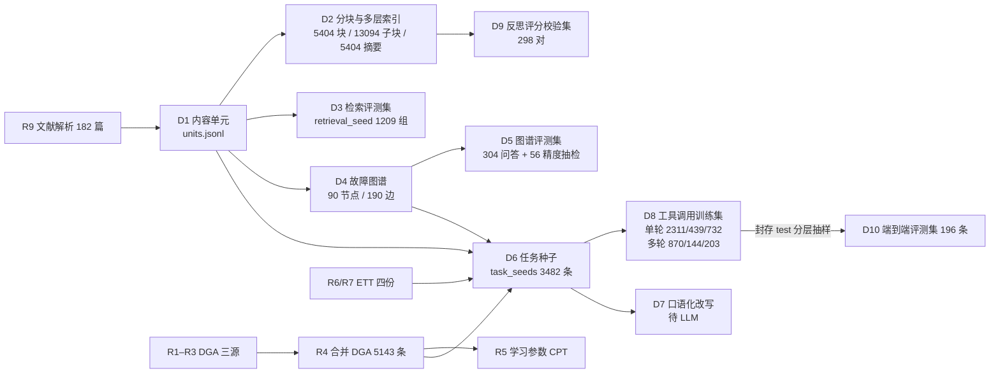
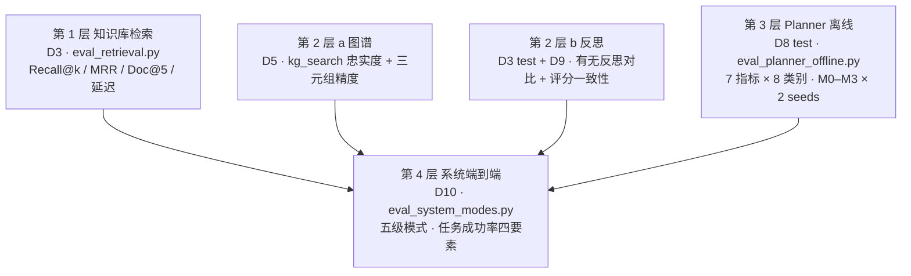

# 数据来源与评测体系

> 更新日期：2026-09-15
> 本文是论文「实验设置」章节的底稿：第一部分说明每份数据从哪里来、怎么派生、允许扮演什么角色；第二部分说明评测分几层、每个指标怎么算、样本口径如何限定。所有数字取自当前仓库产物，尚未产出的正式数字标注「待跑」。
> 相关文件：[data_inventory.md](data_inventory.md)（原始数据盘点）、`data/planner/sft/DATA_CARD.md`、`data/eval/d10/DATA_CARD.md`、[planner_training.md](planner_training.md)。

---

## 第一部分 数据来源

### 1.1 原始数据（一级来源）

| 编号 | 数据 | 规模 | 来源与许可 | 在系统中的角色 |
|---|---|---:|---|---|
| R1 | `data/dga/dga_dataset.csv` | 4150 行 | 来源未核实的 IEC 60599 标签 DGA 汇编（五气体、PD/D1/D2/T1/T2/T3 六类）。早期记为 Kaggle，经核对与 Kaggle 上的公开变压器数据集字段不符，论文中不写作 Kaggle | 贝叶斯故障归因参数学习；评测标签（气体 → IEC 故障性质） |
| R2 / R3 | `data/dga/data.xlsx`、`dataset_(589).xlsx` | 2321 / 589 行 | GitHub `alan-456/transformer-fault-dataset`，由数据库、多篇中国高校学位论文及部分电网数据汇编；R3（589 条）为 2024–2026 年多篇论文采用的公开基准，已有文献报告其含少量重复与跨标签冲突。仓库未声明许可，学术引用范围内使用 | 同 R1；R3 可单列为「589 公开基准子集」报告与文献可比结果 |
| R6 / R7 | `data/ETT-small/ETTh1/h2/m1/m2.csv` | 各 17420 / 69680 行 | ETDataset（Zhou et al., Informer, AAAI 2021），北航与北京国网富达合作采集，两站 2016-07 至 2018-07 油温与负载。许可 CC BY-ND 4.0（以原仓库 LICENSE 为准；HuggingFace 镜像标注 CC BY 4.0，以原仓库为准并脚注说明） | `ett_forecast` 执行环境；未来真实油温作为评测标签；任务种子 |
| R9 | `data/fast_md/*/` | 182 个 MinerU 解析目录 | 中文期刊 / 学位论文 PDF，学术引用范围 | 知识库入库源；图谱抽取源；事实类任务种子 |
| R10 / R11 | `data/ele_trans/*.pdf`、`data/manuals/*.pdf` | 31 + 2 份 | 原始 PDF 与 ABB / Siemens 公开手册 | 知识源备份 |
| R8 | `data/external_transformer/power_transformer_fault.csv` | 1866 行 / 106 台 | 来源未记录，公开数据站点检索未匹配 | 未核实前不进入任何训练 / 评测集；固化前仍无法核实则移除 |

DGA 标签可信度声明（论文实验设置须写明）：R1–R3 的 IEC 故障标签均为文献汇编标签，多数由文献作者据事后检修给出，本研究无法逐条追溯原始检修记录；三源合并去重后 7060 → 5143 条（约 27% 重复），且无设备身份字段，因此本研究不做设备维度的泛化测试。校准结果建议另在来源清晰的 IEC TC 10 案例库（IEEE DataPort，Enwen Li，DOI 10.21227/h8g0-8z59）上做外部检验。

合成数据 `data/synthetic/`（3000 条 DGA、20 台时序、200 条案例、120 条旧评测集）只用于流程回归与前端演示，由 `src/utils/data_guard.py` 的 `assert_not_synthetic` 强制阻止进入评测集与训练集。

### 1.2 派生数据谱系（D1–D10）

| 编号 | 文件 | 规模 | 生成脚本 | 生成方式 | 用途 | 状态 |
|---|---|---:|---|---|---|---|
| R4 | `data/real/dga/dga_records.jsonl` | 5143 | `scripts/convert_real_dga.py` | R1–R3 合并去重，保留 `raw_label`（IEC）与工程映射 `fault_type` | 执行环境、评测标签、数值任务种子 | 完成 |
| R5 | `data/real/dga/learned_params.json` | 8 类先验 + CPT | `scripts/learn_cpt.py` | 从 R4 学习 | `FAULT_ATTR_PARAMS` | 完成 |
| D1 | `data/kb/units.jsonl` | 随 R9 | `scripts/kb/build_units.py` | `content_list_v2.json` 转统一单元，过滤页眉页脚目录参考文献约 5300 个噪声单元 | 分块源、图谱抽取源 | 完成；文档级去重、图片描述待 LLM |
| D2 | `data/kb/chunks.jsonl`、`data/kb/index/` | 5404 块、13094 子块、5404 抽取式摘要 | `build_chunks.py` → `build_index.py` | 动态规划分块 α=0.5（target 400 / max 700 / min 120），子块按句切 100–150 token，摘要为规则抽取 | `rag_search` 两路检索 | 完成；LLM 摘要、稠密向量、重排器待接口 |
| D3 | `data/kb/eval/retrieval_seed.jsonl` | 1209 组（test 264） | `build_retrieval_evalset.py` | 三类查询：A_title 章节标题、B_caption 图表题注、C_definition 定义句；金标为 `source_unit_id` | Recall@k、分块与检索消融 | 完成；LLM 自然问句改写待接口 |
| D4 | `data/kg/graph.json` | 90 节点 / 190 边 | `scripts/kg/extract_rules.py` → `build_graph.py` | 8 实体 / 9 关系 schema（[kg_schema.md](kg_schema.md)），显式因果触发词规则抽取，每条边带 `source_unit_id` 与原文片段 | `kg_search`、推理类任务种子 | 完成；LLM 抽取 1677 候选句待接口 |
| D5 | `data/kg/eval/` | 304 问答 + 56 精度抽检 | `build_kg_eval.py` | 从图谱边生成一跳 / 二跳问答，正式名与别名两种问法；56 条三元组人工精度抽检（AI 预标注） | 图谱忠实度、三元组精度 | 完成；人工 label 待填 |
| D9 | `data/kb/eval/reflection/d9_pairs.jsonl` | 298 对 | `build_reflection_evalset.py --n 300` | D3 查询 × 检索命中块（含金标与非金标）配对 | 评分器与人工分一致性 | 完成；`human_score` 待填 |
| D6 | `data/planner/seeds/task_seeds.jsonl` | 3482 | `scripts/planner_data/build_task_seeds.py --execute` | 六类：fact（D1 块）、reasoning（D4 实体对）、numeric_tool（R4 / R6 / R7 记录）、no_tool、insufficient、composite；金标动作在真实工具环境执行，失败样本剔除 | D8 / D10 的源 | 完成；口语化改写待 LLM |
| D6-多轮 | `data/planner/seeds/multi_turn_seeds.jsonl` | 1217 决策点 | `build_multi_turn.py` | composite_2step、single_then_finish、error_recovery（ett_bad_dataset / ett_bad_range / kg_colloquial_to_std / ts_unrecoverable_ask），工具返回全部真实执行 | 多轮与错误恢复训练 | 完成 |
| D8 | `data/planner/sft/swift_*.jsonl` 等 | 单轮 2311 / 439 / 732；多轮 870 / 144 / 203 | `export_sft.py` | 按 `group_key` 分组切分 70 / 10 / 20，跨集相似度 > 0.9 为 0 对；导出 ms-swift、LLaMA-Factory、JSON 文本三格式；错误恢复的刻意错误首调不作训练目标 | Planner LoRA 训练与离线评测 | 完成；改写后需重导出 |
| D7 | `data/planner/seeds/task_seeds_rewritten.jsonl` | 目标 2750 × 2 | `rewrite_queries.py` | LLM 口语化改写，守卫保证数字 / 实体不变 | 提升训练问法多样性 | 待跑（约 1.2 元） |
| D10 | `data/eval/d10/end2end_eval.jsonl` | 196（71 group_key） | `scripts/eval/build_d10.py` | 仅从 D8 封存 test 分层抽样，8 场景 23 子类，标注必要动作、关键参数、期望证据来源、参考要点 | 五级系统模式端到端评测 | 完成；`reference_points` 人工复核待做 |

### 1.3 数据角色隔离规则

- 训练监督只来自 D8 的 train / dev；test 封存，训练结束前不读取。
- 评测集只从真实来源派生：D3 / D5 / D9 来自文献，D10 来自 D8 test；合成数据一律不进。
- 同一 `group_key`（来源块 / 实体对 / DGA 记录 / ETT 片段）派生的样本只出现在一个切分；ETTh 与 ETTm 疑似同源，按同组处理。
- DGA 评测标签使用 `raw_label`（IEC 性质），不使用工程映射的 `fault_type`；CO / CO2 为 0 填充不作证据。
- fact 类任务的金标块允许存在于知识库中（这是检索任务的定义），但 Planner 训练样本的 assistant 输出只含工具调用与规划，不含答案正文，避免把知识库内容当训练目标。

### 1.4 已知偏差（写论文时须声明）

- 训练与评测的问法目前为模板生成，口语化改写未执行，对 Planner 指标偏乐观。
- DGA 三源标签分布不均（过载过热 / 正常偏多）；`device_id` 为循环生成，不能做设备维度分析。
- 图谱由规则抽取，覆盖有限（90 节点），推理类样本受此约束。
- ETT 负载特征单位未知，预测模型为线性回归，仅用于工具调用行为研究。
- 文献存在重复与 MinerU 解析噪声，图片 956 张仅有路径、表格 627 张无标题。

---

## 第二部分 评测体系

评测分四层，由内向外：知识库检索 → 图谱与反思 → Planner 工具调用（离线）→ 系统端到端。每层有独立评测集、独立脚本、独立报告，避免用同一份数据既调参又报结果。

### 2.1 第 1 层：知识库检索（P1）

评测集 D3 test 264 组；脚本 `scripts/kb/eval_retrieval.py --ablation`、`ablation_chunking.py`；报告 [kb_ablation_test.md](kb_ablation_test.md)。

| 指标 | 定义 |
|---|---|
| Recall@k（k = 1, 3, 5, 10） | 金标 `source_unit_id` 所在块出现在前 k 个结果的查询比例；重叠分块时任一含金标单元的块命中即算 |
| MRR | 金标块首次出现位置倒数的均值 |
| Doc@5 | 前 5 个结果中含金标文档的比例（文档级宽松口径） |
| 平均延迟 | 单次检索毫秒数 |
| 索引体积 | 块数、长度 p50 / p90、索引 token 数 |

消融维度：分块方式（标题 / 固定窗口 512-128 / 动态规划 α ∈ {0.3, 0.5, 0.7}）× 检索方式（bm25_only / naive / two_way / two_way_rerank）。RRF 权重只在 dev 144 条上网格搜索，test 上报告。当前离线结果：two_way 相对 bm25_only R@5 0.674 → 0.742。

### 2.2 第 2 层 a：故障图谱（P2）

评测集 D5；脚本 `scripts/kg/build_kg_eval.py`；报告 `data/kg/eval/report.md`。

| 指标 | 定义 | 当前 |
|---|---|---|
| HitAny / HitAll | `kg_search` 返回链路中包含任一 / 全部期望实体的比例，按关系类型、切分、问法（正式名 / 别名）分组 | HitAll 100%（304 条，工具对图谱忠实） |
| 三元组精度 | 56 条人工抽检，correct / 已标注；严格口径 unsure 计错，宽松口径 unsure 计对 | 83.0% / 95.7%（AI 预标注，人工 label 待填） |
| 负样本拒答率 | 不可串联实体对上返回"无关联"的比例 | 待 LLM 生成负样本 |
| 对比胜率 | 与朴素文本块检索、LightRAG 在信息丰富性 / 相关性 / 逻辑合理性上的两两胜率，LLM 裁判 + 10% 人工复核 | 待跑 |

### 2.2 第 2 层 b：反思模块（P3）

评测集 D3 test 264 条与 D9 298 对；脚本 `scripts/kb/eval_reflection_recall.py`、`build_reflection_evalset.py --eval-only`；报告 [reflection_eval.md](reflection_eval.md)。

| 指标 | 定义 | 当前（LexicalScorer） |
|---|---|---|
| 有 / 无反思 Recall | 反思输出块集合中含金标的比例，对比 `top_k=5` 基线 | 0.746 → 0.765 |
| 有 / 无反思精度 | 输出块中金标占比 | 0.177 → 0.271 |
| 金标误丢 | 基线命中但被反思丢弃的条数，硬约束为 0 | 0 |
| 补召回增益 | 邻块补召回新增的金标命中数 | 5 |
| 平均输出块 / 全丢次数 / 改写次数 / 耗时 | 成本与行为统计 | 5.28 / 1 / 2 / 6.2 ms |
| 评分一致性 | LLMScorer 0–3 分与人工 `human_score` 的一致率与加权 Kappa，验收线 Kappa ≥ 0.6 | 待人工分 |

阈值 `min_keep` 与 t2 / t3 用 D9 混淆矩阵校准，以金标误丢为 0 作硬约束。

### 2.3 第 3 层：Planner 工具调用离线评测（P5）

评测集 D8 封存 test（单轮 732 + 多轮 203 = 935 条，另含 16 条 error_recovery decision_index 0 仅作上下文）；预测脚本 `training/planner_sft/predict.py`；评测脚本 `scripts/eval/eval_planner_offline.py --write-report`；报告 [planner_eval.md](planner_eval.md)。

| 指标 | 定义 | 计入样本 |
|---|---|---|
| 格式合法率 | 输出可解析为 hermes `<tool_call>` 标签、JSON 文本规划或纯文本三者之一 | 全部 |
| 工具选择正确率 | 预测调用的工具名多重集合与金标一致（顺序无关） | 全部 |
| 参数正确率 | 每个调用的参数与金标一致：`query` 词法重合 ≥ 0.5，数值容差 1e-6，其余精确匹配 | 只算有金标调用的样本 |
| 完整调用率 | 格式合法 ∧ 工具正确 ∧ 参数正确 ∧ 通过 `validate_arguments_strict` Schema 校验 | 只算有金标调用的样本 |
| 不必要调用率 | 金标为不调用（no_tool / insufficient）但预测发起了调用 | 只算金标无调用的样本 |
| 追问正确率 | 不调用工具且回复含追问措辞 | 只算 insufficient 与 ts_unrecoverable_ask |
| 错误恢复成功率 | 工具返回业务错误后，下一决策点工具与参数均正确 | 只算 error_recovery 且 decision_index ≥ 1 |

分 8 类别报告：fact / reasoning / numeric_tool / no_tool / insufficient / composite / multi_turn / error_recovery。对照矩阵 M0 未微调基座、M1 普通 LoRA-SFT、M2 结构加权、M3 结构 + 领域加权，每组 seeds 42 / 2026 取均值。金标自检（`--self-test`）7 项 100%、不必要调用 0%，证明评分口径与数据一致。建议追加 M3-random（等量随机词表升权）排除"任何升权都有效"的解释。

### 2.4 第 4 层：系统端到端评测（P6）

评测集 D10 196 条；脚本 `scripts/eval/eval_system_modes.py --modes all --judge llm`；报告 [end2end_eval.md](end2end_eval.md)。

五级模式：mode1 无 RAG（仅数值工具）→ mode2 朴素 RAG（单路 BM25）→ mode3 + 微调 Planner 与两路检索 → mode4 + 图谱 → mode5 + 反思。每级只比上一级多开一个能力，`allowed_tools` 同时约束 Planner 提示词与 Retriever 执行守卫，越权调用记 `tool_disabled` 并计入不必要调用。

| 指标 | 定义 |
|---|---|
| 任务成功率 | 动作正确 ∧ 关键参数正确 ∧ 工具结果有效 ∧ 答案忠实于证据，四项同时满足 |
| 动作正确 | `required_actions` 中必要工具全部被调用；ask_user / direct_answer 样本不得调用工具，ask_user 还需回复含追问措辞 |
| 关键参数正确 | 只比对 D10 `key_params`；`query` 词法重合 ≥ 0.5，`dga_data` 容差 1e-6，`relations` 集合相等 |
| 工具结果有效 | 被调用工具 `exec_success ∧ business_success` |
| 证据忠实度（0–1） | 正式口径为 LLM 裁判判定答案是否被检索块 / 图谱链路 / 工具返回支持，抽 10% 人工复核报告一致率；离线代理为证据锚点词面匹配，仅用于流程校验 |
| 追问正确率 / 错误恢复成功率 | 同第 3 层口径，分别只算 ask_user 与 error_recovery 场景 |
| 平均工具调用次数 / 不必要调用率 | 不必要 = 非必要调用次数 / 总调用次数，含 tool_disabled |
| 平均延迟 / 平均 Token | 单任务秒数；`src.utils.llm.USAGE` 累计 prompt + completion |

分 8 场景报告：single_tool_fact 40 / single_tool_numeric 40 / multi_tool 30 / kg_reasoning 30 / ask_user 17 / error_recovery 16 / no_tool 15 / context_contrast 8。OraclePlanner（金标当预测）校验评分链路：task_success 88.8%，param_acc 100%，tool_result_valid 100%，未到 100% 的部分来自离线忠实度代理的词面偏差。

### 2.5 基线与对照关系

| 对照 | 回答的问题 | 数据 | 层 |
|---|---|---|---|
| `baseline-v0` vs `v1-final` | 整个优化前后 | D3 200 条临时集、50 条手工任务、30 条端到端 | 1 / 3 / 4 |
| bm25_only → two_way → +rerank | 检索方式贡献 | D3 test | 1 |
| 标题 / 固定窗口 / DP α 网格 | 分块方式贡献 | D3 test | 1 |
| 无反思 → LexicalScorer → LLMScorer | 反思贡献与评分器质量 | D3 test + D9 | 2b |
| M0 → M1 → M2 → M3（→ M3-random） | 微调与加权损失贡献 | D8 test | 3 |
| mode1 → mode5 | 每个模块的端到端增量 | D10 | 4 |
| `--planner-mode baseline` 覆盖 mode3–5 | 微调 Planner 在完整系统中的净贡献 | D10 | 4 |

### 2.6 评测纪律

- 每个评测脚本先用金标作预测跑自检，自检不到 100% 先修数据或口径，再跑模型。
- 任何 LLM 裁判结果必须附 10% 人工复核的一致率；裁判模型与被评模型不同（裁判用 `qwen3.7-flash`，被评 Planner 为 Qwen3-VL-8B LoRA）。
- 参数调优（RRF 权重、反思阈值、早停）只看 dev；test 与 D10 只在最终报告读取一次。
- 报告中每个数字标注评测集版本、切分、样本数与运行日期；离线代理指标与 LLM 裁判指标分列，不混报。

### 2.7 待产出的正式数字

| 报告 | 缺什么 | 依赖 |
|---|---|---|
| `docs/baseline.md` | P0-3 三组基线 | LLM 调用 |
| `docs/kb_ablation_test.md` | 稠密向量通道、Qwen3-Reranker、自然问句版 D3 | embedding 接口、GPU |
| `data/kg/eval/report.md` | 人工 label、负样本、LightRAG 对比胜率 | 人工 + LLM |
| `docs/reflection_eval.md` | LLMScorer 版本、Kappa | 人工 `human_score` + LLM |
| `docs/planner_eval.md` | M0–M3 × 2 seeds | 魔搭 A10 训练 + 百炼部署 |
| `docs/end2end_eval.md` | 五级模式正式数字、LLM 裁判、10% 人工复核 | 微调 Planner 部署 + LLM |
