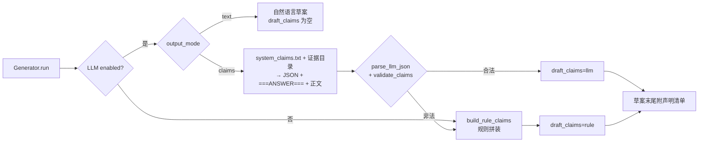
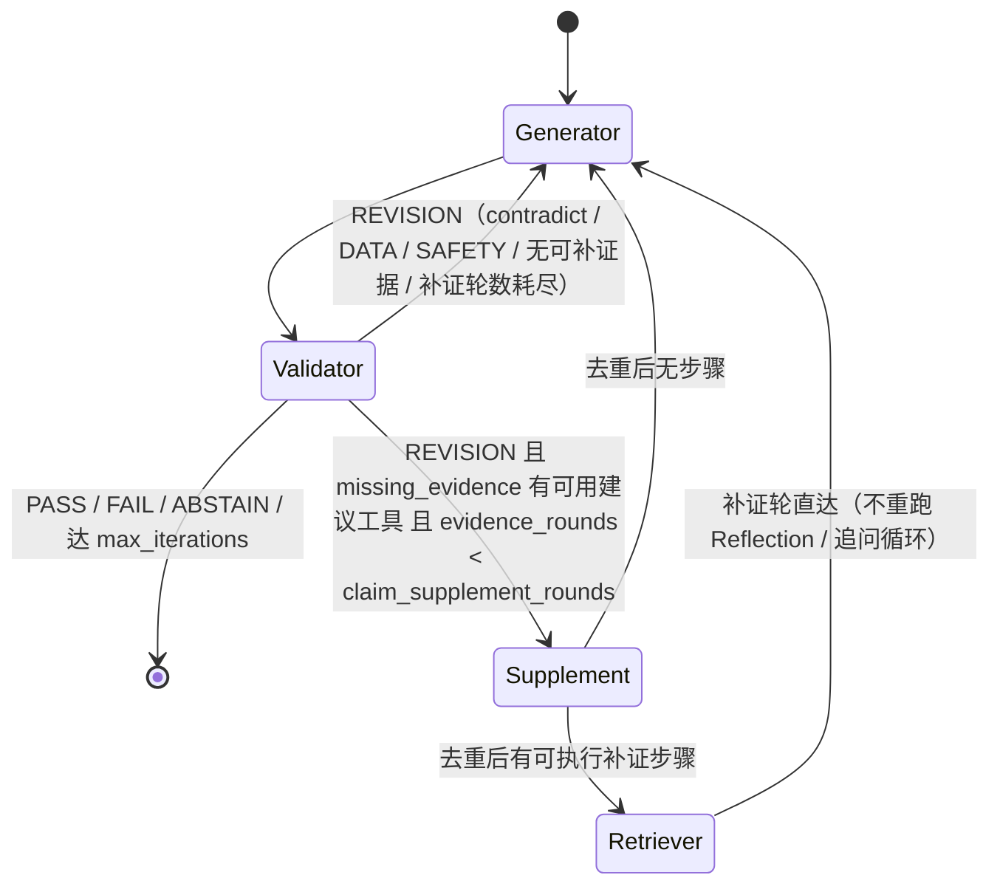

# 声明与证据输出规范（Claim Schema v1）

> C-1 产出。Generator 在 `workflow.generator_output_mode = claims` 下先输出 JSON 声明列表再渲染自然语言草案；LLM 不可用或 JSON 非法时由 [claims.py](../../src/agents/claims.py) 的 `build_rule_claims` 按工具结果规则拼装，链路不断。声明存于 `AgentState.draft_claims`，供 C-2 约束核查器逐条核对。

## 1. Schema

```json
{
  "claims": [
    {
      "id": "c1",
      "text": "一句可独立核对的陈述",
      "type": "observation | inference | recommendation | safety",
      "evidence": [
        {"source": "tool | kb | kg | user", "ref": "<见 §2>", "span": "证据原文片段（≤300 字符）"}
      ]
    }
  ]
}
```

字段约束：

| 字段 | 类型 | 约束 |
|---|---|---|
| `id` | string | 同一草案内唯一，建议 `c1, c2, …` |
| `text` | string | 非空；一条声明只陈述一个可核对的事实或建议 |
| `type` | enum | 见 §3 |
| `evidence` | array | 至少 1 条 |
| `evidence[].source` | enum | `tool` / `kb` / `kg` / `user` |
| `evidence[].ref` | string | 与 `source` 前缀匹配，见 §2 |
| `evidence[].span` | string | 非空；必须是被引用证据的原文片段（可截断、不可改写） |

校验函数：`validate_claims(obj, known_refs) -> (ok, errors, normalized)`。`ok` 为真当且仅当结构合法且每条 claim 至少一条 evidence；`ref` 不在本轮证据目录时记 `[warning]`，不影响 `ok`（由 C-2 的 EVIDENCE 约束判违反）。

## 2. 引用（ref）规范

| source | ref 格式 | 指向 | 备注 |
|---|---|---|---|
| `tool` | `call:<call_index>` | `state.tool_calls[i]`（Retriever 记录，追问循环中跨轮连续） | 可附 `tool`、`call_id` 字段便于追溯 |
| `kb` | `kb:<chunk_id>` | `state.retrieved_knowledge[*].chunk_id`（Milvus 版为 `id` / `child.id`） | 无 id 时回退 `kb:<path>` 或 `kb:#<序号>` |
| `kg` | `kg:<path>` | `kg_search` 返回 `paths[*].path`（如 `过热 → 产生 → C2H4`） | `span` 取该 path 的 `evidence` 原句 |
| `user` | `user:<round>` | `0` = 原始提问；`n` = 第 n 轮追问回答（`inquiry_log[round=n]`） | |

证据目录由 `evidence_catalog(state)` 枚举，claims 模式下随用户消息附给 LLM（`render_evidence_catalog`），LLM 只能从目录中选 ref。

## 3. 声明类型

| type | 含义 | 证据要求 |
|---|---|---|
| `observation` | 直接复述工具输出或用户提供的事实：气体浓度、概率、预测值、异常点数、用户确认的征兆 | 数值与证据完全一致、保留单位 |
| `inference` | 由观测推出的判断：主要故障类型、置信等级、因果解释 | 引用支撑其观测的证据（工具结果或图谱关系） |
| `recommendation` | 检测 / 处理建议 | 引用知识库片段、图谱关系或工具结果 |
| `safety` | 涉及停电、吊罩、更换、退出运行等高风险处置 | 必须同时引用支撑该处置的检测结果（如高乙炔、高概率放电） |

## 4. 约束类型（C-2 核查依据）

### DATA：声明数值与工具输出不一致、单位错误、比值编码错误

正例（合规）：
1. 「C2H2 = 12.5 ppm」，`call:0` 入参 `dga_data.C2H2 = 12.5` —— 数值、单位一致。
2. 「主要故障低温过热后验概率 63.2%」，`call:0` 结果 `primary_probability = 0.632` —— 百分比换算正确。
3. 「未来 24 步油温预测均值 31.8℃」，`call:2` 结果 `horizon = 24, forecast.mean_predicted_ot = 31.8` —— 步数与数值均一致。

反例（违反）：
1. 「C2H2 = 125 ppm」，工具入参 `C2H2 = 12.5` —— 数值篡改（量级错误）。
2. 「低温过热概率 63.2%，高温过热 21.0%」，工具结果两者概率互换 —— 概率错位。
3. 「三比值编码 1-0-2」，工具 `matched_rules` 为 `0-2-1` —— 比值编码错误。

### EVIDENCE：引用不存在、片段不含该内容、历史案例冒充当前检测

正例：
1. `ref = kb:chunk_7f3a`，该 chunk 在 `state.retrieved_knowledge` 中存在且 `span` 为其子串。
2. `ref = kg:过热 → 产生 → C2H4`，`kg_search` 返回 `paths` 中含该 path，`span` 为其 `evidence` 原句。
3. `ref = user:1`，`inquiry_log` 第 1 轮 `symptom = partial_discharge_alarm, answer = True`，`span = "partial_discharge_alarm=有"`。

反例：
1. `ref = call:9`，但本轮只有 3 次工具调用 —— 引用不存在。
2. `ref = kb:chunk_7f3a`，`span = "乙炔超过 5 ppm 应立即停电"`，而该 chunk 原文无此句 —— 片段不含该内容。
3. 「本次检测 C2H2 = 48 ppm」引用 `kb:chunk_case_12`（历史案例文献）而非 `call:0` —— 历史案例冒充当前检测。

### APPLICABILITY：证据设备 / 数据集 / 时间窗与当前任务不匹配

正例：
1. 「基于 ETTh1 数据集回看 96 点预测 24 步」，`call:2` 入参 `dataset = ETTh1, lookback = 96, horizon = 24`。
2. 「#2 主变 DGA 显示…」，`user:0` 用户提问即为 #2 主变，`call:0` 结果亦针对该次输入。
3. 「图谱关系链适用于油浸式变压器过热故障」，`kg` path 实体类型为 `fault:过热`，与当前主要故障一致。

反例：
1. 「基于 ETTm1 数据集预测」，工具入参 `dataset = ETTh1` —— 数据集错位。
2. 「#1 主变油温预测…」，用户问题与工具入参均为 #2 主变 —— 设备号错位。
3. 「过去 7 天油温均值 45℃」，工具回看窗口为 96 点小时级数据（4 天） —— 时间窗不匹配。

### SAFETY：处置建议缺少前提条件、与检测结果矛盾

正例：
1. 「建议申请停电吊罩检查」，同时引用 `call:0` 的 `primary_fault = 高能放电, probability = 0.81` 与 `dga_data.C2H2 = 48`。
2. 「建议缩短 DGA 取样周期至 1 周并跟踪趋势」，引用 `call:0` 的低温过热概率 0.63（中风险，不要求停电）。
3. 「停电检修前须执行工作票、验电、接地」，与「建议停电」的 safety 声明同源引用。

反例：
1. 「建议立即停电吊罩」，无任何 observation 支撑（`evidence` 仅引用 `user:0`） —— 缺前提。
2. 「建议立即停电」，而 `call:0` 结果主要故障为「正常」概率 0.85 —— 与检测结果矛盾。
3. 「可继续运行，无需处理」，而 `call:0` 显示 `arc_discharge` 概率 0.78、C2H2 = 120 ppm —— 与检测结果矛盾（漏报高风险）。

## 5. 产出路径



规则拼装覆盖的证据源与产出：

| 工具 / 来源 | observation | inference | recommendation | safety |
|---|---|---|---|---|
| `fault_attribution` | DGA 入参、特征解释、三比值编码、规则命中、负观测 | 主要故障 + 置信等级、前三排序、不确定性 | | 主要故障高危且概率 ≥ 0.4 时产出，双引用（归因结果 + DGA 入参） |
| `inquiry_log` | 每轮用户回答（`user:n`） | | | |
| `timeseries_anomaly` | 均值 / 标准差 / 异常点数 | 异常点解释 | | |
| `ett_forecast` | 数据集 / 窗口 / 历史统计 | 预测均值与范围 | 异常点 > 0 时提示冷却系统 | |
| `kg_search` | | 前 3 条关系链（`kg:` 引用） | | |
| `retrieved_knowledge` | | | 前 3 条片段（`kb:` 引用） | |
| 无任何证据 | 信息不足声明（`user:0`） | | | |

## 6. 配置与状态

- 配置：`workflow.generator_output_mode: text | claims`（默认 `text`），`GeneratorAgent(config, output_mode=...)` 可覆盖。
- 状态：`AgentState.draft_claims`（声明列表）、`claims_source`（`llm | rule | ""`）、`claims_json_valid`（LLM JSON 或规则声明是否通过 schema 校验）。
- 提示词：[system_claims.txt](../../templates/generator/system_claims.txt)，`GENERATOR_SYSTEM_PROMPT("claims")` 加载，缺失回退基础模板。
- 核查与路由：`workflow.claim_check: off | check | route`；`route` 模式下 Validator 写 `state.missing_evidence`，工作流按 §6.1 状态机补证；`claim_supplement_rounds`（默认 1）限制补证轮数。
- 判定规则（C-2，C-5 修订）：任一硬约束违反 → REVISION，硬约束集合 `claim_hard_constraints`（默认 `[SAFETY, DATA, APPLICABILITY]`；APPLICABILITY 于 C-5 评测后纳入，此前换数据集 / 设备号错位仅记 `violated` 不触发修订）；`claim_strict_observation: true` 时 observation 声明的证据引用无效（伪造 / 不存在 / 知识库冒充检测）直接 REVISION，不再被 `unsupported_ratio` 阈值稀释；其余无依据 / 矛盾声明占比 > `claim_unsupported_threshold`（0.3）→ REVISION；第 `claim_abstain_after`（3）次评估仍不通过 → ABSTAIN。

### 6.1 C-3 补证与重规划路由状态机



- `Supplement` 为规则节点（不调 LLM）：由 `missing_evidence[{claim_id, suggested_tool, suggested_query, reason}]` 构造合成计划（`decision_source=supplement`），Retriever 在既有 `tool_calls` / `retrieved_knowledge` 上累积执行，`call_index` 连续。
- 去重签名 = 工具名 + 规范化参数（`ett_forecast` 补默认 `dataset/lookback/horizon`、`fault_attribution` 忽略 `query`、剔除 None、键排序）。跳过原因：`duplicate_of_existing_call` / `duplicate_in_plan` / `no_tool` / `tool_disabled` / `no_entity_in_kg`。
- 轨迹：每次 Validator 路由写一条 `state.route_log`，含 `iteration / verdict / claim_check_verdict / unsupported_ratio / n_missing / target / reason`；补证轮另记 `round / tools / skipped / extra_tokens / extra_llm_calls / latency_ms`。`state.evidence_rounds` 为已补证轮数。
- Planner `active` 模板含 `missing_evidence` 处理规则（`_render_context` 渲染 `context.missing_evidence`），供 LLM 重规划路径使用。

## 7. 验收（2026-09-15）

见 [tests/test_c1_claims.py](../../tests/test_c1_claims.py) 与 `docs/eval/claims_acceptance.md`：D10 分层抽 30 条，OraclePlanner + 真实工具 + Generator（LLM 未启用，走规则拼装路径），统计 JSON 合法率与每条 claim 的 evidence 覆盖。LLM 路径的合法率需在启用 LLM 后用 `--llm` 补跑并在报告中标注。

C-3 路由验收见 [tests/test_c3_route.py](../../tests/test_c3_route.py) 与 `docs/eval/route_acceptance.md`（`scripts/eval/eval_route_c3.py`）。
