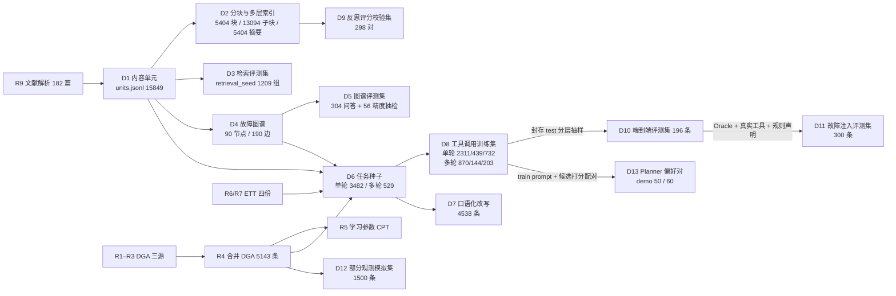
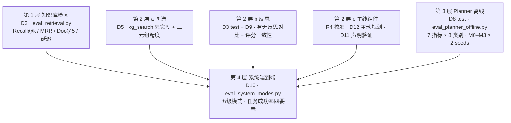

# 数据来源与评测体系

> 更新日期：2026-09-16
> 本文是论文「实验设置」章节的底稿，也是仓库内数据与评测集的唯一权威说明（原 `docs/data_inventory.md` 已于 2026-09-16 并入本文并删除）。第一部分说明每份数据从哪里来、怎么派生、文件格式与关键字段、允许扮演什么角色；第二部分说明评测分几层、每个指标怎么算、样本口径如何限定。所有数字取自当前仓库产物，尚未产出的正式数字标注「待跑」。
> 逐数据集的长表（场景 / 子类分布、注入子类明细、封存哈希）保留在各自的数据卡片中，本文只给汇总数字并链接：[D10 卡片](../../data/eval/d10/DATA_CARD.md)、[D11 卡片](../../data/eval/d11/DATA_CARD.md)、[D12 卡片](../../data/eval/d12/DATA_CARD.md)、[D8 SFT 卡片](../../data/planner/sft/DATA_CARD.md)、[D8 test 封存记录](../../data/planner/sft/SEALED.md)、[D13 DPO 卡片](../../data/planner/dpo/DATA_CARD.md)。训练流程见 [planner_training.md](planner_training.md)。

---

## 第一部分 数据来源

### 1.0 数据角色定义

每份数据只允许扮演下表中被授权的角色，越权使用视为实验设计错误。

| 角色 | 含义 |
|---|---|
| 训练监督 | 可作为模型学习目标（工具调用轨迹、偏好对）的原始材料 |
| 执行环境 | 工具运行时读取的数据（ETT 历史序列、贝叶斯参数、知识库索引、图谱） |
| 评测标签 | 判断业务结果是否正确的金标 |
| 知识源 | RAG / 图谱的入库文档 |
| 任务种子 | 用来程序化构造 Planner 训练与评测问题的素材 |
| 演示数据 | 仅用于前端演示或流程连通性检查，禁止进入任何评测集、训练集与正式报告 |

### 1.1 原始数据（一级来源）

| 编号 | 路径（`data/` 下） | 规模 | 文件格式 | 来源 | 许可 | 允许角色 | 禁止角色 |
|---|---|---:|---|---|---|---|---|
| R1 | `dga/dga_dataset.csv`（gitignore） | 4150 行 | CSV，分号分隔、逗号小数；列 `H2;CH4;C2H6;C2H4;C2H2;Fail`，`Fail` 为 IEC 60599 编码 NF / PD / D1 / D2 / T1 / T2 / T3 | 来源未核实。早期项目说明写作「Kaggle」，2026-09-15 核对后不成立：Kaggle「Power Transformers FDD and RUL」为 4 气体时序、4 类标签，与本文件五气体六类标签不符，未找到匹配发布页 | 未核实；论文与报告中不得写作 Kaggle，应写「来源未核实的 IEC 60599 标签 DGA 汇编」 | 执行环境（学习 CPT）、评测标签（气体 → IEC 故障性质）、任务种子 | 直接作为工具调用监督 |
| R2 | `dga/data.xlsx`（gitignore） | 2321 行 | XLSX，Sheet1，列 `H2, CH4, C2H6, C2H4, C2H2, 故障类型`（中文性质：正常 / 局部放电 / 低能放电 / 高能放电 / 电弧放电 / 低温过热 / 中温过热 / 高温过热） | GitHub `alan-456/transformer-fault-dataset`，README 说明为数据库 + 8 篇以上中国高校学位论文（大连理工、上海交大、东南大学等）+ 部分中国电网数据汇集，`data.xlsx` 为国内数据 | 仓库未声明许可，仅可在学术引用范围内使用 | 同 R1 | 同 R1 |
| R3 | `dga/dataset_(589).xlsx`（gitignore） | 589 行 | 同 R2 | 同 R2 仓库，README 标注为国外文献汇集。2024–2026 年多篇论文（KGRAT / Electronics 2026、GraphSmin、GCDGA 等）以此 589 条为公开基准；KGRAT 审计报告其中含 7 组完全重复、5 组跨标签冲突，且无设备、来源、采样时间字段 | 同 R2 | 同 R1；另可单列为「589 公开基准子集」做与文献可比的校准报告 | 同 R1 |
| R6 | `ETT-small/ETTh1.csv`、`ETTh2.csv`（gitignore） | 各 17420 行，小时级 | CSV，列 `date, HUFL, HULL, MUFL, MULL, LUFL, LULL, OT`；`date` 为 `YYYY-MM-DD HH:MM:SS`，`OT` 为油温 ℃ | ETDataset（Zhou et al., Informer, AAAI 2021），北航团队与北京国网富达合作采集，两站 2016-07 至 2018-07 油温与负载 | CC BY-ND 4.0（以 GitHub 原仓库 `zhouhaoyi/ETDataset` 的 LICENSE 为准；HuggingFace 镜像 `ETDataset/ett` 标注 CC BY 4.0，与原仓库不一致，项目统一采用原仓库写法并在论文脚注说明） | 执行环境（`ett_forecast`）、评测标签（未来真实 OT）、任务种子 | 不能与 DGA 拼成同一设备；ND 条款下不得分发修改后的数据文件，仓库只保留原始 CSV |
| R7 | `ETT-small/ETTm1.csv`、`ETTm2.csv`（gitignore） | 各 69680 行，15 分钟级 | 同 R6 | 同 R6 | 同 R6 | 同 R6 | 同 R6；ETTh 与 ETTm 疑似同源序列，不能视为独立设备做泛化测试 |
| R8 | `external_transformer/power_transformer_fault.csv`（gitignore） | 1866 行 / 106 台 | CSV，分号分隔；含 `Transformer;Measurement Number`、9 种气体、油质、糠醛及 Duval / Dornenburg / Rogers / IEC 四种比值法诊断列 | 来源未记录。2026-09-15 按字段结构检索 Kaggle、IEEE DataPort、Mendeley Data 均未匹配到发布页 | 未核实 | 候选：评测标签（诊断列作规则法参考）、任务种子（含设备编号与多次测量，可构造趋势类任务） | 未核实来源前不入训练集与评测集；F 阶段固化前若仍无法核实，从仓库移除并在 PLAN 附录 B 登记 |
| R9 | `fast_md/*/`（gitignore） | 182 个 MinerU 解析目录 | 每目录含 `full.md`、`content_list_v2.json`（分页内容单元）、`layout.json`、`images/` | 中文期刊 / 学位论文 PDF 解析产物 | 学术引用范围 | 知识源（RAG、图谱）、任务种子（事实类查询） | 测试问题的标准答案不能进知识库 |
| R10 | `ele_trans/*.pdf` | 31 篇 | PDF | 与 R9 部分重叠的原始 PDF | 同 R9 | 知识源备份 | — |
| R11 | `manuals/ABB_*.pdf`、`Siemens_*.pdf` | 2 份 | PDF | 公开厂商手册 | 厂商版权 | 知识源 | — |

DGA 标签可信度声明（论文实验设置须写明）：R1–R3 的 IEC 故障标签均为文献汇编标签，多数由文献作者据事后检修给出，本研究无法逐条追溯原始检修记录；三源合并去重后 7060 → 5143 条（约 27% 重复），且无设备身份字段，因此本研究不做设备维度的泛化测试。校准结果建议另在来源清晰的 IEC TC 10 案例库上做外部检验：候选为 IEEE DataPort「Dissolved Gas Analysis dataset」（Enwen Li，DOI 10.21227/h8g0-8z59，含 IEC TC 10 数据库 117 例，经拆检确认）或 IEEE DataPort Dissanayake 2026 数据集（含 49 条 IEC TC 10 基准）。IEC TC 10 案例库是 IEC 60599 修订时使用的官方案例集，是 DGA 领域可信度最高的小样本。

### 1.2 原始数据已知问题

R1–R3 → R4（合并 DGA）：

- `device_id` 为程序循环生成（`RT-0001` … `RT-0050`），不是真实设备；不能用于分组切分或「同一设备多次测量」任务。
- `fault_label` 是从原始标签（IEC 编码或中文性质）到项目故障类的工程映射（`convert_real_dga.py::LABEL_MAP`：NF → normal；PD / D1 / 低能放电 → partial_discharge；D2 / 高能放电 / 电弧放电 → winding_short_circuit；T1 / 低温过热 → insulation_degradation；T2 / T3 / 中高温过热 → overload_overheating），表示「机理最接近的部位」而非确诊部位。当前 R4 文件未保留原始标签字段，评测与校准实际按 `fault_label` 四类 + normal 进行；若论文需按 IEC 性质口径报告，需在 `convert_real_dga.py` 输出中补 `raw_label` 并重跑。
- `CO`、`CO2` 原始数据缺失，被填为 0.0，不是真实测量，不作证据。
- `evidence`、`severity`、`gas_rate_rapid` 由单次浓度按 DL/T 722 注意值规则派生，不是原始标注；产气速率需要时间序列，单次样本不能给出。
- 三份来源之间存在重复 / 近重复记录（去重键为五气体四舍五入 3 位 + 原始标签，7060 → 5143）；R3 内部另有文献已报告的跨标签冲突。

R6 / R7（ETT）：

- 负载特征 HUFL / HULL / MUFL / MULL / LUFL / LULL 官方未给单位与测点定义。
- ETTh1 与 ETTm1（及 h2 / m2）可能为同一序列的不同采样，防泄漏时视为同组。
- 数据本身存在少量时间间隙，`asfreq` 后会有 NaN，工具层需处理；早期加载代码曾把 15 分钟数据按 1 分钟对齐插 NaN（已修复）。

R8（external_transformer）：来源、许可未记录；`Year` 有空值；四种诊断列大量为 Undefined / Unidentifiable。优点是有真实设备编号与多次测量号，是目前唯一能构造「同一设备趋势」任务的真实数据。处置：来源未核实前不使用，不带入论文任何数字。

R9（文献解析）：182 目录中存在明显重复（同名 PDF 带「(1)」后缀等），文档级去重预计剩约 150 篇；图片 956 张仅有路径，表格 627 张 `table_caption` 为空，公式 1034 个未与解释合并，页眉页脚等噪声约 5300 个已在 D1 构建时过滤。

### 1.3 派生数据谱系（D1–D13）

| 编号 | 文件 | 规模 | 生成脚本 | 生成方式 | 用途 | 状态 |
|---|---|---:|---|---|---|---|
| R4 | `data/real/dga/dga_records.jsonl` / `.csv` | 5143 | `scripts/data/convert_real_dga.py` | R1–R3 合并去重，标签按 `LABEL_MAP` 映射为 `fault_label`，按 DL/T 722 注意值派生 `evidence` 与 `severity` | 执行环境、评测标签、数值任务种子、D12 源 | 完成 |
| R5 | `data/real/dga/learned_params.json` | 8 类先验 + CPT + 融合权重 + 校准参数 | `scripts/data/learn_cpt.py` | 从 R4 极大似然 + 拉普拉斯平滑学习；5 折校准 | `FAULT_ATTR_PARAMS`（calibrated 引擎） | 完成 |
| D1 | `data/kb/units.jsonl`、`docs.jsonl` | 15849 单元 / 182 文档 | `scripts/kb/build_units.py` | `content_list_v2.json` 转统一单元，过滤页眉页脚目录参考文献约 5300 个噪声单元 | 分块源、图谱抽取源 | 完成；文档级去重、图片描述待 LLM |
| D2 | `data/kb/chunks.jsonl`、`data/kb/index/` | 5404 块、13094 子块、5404 抽取式摘要 | `build_chunks.py` → `build_index.py` | 动态规划分块 α=0.5（target 400 / max 700 / min 120），子块按句切 100–150 token，摘要为规则抽取 | `rag_search` 两路检索 | 完成；LLM 摘要、稠密向量、重排器待接口 |
| D3 | `data/kb/eval/retrieval_seed.jsonl`、`split.json` | 1209 组（train 801 / dev 144 / test 264）；文档级切分 127 / 18 / 37 | `build_retrieval_evalset.py` | 三类查询：A_title 章节标题 700、B_caption 图表题注 400、C_definition 定义句 109；金标为 `source_unit_id` 所在块 | Recall@k、分块与检索消融 | 完成；LLM 自然问句改写待接口 |
| D4 | `data/kg/graph.json`、`triples_rule.jsonl`、`synonyms.json` | 90 节点 / 190 边 | `scripts/kg/extract_rules.py` → `build_graph.py` | 8 实体 / 9 关系 schema（[kg_schema.md](kg_schema.md)），显式因果触发词规则抽取，同义词最长匹配归一到规范名，每条边带 `source_unit_id` 与原文片段 | `kg_search`、推理类任务种子 | 完成；`llm_candidates.jsonl` 1660 候选句待 LLM 抽取 |
| D5 | `data/kg/eval/kg_qa_seed.jsonl`、`precision_sample.jsonl` | 304 问答（train 116 / dev 48 / test 140）+ 56 精度抽检 | `build_kg_eval.py` | 从图谱边生成一跳 / 二跳问答，正式名与别名各 152 条；56 条三元组人工精度抽检（AI 预标注） | 图谱忠实度、三元组精度 | 完成；人工 `label` 待填 |
| D9 | `data/kb/eval/reflection/d9_pairs.jsonl` | 298 对 | `build_reflection_evalset.py --n 300` | D3 查询 × 检索命中块配对，四桶：gold 105 / retrieved_nongold 105 / global_random 45 / same_doc_random 43 | 评分器与人工分一致性 | 完成；`human_score` 待填 |
| D6 | `data/planner/seeds/task_seeds.jsonl` | 3482（train 2311 / dev 439 / test 732） | `scripts/planner_data/build_task_seeds.py --execute` | 六类：fact 1207（D1 块）、numeric_tool 952（R4 / R6 / R7 记录）、reasoning 403（D4 实体对）、no_tool 340、insufficient 340、composite 240；金标动作在真实工具环境执行，失败样本剔除（`rejected.jsonl`） | D8 / D10 的源 | 完成；口语化改写待 LLM |
| D6-多轮 | `data/planner/seeds/multi_turn_seeds.jsonl` | 529 种子 / 1286 决策点（train 373 / dev 64 / test 92） | `build_multi_turn.py` | single_then_finish 300、composite_2step 152、composite_recover_kg 8、错误恢复 69（kg_colloquial_to_std 30 / ett_bad_dataset 18 / ett_bad_range 12 / ts_unrecoverable_ask 9）；工具返回全部真实执行 | 多轮与错误恢复训练 | 完成 |
| D8 | `data/planner/sft/*`（jsonl / json gitignore，保留 `DATA_CARD.md`、`SEALED.md`） | 单轮 6131 / 1157 / 732（含 D7 改写；改写前 2311 / 439 / 732）；多轮决策点 870 / 144 / 203；百炼合并 train 7001 / dev 1301（改写前 3181 / 583） | `export_sft.py --seeds task_seeds_rewritten.jsonl` | 按 `group_key` 分组切分 70 / 10 / 20，跨集相似度 > 0.9 为 0 对；导出 ms-swift、LLaMA-Factory、JSON 文本、百炼四种格式；错误恢复的刻意错误首调不作训练目标；test 封存（sha256 见 SEALED.md，`check_sealed.py` 校验） | Planner SFT 训练与离线评测 | 完成（2026-09-16 含改写重导出，test 种子级 sha256 不变） |
| D7 | `data/planner/seeds/task_seeds_rewritten.jsonl`（gitignore，可重建） | 原种子 3482 + 改写 4538（2750 条 train / dev 种子 × K=2 请求，守卫拒绝 961） | `rewrite_queries.py --k 2` | `qwen3.7-flash` 口语化改写（temperature 0.8）；守卫：数字集合不变（气体符号 / 数据集名 / 标准号中的数字屏蔽）、领域实体保留 ≥ 60%（同义词算保留）、长度 8–200、不重复、insufficient 不得补数字、不得引入原句没有的结论 / 故障类型词，numeric_tool / composite / insufficient 另拦软判断词；改写沿用原种子 `gold_actions` / `group_key` / `split`，`seed_id` 加 `-rN`；test 不改写 | 提升训练问法多样性 | 完成（2026-09-16；1.07M Token） |
| D10 | `data/eval/d10/end2end_eval.jsonl` | 196（71 group_key） | `scripts/eval/build_d10.py` | 仅从 D8 封存 test 分层抽样（seed 20260915），8 场景 23 子类，标注必要动作、关键参数、期望证据来源、参考要点 | 五级系统模式端到端评测；C-1 / C-3 抽样底稿 | 完成；`reference_points` 人工复核待做 |
| D11 | `data/eval/d11/fault_injection_eval.jsonl` | 300 = 注入 200（四类各 50）+ 干净 100 | `scripts/eval/build_d11_fault_injection.py` | D10 底稿经 OraclePlanner + 真实工具 + 规则声明生成干净草案，再脚本注入单处错误（numeric_tamper / fake_reference / applicability_swap / safety_premise_removed）；不调 LLM，可复现 | ClaimChecker 分类型检出率、C-5 三组 Validator 对照 | 完成；人工抽检 40 条待做 |
| D12 | `data/eval/d12/partial_obs.jsonl` | 1500（light / medium / heavy 各 500） | `scripts/sim/partial_obs_sim.py --build` | R4 非 normal 记录 3729 条按故障类分层抽样，随机遮蔽 1 / 2 / 3 种气体，派生可见与隐藏征兆 | B-5 四种问询策略对照、E-3 mode2 vs mode3 鲁棒性 | 完成 |
| D13 | `data/planner/dpo/d13_{exec,full}_demo.jsonl` | demo 50 / 60 对 | `scripts/planner_data/score_candidates.py` | 候选按 format / tool / schema / business / faith / ask 六项打分，同 prompt 最高 vs 最低配对（分差 ≥ 0.3），导出百炼 DPO 格式；当前候选为金标扰动 demo，仅验证管线 | Planner DPO 训练（主线三） | 管线完成；正式候选需 M0 / M1 采样（百炼），人工复核 100 对待做 |

### 1.4 各数据集文件格式与关键字段

所有 `.jsonl` 为 UTF-8、每行一个 JSON 对象；`.json` 为单个 JSON 对象或数组。下面只列关键字段，完整字段以文件首行为准。

R4 `dga_records.jsonl`（`.csv` 为同内容扁平化，另含 `TDCG`、`total_hydrocarbon`）

| 字段 | 类型 | 说明 |
|---|---|---|
| `record_id` | str | `DGA-R000001` 起顺序编号 |
| `device_id` | str | 循环生成 `RT-0001`…`RT-0050`，非真实设备 |
| `dga_data` | dict | `H2, CH4, C2H6, C2H4, C2H2, CO, CO2`，单位 μL/L；CO / CO2 恒 0.0 |
| `evidence` | dict[str, bool] | DL/T 722 注意值派生：`*_elevated`、`TDCG_elevated`（总烃 > 150）、`gas_rate_rapid`（C2H2 > 50） |
| `fault_label` / `fault_label_cn` | str | normal 1414 / overload_overheating 1495 / partial_discharge 1070 / winding_short_circuit 653 / insulation_degradation 511 |
| `severity` | str | normal / attention / serious / critical，按标签与超标程度规则给出 |
| `source` | str | `dga_dataset.csv` 2723 / `data.xlsx` 1982 / `dataset_(589).xlsx` 438 |
| `sample_time`, `gas_rate_ml_per_day`, `oil_temp`, `load_ratio` | 空 / null | 原始数据无此字段 |

R5 `learned_params.json`：顶层 `meta`（数据规模、日期、平滑参数）、`prior`（8 类先验）、`cpt`（故障 × 征兆条件概率）、`fusion_weights`（按类别的规则 / 概率融合权重）、`calibration`（温度等校准参数）。

D1 `units.jsonl`：`unit_id`（`<doc_id>-<4 位序号>`）、`doc_id`、`doc_title`、`type`（paragraph 8395 / title 3930 / list 1031 / image 956 / equation 848 / table 627 / footnote 59 / code 3）、`level`、`section_path`、`page`、`order`、`text`、`char_len`。`docs.jsonl` 每文档一行：`doc_id`、`doc_dir`、`title`、`doc_kind`、`n_pages`、`n_units`、`n_chars`、`n_images`、`n_tables`、`n_equations`。

D2 `chunks.jsonl`：`chunk_id`（`<doc_id>-c<4 位>`）、`doc_id`、`doc_title`、`section_path`、`unit_ids`、`unit_types`、`has_anchor`（是否含标题 / 题注锚点）、`text`（含标题前缀）、`body`、`char_len`、`page_start` / `page_end`。`index/` 下 `bm25_{units,chunks,subchunks,summaries}.pkl` 为四层 BM25 索引，`chunk_summaries.jsonl`（`chunk_id, summary, summary_source=extractive`）、`docs_index.jsonl`、`sections_index.jsonl`、`vocab_stats.json`。

D3 `retrieval_seed.jsonl`：`qid`（`<type>-<5 位>`）、`type`（A_title / B_caption / C_definition）、`query`、`gold_chunk_ids`、`gold_doc_id`、`source_unit_id`、`needs_llm_rewrite`、`split`。`split.json` 为文档级 train / dev / test 文档 id 列表，D3 的 `split` 由所属文档决定。辅助产物：`rrf_weight_grid_dev.json`（dev 上的 RRF 权重网格）、`retrieval_result_*_{test,all}.json`、`chunking_ablation_*.json`、`report.md`。

D4 `graph.json`：`schema_version`、`n_nodes`、`n_edges`、`nodes[]`（`id` 形如 `Fault:过热故障`、`name`、`type`、`degree`、`n_docs`）、`edges[]`（`source`、`target`、`relation`、`support_count`、`confidence`、`extractors`、`evidence[]{sentence, unit_id, doc_id}`）、`rejected`、`human_rejected`。`triples_rule.jsonl` 为建图前的 190 条规则三元组（`head, head_type, relation, tail, tail_type, evidence[]`）；`synonyms.json` 为 `{entities: {类型: {规范名: [同义词]}}}`；`llm_candidates.jsonl`（`sentence, unit_id, doc_id, entities`）为待 LLM 抽取的候选句。

D5 `kg_qa_seed.jsonl`：`qa_id`、`question`、`anchor_entity`、`anchor_surface`、`surface_kind`（canonical / alias）、`relation`、`direction`（out 190 / in 114）、`expected_entities[]`、`max_support`、`n_docs`、`split`。`precision_sample.jsonl`：`sample_id`、`triple`（可读形式）、`source`、`relation`、`target`、`support_count`、`confidence`、`evidence[]`、`ai_prelabel` / `ai_note`（AI 预标注）、`label` / `note`（人工，待填）。

D9 `d9_pairs.jsonl`：`pair_id`、`qid`、`query`、`query_type`、`chunk_id`、`doc_id`、`doc_title`、`section`、`text`、`bucket`、`is_gold`、`expected_hint`（按桶给出的预期分数区间：gold `2-3`、retrieved_nongold `0-3`、global_random `0-1`、same_doc_random `0-2`）、`human_score` / `human_score_2` / `adjudicated`（双人打分与仲裁，待填）、`note`。

D6 `task_seeds.jsonl`：`seed_id`（`S-<类别缩写>-<hash>`）、`category`、`sub_type`、`query`、`gold_actions[]`（`{type: tool_call, tool, arguments}` 或 `{type: ask_user, missing[]}` / `{type: direct_answer}`）、`seed_source`（前缀 `chunk:` / `dga:` / `kgqa:` / `kg2hop:` / `ett:` / `ettwin:` / `manual:`）、`group_key`（前缀 `doc:` / `device:` / `entity:` / `ett:` / `ettwin:` / `manual:`，切分单位）、`expected_hint`、`needs_llm_rewrite`、`exec_verified`、`split`、`note`。`multi_turn_seeds.jsonl`：在上表基础上以 `trajectory[]` 代替 `gold_actions`，元素为 `{role: assistant, thought, tool_call | finish}` 与 `{role: tool, tool, content}` 交替，每个 assistant 元素即一个决策点。

D8 四种导出格式（`data/planner/sft/`）

| 格式 | 文件 | 结构 |
|---|---|---|
| ms-swift | `swift_{train,dev,test}.jsonl`、`swift_multiturn_{train,dev,test}.jsonl` | `{messages[{role: system/user/assistant/tool, content, tool_calls?}], tools[], meta{seed_id, category, sub_type, split}}`；多轮每个决策点一条 |
| LLaMA-Factory | `lf_{train,dev,test}.json` | 数组，元素 `{conversations[{from: human / function_call / gpt, value}], system, tools}` |
| JSON 文本规划 | `jsontext_{train,dev,test}.jsonl` | `{messages, meta}`，assistant `content` 为 `{intent_analysis, steps[{id, stage, description, tool, arguments}]}` 的 JSON 字符串 |
| 百炼 SFT | `bailian_{train,dev}.jsonl`（不导出 test） | `{messages[system, user, assistant{content, tool_calls[{id, type: function, function{name, arguments: JSON 字符串}}]}, tool{tool_call_id, content}…], tools[]}`；已通过 `bailian_format.validate_bailian_file` |

系统提示与线上 `PLANNER_SYSTEM_PROMPT()` 一致；test 切分的种子级 sha256 登记在 `SEALED.md`，`python3 scripts/planner_data/check_sealed.py` 校验。

D10 `end2end_eval.jsonl`

| 字段 | 说明 |
|---|---|
| `eval_id`, `scenario`, `category`, `sub_type` | `D10-0001` 起；8 场景 23 子类（分布见卡片） |
| `user_query`, `context` | 问题与设备上下文（context_contrast 场景在 `context` 中给 DGA） |
| `required_actions[]` | `{type: tool_call, tool, key_params}` 只列计分参数；`{type: ask_user, missing[]}`；`{type: direct_answer}` |
| `expected_recovery[]` | `{first_call, error{status, message,…}, recovered_call}`，仅 error_recovery |
| `n_required_tool_calls` | 必要调用数 |
| `evidence_source` | `{type, …}`，`type` 取值 kb_chunk 40 / none 32 / trajectory 31 / dga_label 28 / kg_entities 20 / multi 15 / signal_inline 10 / ett_dataset 10 / kg_path 10 |
| `reference_points[]` | 参考答案要点 |
| `annotation` | `{status: auto → reviewed, source, notes}` |
| `seed_id`, `seed_source`, `group_key` | 回溯到 D6 / D8 |

D11 `fault_injection_eval.jsonl`：`eval_id`、`base_eval_id`（D10 底稿）、`scenario`、`sub_type`、`injected`、`type`、`subtype`、`expected_constraints[]`（DATA / EVIDENCE / APPLICABILITY / SAFETY）、`location{claim_id, field}`、`original`、`injection_detail`、`claims[]`（schema 见 [claim_schema.md](claim_schema.md)：`id, text, type, evidence[{source, ref, span, tool}]`）、`draft_answer`、`snapshot{user_query, context, tool_calls[], retrieved_knowledge, inquiry_log}`（离线重建 `AgentState` 的全部证据）、`checker_preview`、`annotation`。

D12 `partial_obs.jsonl`：`sim_id`（`D12-L/M/H<4 位>`）、`source_record_id` / `source`（回溯 R4）、`level`、`fault_label`、`severity`、`full_gases`、`visible_gases`（被遮蔽气体为 null）、`masked_gases[]`、`initial_evidence`（可见气体派生，含负观测）、`hidden_evidence`（揭示后可得）、`unavailable_symptoms[]`（原始数据无字段、`reveal` 返回 None 的征兆）。

D13 `d13_{exec,full}_demo.jsonl`：百炼 DPO 格式 `{messages[system, user], chosen{role, content, tool_calls}, rejected{…}, tools[]}`；`*_pairs_meta.jsonl`：`seed_id, gap, score_key, chosen, rejected, chosen_parts, rejected_parts`（六项分项分）；`scored_demo.jsonl` 为全部候选打分，`summary_demo.json` 为汇总。

### 1.5 合成数据（禁止进入评测集与正式训练集）

| 编号 | 路径 | 规模 | 生成方式 | 允许角色 | 备注 |
|---|---|---:|---|---|---|
| S1 | `data/synthetic/dga/dga_records.jsonl` / `.csv` | 3000 条 | `scripts/data/generate_synthetic_data.py` 按规则采样 | 演示数据、单元测试 | 字段与 R4 同 schema（见 `data/synthetic/SCHEMA.md`） |
| S2 | `data/synthetic/timeseries/TR-0001..0020.csv` + `devices.json` | 20 台 × 2000 点 | 同上，列对齐 ETT | 演示数据、单元测试 | 前端异常检测已不再默认读取 TR-0001 |
| S3 | `data/synthetic/cases/fault_cases.jsonl` | 200 条 | 同上 | 演示数据（mock RAG）、单元测试 | 不代表真实案例 |
| S4 | `data/synthetic/eval/eval_set.jsonl` | 120 条 | 同上；`expected.primary_fault` 由生成规则给出 | 开发回归（仅检查流程连通与格式） | 与 S1 同源，存在循环验证风险，不进任何报告 |
| S5 | `data/synthetic/eval/report_*.md` | 3 份 | 旧评测输出 | 历史记录 | 早期小样本 100% 完成率不具统计意义 |

守卫机制：`data/synthetic/SYNTHETIC_MARKER.json` 声明 `synthetic: true`、`allowed_roles: [demo, unit_test, dev_regression]`、`forbidden_roles: [eval_set, train_set, test_set, baseline_report]`；`src/utils/data_guard.py::assert_not_synthetic` 在所有造数 / 评测脚本启动时检查源路径前缀，命中 `data/synthetic/` 即拒绝写入。

### 1.6 数据角色隔离规则

- 训练监督只来自 D8 的 train / dev（以及由 D8 train prompt 派生的 D13）；test 封存，训练结束前不读取。
- 评测集只从真实来源派生：D3 / D5 / D9 来自文献，D10 / D11 来自 D8 test，D12 来自 R4；合成数据一律不进。
- 同一 `group_key`（来源文档 / 实体对 / DGA 记录 / ETT 片段）派生的样本只出现在一个切分；ETTh 与 ETTm 疑似同源，按同组处理；D13 的 prompt `seed_source` / `group_key` 不得出现在 D8 test 与 D10。
- DGA 评测标签使用 `fault_label`（工程映射四类 + normal），论文中须注明该映射不代表确诊部位；CO / CO2 为 0 填充不作证据。
- fact 类任务的金标块允许存在于知识库中（这是检索任务的定义），但 Planner 训练样本的 assistant 输出只含工具调用与规划，不含答案正文，避免把知识库内容当训练目标。
- 参数调优只看 dev（D3 dev 144、D8 dev、D9 混淆矩阵）；test 与 D10 只在最终报告读取一次。

数据 × 用途矩阵（v2）：

| 用途 | 可用数据 | 说明 |
|---|---|---|
| 知识库（`rag_search`） | R9 → D1 / D2；R10 / R11 备份 | 文档级去重待做 |
| 故障图谱（`kg_search`） | R9 → D1 → D4 | 规则抽取，LLM 候选句待接口 |
| 归因引擎参数学习与校准（主线一 B-1） | R4 → R5 | 3729 条非 normal 记录 5 折 |
| 主动规划 / EIG（主线一 B-2 ~ B-5） | R5、D12 | 仅气体征兆空间 |
| 声明验证（主线二 C-1 ~ C-5） | D10 抽样 30、D11 | 规则声明底稿 |
| Planner SFT / DPO（主线三 D-1 ~ D-4） | D8 train / dev、D13 | test 封存；正式 D13 需百炼采样 |
| 组件评测 | D3 test、D5、D9、D8 test | 只读一次 |
| 端到端评测（E） | D10、D12 heavy（E-3） | 五级模式 |
| 流程回归 / 前端演示 | S1–S4 | 不进报告 |
| 暂不使用 | R8 | 来源未核实 |

### 1.7 已知偏差（写论文时须声明）

- train / dev 问法已含 LLM 口语化改写（D7），但 D8 test 与 D10 仍为模板问法，Planner 离线 / 端到端指标对真实口语输入仍偏乐观；改写由同一 `qwen3.7-flash` 生成，与 M0 基线同源，存在风格偏置。
- DGA 三源标签分布不均（过载过热 / 正常偏多）；标签为文献汇编而非现场确认；`device_id` 为循环生成，不能做设备维度分析。
- 图谱由规则抽取，覆盖有限（90 节点），推理类样本受此约束。
- ETT 负载特征单位未知，预测模型为线性回归，仅用于工具调用行为研究。
- 文献存在重复与 MinerU 解析噪声，图片 956 张仅有路径、表格 627 张无标题。
- D11 底稿声明为规则拼装，注入错误的隐蔽性低于真实 LLM 幻觉；每条只注入一处错误。
- D12 遮蔽为均匀随机，不模拟真实工况下「某些气体更常缺失」的偏置；现场征兆（温度 / 负载 / 振动 / 局放）无法揭示。
- D13 当前为金标扰动 demo，偏好对分差被人为放大，不能用于训练或报告。

---
## 第二部分 评测体系

评测分四层，由内向外：知识库检索 → 图谱、反思与主线组件 → Planner 工具调用（离线）→ 系统端到端。每层有独立评测集、独立脚本、独立报告，避免用同一份数据既调参又报结果。

### 2.1 第 1 层：知识库检索（P1）

评测集 D3 test 264 组；脚本 `scripts/kb/eval_retrieval.py --ablation`、`ablation_chunking.py`；报告 [kb_ablation_test.md](../eval/kb_ablation_test.md)。

| 指标 | 定义 |
|---|---|
| Recall@k（k = 1, 3, 5, 10） | 金标 `source_unit_id` 所在块出现在前 k 个结果的查询比例；重叠分块时任一含金标单元的块命中即算 |
| MRR | 金标块首次出现位置倒数的均值 |
| Doc@5 | 前 5 个结果中含金标文档的比例（文档级宽松口径） |
| 平均延迟 | 单次检索毫秒数 |
| 索引体积 | 块数、长度 p50 / p90、索引 token 数 |

消融维度：分块方式（标题 / 固定窗口 512-128 / 动态规划 α ∈ {0.3, 0.5, 0.7}）× 检索方式（bm25_only / naive / two_way / two_way_rerank）。RRF 权重只在 dev 144 条上网格搜索，test 上报告。当前离线结果：two_way 相对 bm25_only R@5 0.674 → 0.742。

### 2.2 第 2 层 a：故障图谱（P2）

评测集 D5；脚本 `scripts/kg/build_kg_eval.py`；报告 `data/kg/eval/report.md`。

| 指标 | 定义 | 当前 |
|---|---|---|
| HitAny / HitAll | `kg_search` 返回链路中包含任一 / 全部期望实体的比例，按关系类型、切分、问法（正式名 / 别名）分组 | HitAll 100%（304 条，工具对图谱忠实） |
| 三元组精度 | 56 条人工抽检，correct / 已标注；严格口径 unsure 计错，宽松口径 unsure 计对 | 83.0% / 95.7%（AI 预标注，人工 label 待填） |
| 负样本拒答率 | 不可串联实体对上返回"无关联"的比例 | 待 LLM 生成负样本 |
| 对比胜率 | 与朴素文本块检索、LightRAG 在信息丰富性 / 相关性 / 逻辑合理性上的两两胜率，LLM 裁判 + 10% 人工复核 | 待跑 |

### 2.2 第 2 层 b：反思模块（P3）

评测集 D3 test 264 条与 D9 298 对；脚本 `scripts/kb/eval_reflection_recall.py`、`build_reflection_evalset.py --eval-only`；报告 [reflection_eval.md](../eval/reflection_eval.md)。

| 指标 | 定义 | 当前（LexicalScorer） |
|---|---|---|
| 有 / 无反思 Recall | 反思输出块集合中含金标的比例，对比 `top_k=5` 基线 | 0.746 → 0.765 |
| 有 / 无反思精度 | 输出块中金标占比 | 0.177 → 0.271 |
| 金标误丢 | 基线命中但被反思丢弃的条数，硬约束为 0 | 0 |
| 补召回增益 | 邻块补召回新增的金标命中数 | 5 |
| 平均输出块 / 全丢次数 / 改写次数 / 耗时 | 成本与行为统计 | 5.28 / 1 / 2 / 6.2 ms |
| 评分一致性 | LLMScorer 0–3 分与人工 `human_score` 的一致率与加权 Kappa，验收线 Kappa ≥ 0.6 | 待人工分 |

阈值 `min_keep` 与 t2 / t3 用 D9 混淆矩阵校准，以金标误丢为 0 作硬约束。

### 2.2 第 2 层 c：主线一 / 主线二组件评测（B / C 系列）

| 组件 | 评测集 | 脚本 | 报告 | 主要指标 | 当前 |
|---|---|---|---|---|---|
| 归因引擎校准（B-1） | R4 非 normal 3729 条，按类分层 5 折 | `scripts/data/learn_cpt.py --kfold 5` | [attribution_calibration.md](../eval/attribution_calibration.md) | Top-1 / Top-3、NLL、Brier、ECE（15 桶）；expert vs calibrated | 完成（离线） |
| EIG 推荐一致性（B-2） | 20 条手工部分观测样例 | `scripts/eval/eig_sanity_check.py` | [eig_sanity_check.md](../eval/eig_sanity_check.md) | Top-1 / Top-3 推荐落入预期征兆集合的比例 | 90% / 95%（AI 预填预期，人工复核待做） |
| 主动规划策略（B-5） | D12 1500 条 | `scripts/eval/eval_active_planning.py` | [active_planning_eval.md](../eval/active_planning_eval.md) | 停止时 Top-1 / Top-3 准确率、平均问询轮数、累计成本、终止熵；策略 random / fixed / eig_greedy / eig_cost，统一停止准则 τ_H=0.8 bit、K=3 | 完成（离线，`llm_free` 策略待 LLM） |
| 声明级输出（C-1） | D10 分层抽 30 | `scripts/eval/eval_claims_c1.py` | [claims_acceptance.md](../eval/claims_acceptance.md) | schema 合法率、每条 claim ≥ 1 evidence、ref 可解析率 | 完成（规则声明路径） |
| 约束核查器（C-2） | 四类约束 × 5 违反 + 5 合规构造样例 | `scripts/eval/eval_claim_checker_c2.py` | [claim_checker_acceptance.md](../eval/claim_checker_acceptance.md) | 检出 / 误报 | 20/20 检出、0 误报 |
| 补证与重规划路由（C-3） | D10 分层抽 30 + 4 条注入缺证声明 | `scripts/eval/eval_route_c3.py` | [route_acceptance.md](../eval/route_acceptance.md) | 补证调用触发率、去重、轮数上限遵守 | 完成 |
| 验证器三组对照（C-5） | D11 300 条（E1 原样 / E2 追加缺证声明） | `scripts/eval/eval_validator.py` | [validator_eval.md](../eval/validator_eval.md) | 分类型检出率、干净样本误报率、修订后残留错误数、补证调用数；v1 / v2_check / v2_route | 完成（模拟 Generator，人工抽检 40 条待做） |

C 系列均以 OraclePlanner + 真实工具 + 规则声明运行，不调 LLM；结论刻画的是「验证器能否把错误定位到声明并给出可执行的修订信号」，不是 LLM 自我纠错能力。

### 2.3 第 3 层：Planner 工具调用离线评测（P5）

评测集 D8 封存 test（单轮 732 + 多轮 203 = 935 条，另含 16 条 error_recovery decision_index 0 仅作上下文）；预测脚本 `training/planner_sft/predict.py`；评测脚本 `scripts/eval/eval_planner_offline.py --write-report`；报告 `docs/planner_dpo_eval.md`（待跑）。

| 指标 | 定义 | 计入样本 |
|---|---|---|
| 格式合法率 | 输出可解析为 hermes `<tool_call>` 标签、JSON 文本规划或纯文本三者之一 | 全部 |
| 工具选择正确率 | 预测调用的工具名多重集合与金标一致（顺序无关） | 全部 |
| 参数正确率 | 每个调用的参数与金标一致：`query` 词法重合 ≥ 0.5，数值容差 1e-6，其余精确匹配 | 只算有金标调用的样本 |
| 完整调用率 | 格式合法 ∧ 工具正确 ∧ 参数正确 ∧ 通过 `validate_arguments_strict` Schema 校验 | 只算有金标调用的样本 |
| 不必要调用率 | 金标为不调用（no_tool / insufficient）但预测发起了调用 | 只算金标无调用的样本 |
| 追问正确率 | 不调用工具且回复含追问措辞 | 只算 insufficient 与 ts_unrecoverable_ask |
| 错误恢复成功率 | 工具返回业务错误后，下一决策点工具与参数均正确 | 只算 error_recovery 且 decision_index ≥ 1 |

分 8 类别报告：fact / reasoning / numeric_tool / no_tool / insufficient / composite / multi_turn / error_recovery。v2 对照矩阵（百炼 `qwen3-8b`）：M0 未微调基座、M1 `efficient_sft`、M4-exec / M4-full 在 M1 上以 D13-exec / D13-full 做 `dpo_lora`，报告写入 `docs/planner_dpo_eval.md`；v1 魔搭矩阵（M1 普通 LoRA-SFT、M2 结构加权、M3 结构 + 领域加权，seeds 42 / 2026）降级为备选。金标自检（`--self-test`）7 项 100%、不必要调用 0%，证明评分口径与数据一致。建议追加 M3-random（等量随机词表升权）排除"任何升权都有效"的解释。

### 2.4 第 4 层：系统端到端评测（P6）

评测集 D10 196 条；脚本 `scripts/eval/eval_system_modes.py --modes all --judge llm`；报告 [end2end_eval.md](../eval/end2end_eval.md)。

五级模式（v2，2026-09-16 起）：mode1 `llm_only`（无工具）→ mode2 `tool_base`（全工具 + 知识库两路检索 + 图谱 + 词法反思，专家 CPT，自由规划，v1 Validator）→ mode3 `active_plan`（+ 校准归因、EIG 主动追问）→ mode4 `claim_verify`（+ 声明级输出、约束核查、补证重规划路由）→ mode5 `dpo_planner`（+ DPO 微调 Planner）。每级只比上一级多开一组开关，知识库 / 图谱 / 反思从 mode2 起作为工程基座固定全开，不再单独归因；`allowed_tools` 同时约束 Planner 提示词与 Retriever 执行守卫，越权调用记 `tool_disabled` 并计入不必要调用。`--validator-mode / --attribution-mode / --planner-strategy / --generator-output / --planner-mode` 可单独覆盖，用于交叉对照。

| 指标 | 定义 |
|---|---|
| 任务成功率 | 动作正确 ∧ 关键参数正确 ∧ 工具结果有效 ∧ 答案忠实于证据，四项同时满足 |
| 动作正确 | `required_actions` 中必要工具全部被调用；ask_user / direct_answer 样本不得调用工具，ask_user 还需回复含追问措辞 |
| 关键参数正确 | 只比对 D10 `key_params`；`query` 词法重合 ≥ 0.5，`dga_data` 容差 1e-6，`relations` 集合相等 |
| 工具结果有效 | 被调用工具 `exec_success ∧ business_success` |
| 证据忠实度（0–1） | 正式口径为 LLM 裁判判定答案是否被检索块 / 图谱链路 / 工具返回支持，抽 10% 人工复核报告一致率；离线代理为证据锚点词面匹配，仅用于流程校验 |
| 追问正确率 / 错误恢复成功率 | 同第 3 层口径，分别只算 ask_user 与 error_recovery 场景 |
| 平均工具调用次数 / 不必要调用率 | 不必要 = 非必要调用次数 / 总调用次数，含 tool_disabled |
| 平均延迟 / 平均 Token | 单任务秒数；`src.utils.llm.USAGE` 累计 prompt + completion |

分 8 场景报告：single_tool_fact 40 / single_tool_numeric 40 / multi_tool 30 / kg_reasoning 30 / ask_user 17 / error_recovery 16 / no_tool 15 / context_contrast 8。OraclePlanner（金标当预测）校验评分链路：v1 mode5 离线代理 50 条 task_success 88.8%（46/50）；v2 mode2 全量 196 条、LLM 正常生成时 task_success 97.4%（191/196），param_acc 100%，tool_result_valid 100%，剩余 5 条为 Generator 忠实度代理词面偏差与 ask_user 追问措辞判定，不是模式定义问题。

### 2.5 基线与对照关系

| 对照 | 回答的问题 | 数据 | 层 |
|---|---|---|---|
| `baseline-v0` vs `v1-final` | 整个优化前后 | D3 200 条临时集、50 条手工任务、30 条端到端 | 1 / 3 / 4 |
| bm25_only → two_way → +rerank | 检索方式贡献 | D3 test | 1 |
| 标题 / 固定窗口 / DP α 网格 | 分块方式贡献 | D3 test | 1 |
| 无反思 → LexicalScorer → LLMScorer | 反思贡献与评分器质量 | D3 test + D9 | 2b |
| M0 → M1 → M2 → M3（→ M3-random） | 微调与加权损失贡献 | D8 test | 3 |
| mode1 → mode5（v2） | 工具基座 / 主动规划 / 声明验证 / DPO Planner 的端到端增量 | D10 | 4 |
| mode4 + `--planner-mode baseline`、mode5 + `--validator-mode off` | 分离主线二与主线三在完整系统中的净贡献 | D10 | 4 |

### 2.6 评测纪律

- 每个评测脚本先用金标作预测跑自检，自检不到 100% 先修数据或口径，再跑模型。
- 任何 LLM 裁判结果必须附 10% 人工复核的一致率；裁判模型与被评模型不同（裁判用 `qwen3.7-flash`，被评 Planner 为百炼 `qwen3-8b` SFT / DPO 部署模型；v1 备选路线为 Qwen3-VL-8B LoRA）。
- 参数调优（RRF 权重、反思阈值、早停）只看 dev；test 与 D10 只在最终报告读取一次。
- 报告中每个数字标注评测集版本、切分、样本数与运行日期；离线代理指标与 LLM 裁判指标分列，不混报。

### 2.7 待产出的正式数字

| 报告 | 缺什么 | 依赖 |
|---|---|---|
| `docs/eval/kb_ablation_test.md` | 稠密向量通道、Qwen3-Reranker、自然问句版 D3 | embedding 接口、GPU |
| `data/kg/eval/report.md` | 人工 label、负样本、LightRAG 对比胜率 | 人工 + LLM |
| `docs/eval/reflection_eval.md` | LLMScorer 版本、Kappa | 人工 `human_score` + LLM |
| `docs/planner_dpo_eval.md` | M0 / M1 / M4-exec / M4-full 离线 7 指标与端到端对照（M0 100 条基线已在 `baseline.md`） | 百炼 SFT + DPO 训练与部署（D-1 ~ D-4） |
| `docs/eval/planner_eval.md` | M0 已有 100 条基线（`docs/eval/baseline.md` §2）；M1 / M4 列与 935 条全量、2 seeds | 百炼 SFT + DPO 部署 |
| `docs/eval/end2end_eval.md` / `system_modes_eval.md` | 五级模式正式数字（196 × 5 × 2 次）、交叉对照、LLM 裁判、10% 人工复核（mode2 前 50 条基线 46.0% 与 Oracle 上界 97.4% 已有） | DPO Planner 部署 + LLM + D10 人工复核（E-2） |
| `docs/eval/active_planning_eval.md` | `llm_free` 策略 | LLM |
| `docs/eval/validator_eval.md`、`data/eval/d11/manual_review_sample.md` | 注入有效率人工抽检 40 条 | 人工 |
| `data/eval/d10/DATA_CARD.md` | `reference_points` 人工复核（status → reviewed） | 人工（A-3） |
| `data/planner/dpo/` | 正式 D13 偏好对 ≥1200 对（现为 demo 50 / 60）、100 对人工复核 | 百炼 M1 采样 + 人工（D-2） |

完整进度以 [PLAN_优化计划清单.md](../../PLAN_优化计划清单.md) §0.6 为准。
