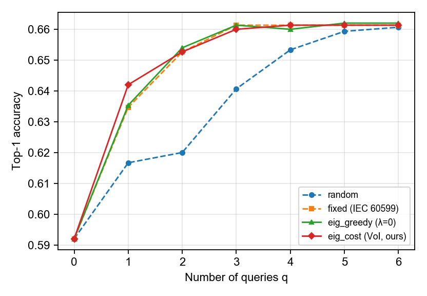
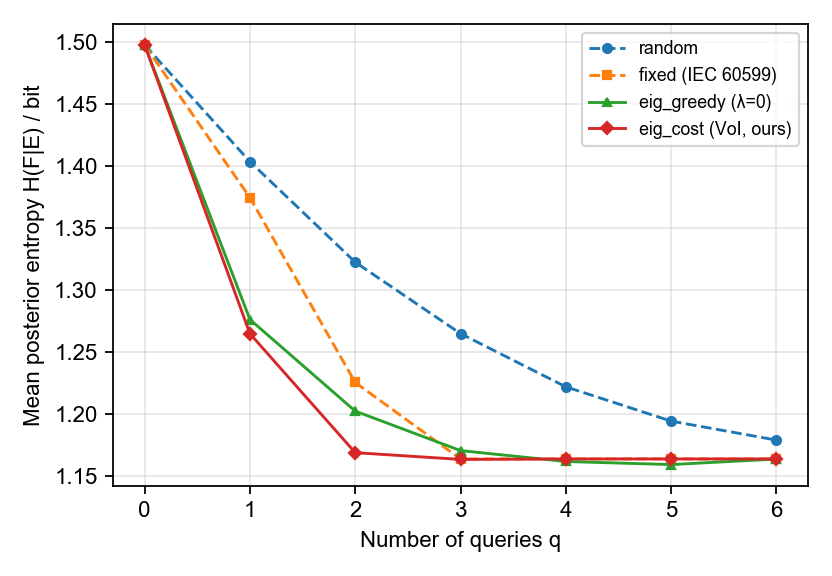

# B-5 主动规划对照实验报告

- 生成时间：2026-09-18 11:09:00；脚本 `scripts/eval/eval_active_planning.py`；数据 D12 `data/eval/d12/partial_obs.jsonl`（1500 条，sha256 `9e2a35b3e0758e9b…`）
- 归因引擎：`/Users/ts/Desktop/thu/multi_Agent/data/real/dga/learned_params.json`（calibrated）与专家默认（expert）；候选征兆 12 个（`ask_user` 类；`call_tool` 类油温 / 负载需时序信号，D12 无此数据，不参与）
- 停止准则（协议 B）：H(F|E) < τ_H=0.8 bit、轮数 ≥ K=3、无候选；EIG 策略额外 VoI < ε=0.02；λ=0.05
- 所有策略确定性（random 固定 seed 20260915）；不调用 LLM。`llm_free` 策略需真实模型，见第 6 节

## 1. 策略

| 策略 | 每轮选择 | 停止 |
|---|---|---|
| `random` | 未观测征兆中均匀随机 | τ_H / K / 无候选 |
| `fixed` | IEC 60599 / DL/T 722 常规顺序：H2 → CH4 → C2H2 → C2H4 → C2H6 → 总烃 → 产气速率 → CO → CO2 → 现场 | 同上 |
| `eig_greedy` | argmax EIG(s)（λ=0） | 同上 + EIG < ε |
| `eig_cost`（本文） | argmax VoI(s) = EIG(s) − λ·cost(s) | 同上 + VoI < ε |

## 2. 协议 B：自适应停止（calibrated 引擎）

| 策略 | Top-1 | Top-3 | 平均问询 | 平均成本 | 追问命中率@2 | ECE | NLL |
|---|---:|---:|---:|---:|---:|---:|---:|
| 无追问（q=0） | 0.592 | 0.956 | 0.00 | 0.00 | - | 0.039 | 0.979 |
| `random` | 0.641 | 0.975 | 2.84 | 2.63 | 0.306 | 0.026 | 0.865 |
| `fixed` | 0.661 | 0.980 | 2.79 | 0.85 | 0.623 | 0.041 | 0.803 |
| `eig_greedy` | 0.661 | 0.979 | 2.64 | 1.78 | 0.762 | 0.036 | 0.817 |
| `eig_cost` | 0.660 | 0.980 | 2.04 | 0.26 | 1.000 | 0.042 | 0.806 |

追问命中率@2：所问征兆是否落在当轮 VoI 前 2（对 EIG 策略恒为 1，作为 random / fixed 的参照）。

停止原因分布：

| 策略 | 熵低于 τ_H | VoI 低于 ε | 达轮数上限 | 无候选 |
|---|---:|---:|---:|---:|
| `random` | 153 | 0 | 1347 | 0 |
| `fixed` | 232 | 0 | 1268 | 0 |
| `eig_greedy` | 217 | 324 | 959 | 0 |
| `eig_cost` | 261 | 1100 | 139 | 0 |

分档（遮蔽 1 / 2 / 3 种气体）：

| 策略 | light Top-1 / 问询 | medium Top-1 / 问询 | heavy Top-1 / 问询 |
|---|---:|---:|---:|
| `random` | 0.644 / 2.75 | 0.626 / 2.87 | 0.652 / 2.91 |
| `fixed` | 0.660 / 2.64 | 0.650 / 2.79 | 0.674 / 2.94 |
| `eig_greedy` | 0.660 / 2.29 | 0.656 / 2.73 | 0.668 / 2.89 |
| `eig_cost` | 0.660 / 1.22 | 0.650 / 2.13 | 0.670 / 2.76 |

## 3. 配对检验（calibrated，协议 B）

| 对比 | 问询次数均差 | 置换检验 p | Top-1 不一致 (b, c) | McNemar p |
|---|---:|---:|---|---:|
| `eig_cost` vs `fixed` | -0.754 | <0.0001 | (5, 7) | 0.7744 |
| `eig_cost` vs `random` | -0.807 | <0.0001 | (84, 55) | 0.0172 |
| `eig_greedy` vs `fixed` | -0.153 | <0.0001 | (29, 29) | 1.0000 |
| `eig_cost` vs `eig_greedy` | -0.601 | <0.0001 | (22, 24) | 0.8830 |

b = 前者对、后者错的条数；c 反之。问询次数均差为负表示前者问得更少。

## 4. 协议 A：固定预算曲线

| q | random Top-1 | fixed Top-1 | eig_greedy Top-1 | eig_cost Top-1 | random H | fixed H | eig_greedy H | eig_cost H |
|---:|---:|---:|---:|---:|---:|---:|---:|---:|
| 0 | 0.592 | 0.592 | 0.592 | 0.592 | 1.497 | 1.497 | 1.497 | 1.497 |
| 1 | 0.617 | 0.635 | 0.635 | 0.642 | 1.403 | 1.374 | 1.276 | 1.265 |
| 2 | 0.620 | 0.653 | 0.654 | 0.653 | 1.322 | 1.225 | 1.202 | 1.169 |
| 3 | 0.641 | 0.661 | 0.661 | 0.660 | 1.265 | 1.164 | 1.170 | 1.163 |
| 4 | 0.653 | 0.661 | 0.660 | 0.661 | 1.222 | 1.164 | 1.162 | 1.164 |
| 5 | 0.659 | 0.661 | 0.662 | 0.661 | 1.194 | 1.164 | 1.159 | 1.164 |
| 6 | 0.661 | 0.661 | 0.662 | 0.661 | 1.179 | 1.164 | 1.164 | 1.164 |

## 5. 消融

### 5.1 有 / 无校准参数（协议 B）

| 引擎 | 策略 | Top-1 | Top-3 | 平均问询 | ECE |
|---|---|---:|---:|---:|---:|
| expert | `random` | 0.407 | 0.703 | 2.94 | 0.085 |
| expert | `fixed` | 0.406 | 0.734 | 2.94 | 0.145 |
| expert | `eig_greedy` | 0.377 | 0.676 | 2.96 | 0.127 |
| expert | `eig_cost` | 0.383 | 0.669 | 2.93 | 0.130 |
| calibrated | `random` | 0.641 | 0.975 | 2.84 | 0.026 |
| calibrated | `fixed` | 0.661 | 0.980 | 2.79 | 0.041 |
| calibrated | `eig_greedy` | 0.661 | 0.979 | 2.64 | 0.036 |
| calibrated | `eig_cost` | 0.660 | 0.980 | 2.04 | 0.042 |

### 5.2 有 / 无成本项

`eig_cost` 与 `eig_greedy` 的差别在于 λ·cost 惩罚：本数据集气体征兆成本 0、CO/CO2/产气速率/温度/振动成本 1、局放检测成本 3。
calibrated 下平均成本 eig_greedy 1.78 vs eig_cost 0.26，Top-1 0.661 vs 0.660。

### 5.3 不同 τ_H（calibrated，`eig_cost`）

| τ_H | Top-1 | Top-3 | 平均问询 | 平均成本 | 熵低于 τ 停止占比 |
|---:|---:|---:|---:|---:|---:|
| 0.5 | 0.660 | 0.980 | 2.06 | 0.26 | 0.0% |
| 0.8 | 0.660 | 0.980 | 2.04 | 0.26 | 17.4% |
| 1.0 | 0.661 | 0.982 | 1.86 | 0.24 | 39.0% |
| 1.2 | 0.653 | 0.981 | 1.52 | 0.17 | 62.3% |
| 1.5 | 0.639 | 0.979 | 0.85 | 0.02 | 92.1% |

## 6. 完整工作流一致性核对与 LLM 策略

抽 30 条（每档均分）用完整 LangGraph 工作流（Planner `strategy=active, decision=eig`，PartialObsEnv 回答）运行：
Top-1 0.767，平均追问 2.20 轮；与轻量模拟 `eig_cost` 在同一 30 条上 Top-1 0.767、平均问询 2.07；Top-1 结论逐条一致 30/30，轮数一致 26/30。
差异来源：工作流的候选集含 `call_tool` 类征兆（油温 / 负载），其 VoI 参与停止判断但在 D12 中无法获取被跳过。

`llm_free`（Planner 自由追问，`decision=llm`）需要真实 LLM，本次未运行；命令：`python3 scripts/eval/eval_active_planning.py --llm 100`（用 `config.yaml` 的模型，结果追加到本节）。

## 7. 结论

- 无追问基线 Top-1 0.592；自适应停止后 eig_cost 0.660（平均 2.04 问）、fixed 0.661（2.79 问）、random 0.641（2.84 问）、eig_greedy 0.661（2.64 问）。
- eig_cost 相对 fixed：问询次数均差 -0.754（置换检验 p=<0.0001），Top-1 McNemar p=0.7744；相对 random：均差 -0.807（p=<0.0001），McNemar p=0.0172。
- 固定预算下（协议 A）q=1 时 Top-1：eig_cost 0.642 / fixed 0.635 / random 0.617；q=2 时 0.653 / 0.653 / 0.620。
- 校准消融：expert 引擎下 eig_cost Top-1 0.383 ECE 0.130，calibrated 下 0.660 / 0.042。
- 验收通过：eig_cost 在 Top-1 不低于 fixed（差 -0.001）的前提下平均问询次数低于 fixed（2.04 vs 2.79，减少 27%，p=<0.0001）；平均获取成本 0.26 vs 0.85。llm_free 对照待 LLM 可用时补跑。

## 8. 局限

- D12 现场征兆（CO / 温度 / 负载 / 振动 / 局放）无字段，询问返回「不可获取」并计成本；主动规划实际在 7 个气体征兆空间内进行，EIG 相对 fixed 的优势主要体现在「先问哪种气体」上。
- 标签为文献汇编的四类（过热 / 局放 / 短路 / 绝缘老化），引擎 8 类中另 4 类无正样本，Top-1 上限受此约束。
- 轻量模拟直接调用归因引擎与 EIG 模块，不经过 LLM；完整工作流一致性见第 6 节。