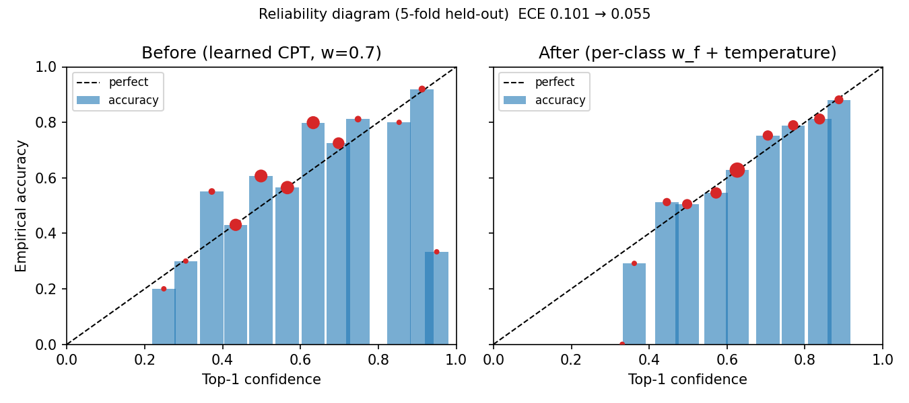

# 故障归因引擎校准报告（B-1）

> 生成：`python3 scripts/data/learn_cpt.py --kfold 5 --seed 42`
> 数据：`data/real/dga/dga_records.jsonl` 共 5143 条，其中非 normal 评测样本 3729 条（引擎不输出 normal，口径与 `eval_fault_attribution.py` 一致）。
> 负观测（低于注意值的气体征兆记为 False）：开。

## 1. 方法

- 参数学习：按故障类别分层 5 折；每折用 4 折统计先验与 CPT（拉普拉斯 α=1）。
- 校准参数拟合与评估分离：验证折按记录顺序二分，前半拟合按类别融合权重 w_f（坐标下降网格 0.0~1.0，目标 NLL） 与温度 T（网格 0.5~4.5，目标 NLL），后半（held-out）评估。
- 指标：Top-1 / Top-3、NLL、Brier、ECE（Top-1 置信度 15 桶）。

## 2. 5 折平均：全验证折（专家 CPT vs 学习 CPT，固定 w=0.7）

| 配置 | Top-1 | Top-3 | NLL | Brier | ECE |
|---|---:|---:|---:|---:|---:|
| 专家 CPT（v1 默认） | 0.384 | 0.733 | 1.970 | 0.740 | 0.115 |
| 学习 CPT，w=0.7 | 0.638 | 0.917 | 1.058 | 0.524 | 0.092 |

## 3. 5 折平均：held-out 半折（校准消融）

| 配置 | Top-1 | Top-3 | NLL | Brier | ECE |
|---|---:|---:|---:|---:|---:|
| 学习 CPT，w=0.7（校准前） | 0.635 | 0.915 | 1.061 | 0.527 | 0.101 |
| + 按类别 w_f | 0.665 | 0.975 | 0.837 | 0.467 | 0.075 |
| + 温度 T（w=0.7） | 0.635 | 0.915 | 1.061 | 0.526 | 0.096 |
| + 按类别 w_f + 温度 T（校准后） | 0.665 | 0.975 | 0.822 | 0.463 | 0.055 |

- 温度 T 逐折：1.20, 1.10, 1.20, 1.40, 1.20；平均 **1.22**（写入 `learned_params.json.calibration.T`）。
- 融合权重 w_f（贝叶斯占比，5 折平均，写入 `learned_params.json.fusion_weights`）：

| 故障 | w_f |
|---|---:|
| `winding_deformation` | 1.00 |
| `winding_short_circuit` | 0.82 |
| `core_grounding` | 1.00 |
| `bushing_fault` | 1.00 |
| `olc_fault` | 1.00 |
| `partial_discharge` | 0.82 |
| `overload_overheating` | 0.00 |
| `insulation_degradation` | 0.56 |

## 4. 可靠性图

| 桶 | n（前） | conf（前） | acc（前） | n（后） | conf（后） | acc（后） |
|---:|---:|---:|---:|---:|---:|---:|
| 0 | 0 | - | - | 0 | - | - |
| 1 | 0 | - | - | 0 | - | - |
| 2 | 0 | - | - | 0 | - | - |
| 3 | 5 | 0.249 | 0.200 | 0 | - | - |
| 4 | 30 | 0.305 | 0.300 | 4 | 0.331 | 0.000 |
| 5 | 69 | 0.372 | 0.551 | 24 | 0.362 | 0.292 |
| 6 | 302 | 0.434 | 0.430 | 119 | 0.445 | 0.513 |
| 7 | 333 | 0.499 | 0.607 | 194 | 0.498 | 0.505 |
| 8 | 363 | 0.566 | 0.565 | 253 | 0.572 | 0.545 |
| 9 | 343 | 0.633 | 0.799 | 489 | 0.626 | 0.628 |
| 10 | 269 | 0.698 | 0.725 | 202 | 0.705 | 0.752 |
| 11 | 69 | 0.748 | 0.812 | 204 | 0.770 | 0.789 |
| 12 | 5 | 0.853 | 0.800 | 234 | 0.838 | 0.812 |
| 13 | 75 | 0.912 | 0.920 | 143 | 0.887 | 0.881 |
| 14 | 3 | 0.950 | 0.333 | 0 | - | - |

## 5. 逐折明细

| 折 | n_val | n_heldout | T | Top-1 前→后 | ECE 前→后 | NLL 前→后 |
|---:|---:|---:|---:|---|---|---|
| 0 | 747 | 374 | 1.20 | 0.610→0.647 | 0.120→0.029 | 1.131→0.879 |
| 1 | 746 | 373 | 1.10 | 0.673→0.684 | 0.122→0.093 | 0.966→0.745 |
| 2 | 746 | 373 | 1.20 | 0.606→0.665 | 0.064→0.041 | 1.080→0.844 |
| 3 | 745 | 373 | 1.40 | 0.625→0.641 | 0.086→0.050 | 1.145→0.881 |
| 4 | 745 | 373 | 1.20 | 0.660→0.686 | 0.113→0.062 | 0.985→0.761 |

### 各类召回（held-out，校准后，逐折）

| 折 | `insulation_degradation` | `overload_overheating` | `partial_discharge` | `winding_short_circuit` |
|---:|---:|---:|---:|---:|
| 0 | 0.482 | 0.771 | 0.627 | 0.550 |
| 1 | 0.392 | 0.884 | 0.637 | 0.548 |
| 2 | 0.529 | 0.818 | 0.626 | 0.475 |
| 3 | 0.429 | 0.776 | 0.577 | 0.578 |
| 4 | 0.365 | 0.826 | 0.701 | 0.571 |

## 附：R3 公开基准子集 `dataset_(589).xlsx` 单列

注意：该子集同时参与了全量参数学习（非严格外部检验），n=438（非 normal）。

| 配置 | Top-1 | Top-3 | NLL | Brier | ECE |
|---|---:|---:|---:|---:|---:|
| 学习 CPT，w=0.7 | 0.662 | 0.943 | 0.985 | 0.499 | 0.113 |
| + w_f + T | 0.669 | 0.975 | 0.782 | 0.449 | 0.091 |

## 6. 说明与局限

- 数据为文献汇编 DGA（见 `docs/design/data_and_evaluation.md` §1.1），标签仅有 4 个故障类（局部放电 / 匝间短路 / 过载过热 / 绝缘老化）+ normal；引擎 8 类中的另 4 类（绕组变形 / 铁芯接地 / 套管 / 分接开关）无正样本，其先验被平滑到接近 0，Top-1 不会落在这些类上。
- 朴素贝叶斯独立假设使多征兆同时出现时后验过尖，这是温度 T>1 的直接原因；报告的 ECE 下降即对此的修正。
- 数据集不含 CO / CO2 / 油温 / 绕组温度 / 负载 / 振动 / 局放告警字段，这 7 个征兆的 CPT 无法从数据学习；写入向 0.5 收缩的专家值 p' = 0.5 + κ(p − 0.5)，κ = 0.5（`EXPERT_SHRINK`），并在 CPT 条目标记 `source: expert_shrunk`。κ 对本报告的准确率 / ECE 无影响（评测数据不含这些征兆），但直接影响 B-2 EIG 对现场征兆的推荐强度，其敏感性见 `docs/eval/eig_sanity_check.md`。
- 校准参数（T、w_f）为 5 折平均值，最终 prior / CPT 用全量数据重学；线上引擎加载 `learned_params.json` 时自动生效。