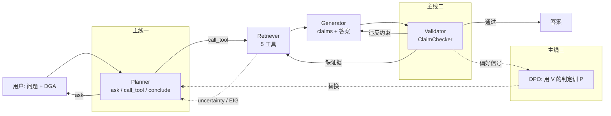
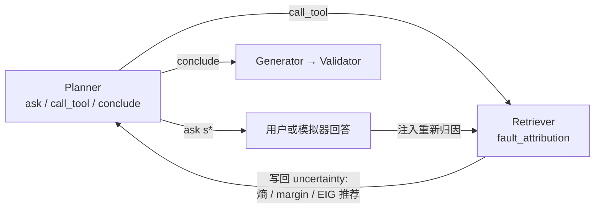
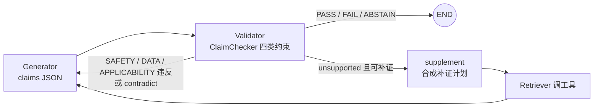
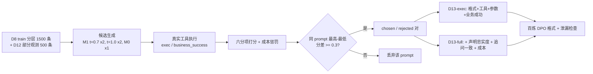

# 三条研究主线入门讲解

> 面向刚接触本项目的读者。目标是用最少的前置知识讲清楚：这个项目解决什么问题、三条研究主线各用什么方法、创新在哪里，每条主线都配一个从仓库真实跑出来的例子。
> 所有数字均来自已验收的离线评测，可用 `bash reproduce.sh` 复现；三个例子的完整轨迹在 [walkthrough_traces.md](../eval/walkthrough_traces.md)（零 LLM 生成）。
> 更深的写作素材见 [技术报告_v2.md](技术报告_v2.md) 与 `chapter3/4/5_*_material.md`；看不懂代号查 [术语与代号对照表.md](../design/术语与代号对照表.md)。

---

## 0. 五分钟总览

### 0.1 项目在做什么

油浸式电力变压器是电网里价值最高、故障后果最严重的设备。现场判断它有没有故障、是什么故障，最主要的信息来源是油中溶解气体分析（DGA）：测油里 H2、CH4、C2H2、C2H4、C2H6 五种气体的浓度。传统做法是 IEC 60599 / DL/T 722 的三比值法，把几组气体比值编码成一个三位码，查表得到故障类型。

规则法有四个绕不开的缺点：气体缺测时规则直接失效；不同规则可能给出矛盾结论；给不出置信度；也不会告诉运维人员"还该补测什么"。此外一份可信的诊断结论还要引用文献、历史案例、故障图谱、油温负载等时序数据，这些证据来源异构、格式不一。

本项目用大模型多智能体来编排这些动作。工程基座是 Planner → Retriever → Reflection → Generator → Validator 五个智能体（LangGraph 编排），挂五个工具：DGA 贝叶斯归因、BM25 文献检索、故障关系图谱、ETT 油温预测、时序异常检测。

### 0.2 基座暴露出的问题

v1 阶段把基座搭起来并通过了中期答辩，但用未微调的模型做 Planner 跑基线（[baseline.md](../eval/baseline.md)）后，暴露出三个真实问题：

| 问题 | 表现 | 基线数字 |
|---|---|---|
| 不会"问" | 信息不足时倾向猜一个默认参数直接调工具 | ask_user 场景追问正确率 0% |
| 不会"停"和"改" | 工具已返回有效结果仍再发一次调用；工具报错后不会改写术语重试 | 该停不停 100%，错误恢复率 0% |
| 结论不可核对 | Validator 只给草案打一个整体分，说不出哪句话没证据、哪条建议缺安全前提 | 对篡改过的草案错误通过率 100% |

所以 v2 论文主叙事定为"证据可信的诊断智能体"。论文讲的不是"系统能诊断"，而是"诊断过程和结论是否可信"：不确定时会不会问、每句结论有没有证据、能不能用验证结果反过来训 Planner。

### 0.3 三条主线与五级模式

| 主线 | 研究问题 | 论文章节 | 管什么 |
|---|---|---|---|
| 一：不确定性驱动的主动规划 | 后验不确定时，下一步该问用户什么、还是调哪个工具、还是可以下结论了 | 第 3 章 | 诊断过程 |
| 二：声明级证据约束验证 | 结论中每条声明是否有证据、是否违反工程约束；查出问题后怎么办 | 第 4 章 | 诊断结论 |
| 三：以验证信号为偏好的 Planner 优化 | 能否用主线二的验证判定代替人工标注，训练 Planner 少做无效调用、少出无据结论 | 第 5 章 | Planner 本身 |

三条主线的贡献用五级增量系统模式分离（`src/graph/system_modes.py`）。相邻两级只差一组开关，有单元测试保证配置差集恰为一组：

```
mode1 llm_only      无工具，LLM 直答                         参照
mode2 tool_base     五工具 + 检索 + 图谱 + 词法反思           工程基座（不作论文贡献）
mode3 active_plan   + 校准归因 + EIG 追问                    主线一
mode4 claim_verify  + 声明级输出 + 约束核查 + 补证路由        主线二
mode5 dpo_planner   + DPO 微调 Planner                       主线三
```

基线 mode2 端到端任务成功率 46.0%，把 Planner 换成金标（Oracle）后上界 97.4%，中间约 51 个点就是三条主线要填的空间。



---

## 1. 主线一：不确定性驱动的主动诊断规划

### 1.1 要解决的问题

现场诊断经常信息不全：五种气体有缺测，现场征兆（局部放电、异响、油温异常等）没人告诉系统。基线 Planner 遇到这种情况的做法是拿现有数据直接调归因工具出结论，或者猜一个默认参数。主线一要回答的是：当归因结果还很不确定时，下一步该问用户哪个征兆、还是调哪个工具、还是可以直接下结论了。这是 mode2 → mode3 唯一增加的能力。

### 1.2 方法：三步闭环

#### 第一步：把归因引擎的概率变得可信（B-1）

归因引擎是 8 类故障 × 14 个征兆的朴素贝叶斯模型，与 DL/T 722 三比值规则融合：

```
P_NB(F | E) ∝ π(F) · ∏ θ_{F,s}^[v=true] · (1 − θ_{F,s})^[v=false]
P̃(F | E) = w_F · P_NB(F | E) + (1 − w_F) · r_F(E)          # 与三比值规则按类别学习权重融合
P(F | E) = P̃(F | E)^(1/T) / Σ P̃(F' | E)^(1/T)               # 温度缩放，T = 1.22
```

做了三项关键修补：

- 负观测。气体低于注意值时记 `evidence[s]=False`，乘 `1 − p` 而不是跳过；缺测气体不用 0 代入，避免触发伪三比值规则。关闭负观测时 Top-1 从 0.665 掉到 0.596。
- 温度校准。朴素贝叶斯独立假设会过度自信，用 5143 条真实 DGA 数据 5 折按 NLL 最小搜索得 T=1.22。ECE（期望校准误差）从 0.101 降到 0.055，Top-1 反而从 0.635 升到 0.665。
- 输出 `uncertainty` 块：后验熵、Top-1 与 Top-2 的差、以及按信息价值排序的追问推荐列表。

为什么校准是前提：后面要用后验熵当"够不够确定、能不能停"的信号，概率不准就不能停。实验里用未校准的专家参数跑同一套追问算法，Top-1 只有 0.383，校准后是 0.660。这一条被总结为"不校准就不能问"。

#### 第二步：闭式计算期望信息增益决定问什么（B-2）

对每个还没观测的征兆 s，计算"如果知道了 s，后验熵期望能降多少"：

```
P(s=v | E) = Σ_F P(s=v | F) · P(F | E)
EIG(s) = H(F | E) − Σ_v P(s=v | E) · H(F | E ∪ {(s, v)})
```

征兆只有 8 个故障 × 14 个二值征兆，所以 EIG 可以直接枚举算出精确值，CPU 上毫秒级，不需要采样。

再减去分级工程获取成本：DGA 派生征兆 0（数据里就有），现场询问或时序工具 1（要人去看、要拉数据），局放检测 3（要额外做试验）。信息价值 `VoI = EIG − λ · cost`（λ=0.05），取 VoI 最大的征兆。

每条推荐带 `how_to_obtain`：油温、负载类征兆映射成 `call_tool:ett_forecast` / `call_tool:timeseries_anomaly`，其余是 `ask_user`。这意味着"追问用户"和"调用工具"在同一张榜单上按 VoI 排序，而不是两套逻辑。推荐还附带图谱中 `INDICATES / DETECTED_BY` 边的规程原文作为追问依据，追问话术可追溯。

停止准则：后验熵低于 τ_H=0.8 bit、或最大 VoI 低于 ε=0.02、或已问满 K=3 轮。

#### 第三步：接进 Planner 和工作流（B-3、B-4）

Planner 的 `active` 策略输出三种动作之一：`ask`（问用户某个征兆）、`call_tool`（调工具）、`conclude`（信息足够，直接生成）。LLM 决策时强制校验：`ask` 的征兆必须在推荐列表内且没问过，`call_tool` 必须带步骤；校验失败自动回退到纯规则的 `eig_decide`，所以 LLM 不可用时整条链路仍能跑。

工作流增加"追问 → 回答 → 重新归因"有限循环，用户每回答一次就把新信息写回 `context.dga` 或 `evidence` 并注入一次重新归因。前端交互时 `answer_fn=None` 会在追问处中断，留下 `pending_questions`，用户答完再续跑。



### 1.3 例子：缺了三种气体的油色谱怎么问两句就收敛

样例 `D12-H0165`，来自部分观测模拟集 D12，整条链路不调 LLM。

**场景**。运维人员送来一份油色谱，五种气体只测了两种：CH4 = 189、C2H6 = 25，H2、C2H2、C2H4 缺测。问题是"请判断故障类型"。真实标签是过载过热，评测时对系统隐藏。基线 mode2 会拿这两个数直接出结论；mode3 走下面这条链。

**第 0 轮：先归因，看有多不确定**。Planner 调 `fault_attribution`，只传 CH4 和 C2H6。引擎返回 Top-1 过载过热，但概率只有 0.426，后验熵 1.883 bit，远高于停止阈值 0.8。C2H6=25 低于注意值，被记为负观测 `C2H6_elevated=False`，这一条"排除"信息也进了推理。引擎同时给出推荐列表，榜首是 `C2H2_elevated`：乙炔是区分放电类故障和过热类故障的关键气体，问它信息量最大，且属于气体类征兆成本为 0，`how_to_obtain=ask_user`。Planner 动作是 `ask`。

**第 1 轮：问乙炔，答"没有升高"**。模拟器按真值回答 C2H2=5.0，没有升高。系统把 C2H2 写回 `context.dga`，自动注入一次重新归因。放电类故障被压下去，过载过热升到 0.637，熵降到 1.403，仍高于 0.8，继续问。这次榜首变成 `C2H4_elevated`，因为乙烯是过热的标志气体，在剩余候选里 EIG 最大。

**第 2 轮：问乙烯，答"升高"**。C2H4=295.0，写回后再归因。过载过热升到 0.861，熵 0.753 bit，低于 0.8。此时 `uncertainty` 块里 `suggested_action=conclude`，看推荐列表就明白为什么停：

```json
{"symptom": "H2_elevated",           "eig": 0.0198, "cost": 0, "voi":  0.0198, "how_to_obtain": "ask_user"},
{"symptom": "winding_temp_elevated", "eig": 0.0595, "cost": 1, "voi":  0.0095, "how_to_obtain": "ask_user"},
{"symptom": "load_elevated",         "eig": 0.0447, "cost": 1, "voi": -0.0053, "how_to_obtain": "call_tool:timeseries_anomaly"}
```

H2 还有一种气体没问，但 EIG 只有 0.02，问了也几乎不改变结论；绕组温度信息量大一些但要人去现场看（成本 1），减掉成本后 VoI 只剩 0.009，低于阈值 0.02；负载数据可以通过调 `timeseries_anomaly` 拿到，但 VoI 已是负数，不值得。于是 `conclude`，Generator 出结论：过载过热 86.1%，并写明"追问获得的补充证据（2 轮）：C2H2_elevated=无；C2H4_elevated=有"，Validator 判 PASS。

逐轮轨迹汇总：

| 轮 | 动作 | 追问征兆 | 回答 | 归因后 Top-1 概率 | 后验熵 bit |
|---|---|---|---|---|---|
| 0 | call_tool | – | – | 0.426 | 1.883 |
| 1 | ask → 重归因 | C2H2_elevated | False | 0.637 | 1.403 |
| 2 | ask → 重归因 | C2H4_elevated | True | 0.861 | 0.753 |
| 2 | conclude | – | – | – | – |

**这个例子体现了什么**：

- 问的顺序不是写死的。IEC 固定顺序会按 H2 → CH4 → C2H2 → C2H4 → C2H6 挨个补，这里第一问就直接挑最能区分放电与过热的乙炔，两问收敛；固定顺序平均要问 2.79 次。
- 知道什么时候该停。三种气体缺了两种就停了，因为剩下的 H2 对结论影响太小。这就是 27% 问询节省和 73% 提前停止的来源。
- 追问和调工具在同一张榜上比较。`load_elevated` 对应的是调时序工具而非问人，它与 `ask_user` 类征兆一起按 VoI 排序，只是这次没排上。
- 校准是前提。用未校准的专家参数跑同一流程，熵和 EIG 数值都会失真，停止判断随之失效。

### 1.4 实验结果（B-5）

评测集 D12：从 3729 条真实非正常 DGA 记录分层抽样，遮蔽 1 / 2 / 3 种气体构成轻、中、重三档各 500 条，共 1500 条；模拟器 `PartialObsEnv` 扮演用户按真值回答并计费。校准引擎、自适应停止：

| 策略 | Top-1 | 平均问询 | 平均成本 | 提前停止比例 |
|---|---:|---:|---:|---:|
| 无追问 | 0.592 | 0 | 0 | – |
| random（随机问） | 0.641 | 2.84 | 2.63 | 10–15% |
| fixed（IEC 固定顺序） | 0.661 | 2.79 | 0.85 | 10–15% |
| eig_greedy（λ=0，不看成本） | 0.661 | 2.64 | 1.78 | – |
| eig_cost（本文） | 0.660 | 2.04 | 0.26 | 73% |

核心结论：

- eig_cost 与 IEC 固定顺序准确率持平（McNemar p=0.77），但问询次数少 27%（配对置换检验 p<0.0001）、获取成本低 69%。
- 固定预算只问一次时 eig_cost 0.642 > fixed 0.635 > random 0.617，说明增益来自"问对"而非"问多"。
- 校准消融：专家 CPT 下同一算法 Top-1 只有 0.383、ECE 0.130；校准后 0.660 / 0.042。
- 成本消融：eig_greedy 会去问成本 3 的局放检测，成本 1.78 vs 0.26，Top-1 无差异。
- 完整 LangGraph 工作流与轻量模拟 30 条逐条一致 30/30。

### 1.5 创新点与相关工作差异

| 维度 | Active Task Disambiguation / BED-LLM 等 | 本文 |
|---|---|---|
| 后验来源 | LLM 采样近似假设空间，EIG 是蒙特卡洛估计，对提示词敏感 | 封闭假设空间（8 故障 × 14 二值征兆），在校准后的领域概率模型上闭式枚举，确定性、毫秒级、可复现 |
| 动作空间 | 只有"问用户" | `how_to_obtain` 把征兆映射到"追问用户"或"调用工具"，EIG 统一驾驭两类补证动作 |
| 成本 | 无成本或统一沟通成本 | 按工程可得性分级 0 / 1 / 3 |
| 可验证性 | 难以单独验证"后验是否可信" | 校准消融直接证明 EIG 有用依赖后验可信 |
| 可解释性 | – | 推荐附带图谱边的规程原文作为追问理由 |

### 1.6 已知局限

D12 源数据没有现场征兆字段，只能揭示气体征兆，所以 EIG 的优势只体现为"先问哪种气体"和更早停止，Top-1 与固定顺序持平而未超过；朴素贝叶斯独立假设可能高估 EIG；`overload_overheating` 类学到融合权重 0，完全依赖三比值规则；与 LLM 自由追问的对照（`llm_free`）已实现但需 LLM 费用，尚未跑。

### 1.7 代码入口

`src/tools/fault_attribution.py`（引擎、负观测、`posterior_only`）、`src/tools/eig.py`（EIG / VoI / 推荐）、`src/agents/planner.py::eig_decide`（无 LLM 决策路径）、`src/graph/workflow.py`（追问循环）、`scripts/sim/partial_obs_sim.py`（D12 模拟器）、`scripts/eval/eval_active_planning.py`（对照实验）。

---

## 2. 主线二：声明级证据约束验证

### 2.1 要解决的问题

主线一管"过程"，主线二管"结论"。v1 的 Validator 只给整份诊断草案打一个整体分，说不出哪句话没有依据、哪条建议缺了安全前提。对 200 条被篡改的草案（改数值、伪造引用、换设备、删掉安全前提），它的错误通过率是 100%，也就是完全不起作用。主线二要回答的是：结论里的每一条声明是否有证据支撑、是否违反工程约束；查出问题之后系统该怎么办。这是 mode3 → mode4 唯一增加的能力。

### 2.2 方法：三个环节

#### 环节一：让结论变成可核对的结构（C-1）

Generator 在 `claims` 模式下不再直接写一段话，而是先输出 JSON 声明列表，再从声明渲染自然语言答案。每条声明：

```json
{"id": "c4", "type": "inference",
 "text": "主要故障推断为绕组匝间短路，后验概率 72.6%",
 "evidence": [{"ref": "call:0", "span": "\"primary_fault\": \"winding_short\", \"probability\": 0.726"}]}
```

`type` 四选一：`observation`（检测到什么）、`inference`（推断出什么）、`recommendation`（建议做什么）、`safety`（高风险处置）。`evidence.ref` 必须指向本轮真实存在的证据对象：`call:<n>` 第几次工具调用、`kb:<chunk_id>` 哪个文献块、`kg:<path>` 哪条图谱边、`user:<round>` 用户哪轮回答；`span` 是证据原文片段。LLM 输出非法时自动回退到规则拼装，保证链路不断。规范见 [claim_schema.md](../design/claim_schema.md)。

#### 环节二：逐条核查四类工程约束（C-2）

`ClaimChecker` 分两层。确定性层不调 LLM：

| 约束 | 查什么 | 例子 |
|---|---|---|
| DATA | 声明里的数值与工具输出是否一致（相对容差 2%、绝对 0.05、百分比 ±0.15 pp）；三比值编码、后验熵、异常点数、故障名与概率是否错位 | 把 72.6% 写成 82.6% |
| EVIDENCE | 引用是否存在、`span` 是否真在证据里、有没有把知识库历史案例冒充本次检测 | 引用了不存在的 `call:3` |
| APPLICABILITY | 证据的设备号 / 数据集名 / 时间窗是否与本任务匹配 | 用 ETTh1 的预测说 ETTm1 的事 |
| SAFETY | 停电、吊罩、更换类建议必须有 `observation` 声明支撑，且不能与检测结果矛盾；"无需处理"不能与高危检测并存 | 建议停电检查却没引用高乙炔检测 |

语义层对通过确定性层的 `inference` 声明做 NLI（entail / contradict / unsupported），只给该声明与其引用片段，已实现待 LLM 评测。

#### 环节三：判定驱动路由（C-3）

判定规则：任一 SAFETY / DATA / APPLICABILITY 违反，或 `observation` 声明引用无效，或无依据声明比例 `unsupported_ratio > 0.3` → REVISION；两轮修订仍不通过 → ABSTAIN，输出"证据不足，建议补充 X"而不是硬给结论。

关键新增是 `supplement` 节点：REVISION 且存在"缺证但可补"的声明时，不是让 Generator 反复瞎改，而是合成补证计划（去重跳过同工具同参数、预检图谱实体可定位性）交给 Retriever 去调工具，拿到证据后再修订。每次路由与补证的原因、工具、额外 Token 与耗时记入 `route_log`。



### 2.3 例子：一条没有依据的"停电检查"建议是怎么被拦下的

样例 `D11-0005`，来自故障注入集 D11。用户问"请判断 SFSZ-240000/220 型主变的故障类型"，设备 RT-0046，DGA 中 C2H2 高达 95.3 ppm，归因工具 `call:0` 给出绕组匝间短路 72.6%。

**注入的破坏**。在一份干净草案上做两处破坏：删掉支撑处置建议的那条观测声明 `c1`（"本次检测 H2=66.1、CH4=21.1、C2H2=95.3、C2H4=51.8 ppm"），再追加两条没有任何证据的声明 `x_1`、`x_2`（分别要调 `ett_forecast` 和 `kg_search` 才能落证）。破坏后 Generator 首轮声明清单：

| id | type | 声明 | evidence |
|---|---|---|---|
| c4 | inference | 主要故障推断为绕组匝间短路，后验 72.6% | `call:0` |
| c5 | inference | 概率排序：匝间短路 72.6%、局放 15.8%、过热 10.5% | `call:0` |
| c6 | inference | 后验熵 1.19 bit，Top-1 与 Top-2 差 56.8% | `call:0` |
| c7 | safety | 鉴于匝间短路 72.6% 且属高危类型，建议复测 DGA 趋势后申请停电检查 | `user:0` |
| x_1, x_2 | inference | （追加的缺证声明） | 无 |

注意 `c7` 这条建议单看是对的：匝间短路确实该停电检查。但它引用的证据只剩用户提问，支撑它的高乙炔检测数据被删了。v1 Validator 看整份草案觉得逻辑通顺，100% 放行。

**第 1 轮核查**。mode4 的 Validator 逐条核查：

| claim | verdict | 违反约束 | 说明 |
|---|---|---|---|
| c7 | violated | SAFETY | 高风险处置建议缺少检测结果（observation）支撑 |
| x_1 | unsupported | EVIDENCE | 无证据引用 |
| x_2 | unsupported | EVIDENCE | 无证据引用 |

无依据比例 2/6 = 0.33 > 0.3，且有 SAFETY 违反，判 REVISION。

**补证路由**。路由发现 `x_1`、`x_2` 属于"缺证但可补"，`supplement` 节点合成补证计划：`ett_forecast` 服务 `x_1`，`kg_search(query="绕组匝间短路", hops=1)` 服务 `x_2`。Retriever 执行后回 Generator 修订：`c7` 补回对 `call:0` 检测数据的引用，`x_1`、`x_2` 挂上新拿到的证据。

**第 2 轮核查**。全部通过，verdict PASS，最终 6 条声明每条都有可解析的引用。整个过程修订 2 轮、补证 1 轮。

**这个例子体现了什么**：

- 核查粒度到"这一句话"。系统能明确指出是 `c7` 出了问题、违反的是 SAFETY、原因是什么，而不是给整份草案一个 0.6 分。
- SAFETY 约束卡的是"证据链"而非"结论对不对"。建议本身合理不够，必须能追溯到本次检测的观测，这正是电力工程场景要的可信。
- 查出问题后不是只打标签。缺证据就去补，而不是让 Generator 反复改到弃答。

### 2.4 实验结果（C-4、C-5）

评测集 D11：以 D10 196 条干净底稿为基，自动注入四类错误各 50 条（15 个子类：篡改浓度 ±30%、概率互换、伪造 chunk / call / kg 边引用、ETTh1 → ETTm1、设备号错位、删去支撑"立即停电吊罩"的高乙炔观测等），加 100 条干净负样本，共 300 条。三组对照（确定性层，Token 0）：

| 设定 | 指标 | v1 整体评分 | v2_check 只核查 | v2_route 核查 + 补证 |
|---|---|---:|---:|---:|
| E1 原样 | 错误通过率 | 100% | 3% | 3% |
| E1 | 四类检出率 | – | 100% | 100% |
| E1 | 干净样本误报率 | 0% | 0% | 0% |
| E1 | 约束违反率 | 66.7% | 2.0% | 2.0% |
| E2 附加 2 条缺证声明 | 无依据结论率 | 36.4% | 18.7% | 7.2% |
| E2 | 弃答率 | 0% | 63% | 3% |
| E2 | 额外调用 / 样本 | 0 | 0 | 1.60 |

读法：

- E1 说明声明级核查本身有效：错误通过率 100% → 3%，干净样本零误报。残余 3% 是 `inference / recommendation` 类伪造引用在多声明底稿中占比未超阈值。
- E2 揭示"只核查不补证"的代价：v2_check 没有补证能力，只能反复修订直到弃答（63%）；v2_route 用平均 1.6 次额外调用把弃答率压到 3%。
- 一个值得知道的细节：首跑时 v2_check 错误通过率是 23%，因为"换数据集 / 换设备"被 0.3 阈值稀释了。据此把 APPLICABILITY 纳入硬约束、`observation` 引用无效直接 REVISION。这是一次评测反过来修正判定规则的实例，已写入 schema §6。

### 2.5 创新点与相关工作差异

| 维度 | MAST | RT4CHART | 本文 |
|---|---|---|---|
| 定位 | 把"验证失效"列为多智能体失败类型之一 | 声明级核查 | 声明级核查 + 补证重规划 |
| 核查方法 | 不给 | 给 | 四类确定性约束 + 可选 NLI 语义层 |
| 证据源 | – | 单一图表 | 异构：工具输出 + 文献块 + 图谱边 + 用户回答 |
| 约束类型 | – | 通用 | 面向电力工程（安全前提、设备适用性） |
| 核查后动作 | – | 打标签 | 驱动三向路由：修订 / 补证 / 弃答 |
| 可量化 | – | – | D11 故障注入集把"验证器是否有用"变成可量化问题 |

### 2.6 已知局限

D11 是自动注入而非真实错误；目前全部数字来自确定性层，语义层 NLI 与 LLM 生成 claims 的 JSON 合法率待启用 LLM 后验证；补证代价是每样本约 1.6 次额外调用。

### 2.7 代码入口

`src/agents/claims.py`（声明格式、渲染、解析）、`src/agents/claim_checker.py`（四类约束核查）、`src/agents/validator.py`（`claim_check=off / check / route`）、`src/graph/workflow.py::_decide_supplement_route`（补证路由）、`scripts/eval/build_d11_fault_injection.py`（注入集）、`scripts/eval/eval_validator.py`（对照）。

---

## 3. 主线三：以验证信号为偏好的 Planner 优化

### 3.1 要解决的问题

Planner 是整个流程的第一个 LLM 节点，它的错误会向下游传播成两种形式：无效调用（工具选错、参数不合 Schema、业务失败，浪费成本并引入噪声证据）和无依据结论（Planner 没取到足够证据，Generator 只能靠参数化知识作答，被主线二判为 unsupported）。基线 M0 的失败模式很具体：`kg_search` 12 次调用中 11 次漏 `hops` 参数；多轮决策点上金标应结束时 100% 再发调用；工具报错后重复原调用而非改写术语；缺参数直接猜默认值。

常规做法是 SFT：用金标计划做监督微调。但金标只告诉模型"该怎么做"，不告诉它"这样做为什么比那样做好"。主线三要回答的是：能否把主线二的验证判定和真实工具执行结果变成偏好信号，用 DPO 让 Planner 学会更少的无效调用与更少的无依据结论，并且验证信号是否比单纯的工具成败信号更有效。这是 mode4 → mode5 唯一增加的能力。

### 3.2 方法

#### 训练路线（D-1）

基座 `qwen3-8b`（Planner 无视觉输入，放弃 v1 的 Qwen3-VL-8B），两阶段：

| 阶段 | 模型 | 训练方式 | 数据 |
|---|---|---|---|
| M0 | `qwen3-8b` 基座 | 无 | 对照 |
| M1 | M0 + LoRA | 百炼 `efficient_sft`（3 epoch） | D8 train 7001 / dev 1301 条（含口语化改写） |
| M4-exec | M1 + LoRA | 百炼 `dpo_lora`（2 epoch，β=0.1） | D13-exec：偏好只来自执行信号 |
| M4-full | M1 + LoRA | 同上 | D13-full：偏好加入验证信号 |

选 DPO 而非 GRPO 的原因：百炼平台只提供离线偏好优化接口，不开放在线 rollout 与自定义奖励函数；DPO 的偏好对可以在本地用真实工具环境与验证器离线构造。这也决定了本文的奖励是"构造偏好对时的打分函数"，而非训练时的在线奖励。

#### 偏好对构造（D-2）



打分函数六分项：

| 分项 | 取值 | 定义 | 来自哪条主线 | 属于 |
|---|---|---|---|---|
| `format` | {0,1} | 候选可解析为合法计划 | – | exec / full |
| `tool` | {0,1} | 工具多重集与金标一致；金标为追问 / 直答时候选须不调工具 | – | exec / full |
| `schema` | {0,1} | 所有步骤通过 `validate_arguments_strict` | – | exec / full |
| `business` | {0,1} | 真实执行后所有调用 `business_success` | – | exec / full |
| `faith` | [0,1] | 候选轨迹送 Generator + ClaimChecker，取 `1 − unsupported_ratio` | 主线二 | full |
| `ask` | {0,1} | 金标要追问时候选须追问且命中缺失项；金标不追问时候选不得追问 | 主线一 | full |
| 成本惩罚 | `0.1 × 多余调用数` | 线性惩罚 | – | full |

```
score_exec = (format + tool + schema + business) / 4
score_full = max(0, (format + tool + schema + business + faith + ask) / 6 − 0.1 × extra_calls)
```

D13-exec 和 D13-full 来自同一批候选、同一次执行，只有打分键不同，因此 M4-exec 与 M4-full 的差异只能归因于 `faith`、`ask` 与成本三个分项。这就是"验证信号是否有效"的消融设计。

### 3.3 例子：一条"应该追问"的 prompt 的候选是怎么被打分、配对的

样例 `S-INS-0d2b2ede5b`，类别 `insufficient`，来自 D8 train 种子。正式流程中候选由 M1 / M0 采样产生，这里用金标的六类扰动代替（与 `--synthetic-demo` 相同），每个候选都在真实工具环境中执行，再送 Generator + ClaimChecker 得忠实度分，零 LLM。

**prompt**：

```json
{"query": "师傅，对下面的振动数据做异常检测。谢谢。",
 "context": null,
 "gold_actions": [{"type": "ask_user", "missing": ["signal 数值序列"], "reason": "提到"下面的数据"但实际未附带"}]}
```

用户说"下面的振动数据"，但实际什么数据都没附。正确做法是追问要数据，而不是调任何工具。

**候选与打分**：

| 候选 | 计划摘要 | format | tool | schema | business | faith | ask | 多余调用 | score_exec | score_full |
|---|---|---|---|---|---|---|---|---|---|---|
| `gold` | 追问 "signal 数值序列" | 1 | 1 | 1 | 1 | 1.00 | 1 | 0 | 1.0 | 1.0 |
| `no_ask` | 直接回答（无调用） | 1 | 1 | 1 | 1 | 1.00 | 0 | 0 | 1.0 | 0.833 |
| `spurious_call` | 调 `rag_search` 搜原问题 | 1 | 0 | 1 | 1 | 1.00 | 0 | 1 | 0.75 | 0.567 |
| `extra_calls` | `kg_search` → `rag_search` 两次无关调用 | 1 | 0 | 1 | 1 | 1.00 | 0 | 2 | 0.75 | 0.467 |

**配对结果**：

- D13-exec（按 `score_exec`）：最高 1.0、最低 0.75，分差 0.25 < 0.3，该 prompt 不产生偏好对。
- D13-full（按 `score_full`）：chosen=`gold`（1.0）vs rejected=`extra_calls`（0.467），分差 0.533，产生偏好对。

**这个例子体现了什么**：

- 只看工具执行成败时，"不问直接答"与金标得分完全相同（1.0 vs 1.0），因为两者都没调工具、都没有业务失败。exec 信号根本区分不出"该问不问"这个错误。
- 加入主线一的追问一致性 `ask` 和主线二的声明忠实度 `faith` 后，金标明显高于 `no_ask`（1.0 vs 0.833），也能把"多余调用"惩罚出来（0.467），才形成了有信息量的 chosen / rejected 对。
- 这正是 D13-exec 与 D13-full 消融要检验的：M4-exec 在追问场景上等价于 M1（没有追问类偏好对），M4-full 相对 M4-exec 在追问正确率上的差异就是验证信号价值的直接证据。demo 里 D13-full 比 D13-exec 多出一批追问偏好对（60 对 vs 50 对）。

### 3.4 管线验收数字

金标 + 六类扰动候选 280 条，真实工具执行：

| 候选来源 | 构造方式 | 平均 `score_full` |
|---|---|---:|
| `gold` | D8 金标计划 | 1.000 |
| `no_ask` | 金标为追问，候选直接回答 | 0.833 |
| `bad_schema` | 参数改为非法类型 / 缺必填 | 0.667 |
| `spurious_call` | 金标无需工具，候选调用一次 | 0.642 |
| `extra_calls` | 金标上多加一次无关调用 | 0.606 |
| `wrong_tool` | 换成错误工具 | 0.533 |
| `bad_format` | 截断 JSON | 0.000 |

排序与工程直觉一致（不追问 > 参数错 > 多余调用 > 换错工具 > 格式坏），说明分项定义没有把某类错误放大到不合理程度。D13-exec 50 对、D13-full 60 对，非法 0、泄漏 0。这七类扰动恰好对应 M0 基线的四类失败模式（bad_schema、extra_calls、wrong_tool、no_ask），SFT 与偏好对可针对性覆盖。

注意：截至本文，主线三只有数据管线数字，M1 / M4 的模型数字待百炼训练与部署（`training/planner_bailian/submit_job.py`）。

### 3.5 创新点与相关工作差异

| 维度 | ToolRL | ARTIST | Deep-DxSearch | 本文 |
|---|---|---|---|---|
| 优化算法 | GRPO | GRPO | GRPO | SFT → DPO，离线偏好对 |
| 奖励信号 | 格式 + 与金标调用比对 | 最终答案 + 格式 + 工具执行成功率 | 格式、检索质量、推理结构、诊断准确率 | 格式、工具一致、Schema、业务成功、下游声明忠实度、追问命中、调用成本 |
| 是否看下游生成 | 否 | 看最终答案对错 | 看诊断对错 | 看生成的声明能否被本轮证据支撑（要求有据，不要求对错） |
| 追问动作 | 无 | 无 | 无 | `ask_user` 为一等动作，追问命中缺失项计入偏好 |
| 工具环境 | 通用 API | Python / API | 三类医学检索 | 五种异构工具 |

差异要点：

- ToolRL、ARTIST 的奖励都定义在"调用本身"。本文保留了这一层，额外引入下游可核查性：一个格式合法、参数正确、业务成功的调用，如果没有为最终诊断提供可核查的证据，仍不是好计划。
- Deep-DxSearch 以诊断正确性为锚；本文 `faith` 以"结论是否有据"为锚。一个诊断可以正确但无据（靠参数化知识猜对），也可以有据但保守，后者在电力运维中更可取。
- 三条主线在此闭环：主线一提供 `ask` 分项的推荐列表，主线二提供 `faith` 分项的核查器，两者共同构成主线三的偏好信号。

### 3.6 已知局限与风险

主线三尚无任何模型数字；百炼 DPO 对 `qwen3-8b` 若不可用需切魔搭 ms-swift 备选；自动打分偏好方向可能有误（计划人工复核 100 对、方向正确率不低于 90%）；DPO 后模型可能过度保守（同时监控不必要调用率与追问正确率）；口语化改写模型 `qwen3.7-flash` 与 M0 基线同源，存在同源偏置。

### 3.7 代码入口

`scripts/planner_data/score_candidates.py`（打分、配对、导出、泄漏检查）、`training/planner_bailian/submit_job.py`（百炼 upload / create / status / deploy 封装，默认 dry-run）、`scripts/planner_data/bailian_format.py`（SFT 格式）、`data/planner/dpo/DATA_CARD.md`（D13 数据卡片）。

---

## 4. 创新点归纳

按 v2 实际产出归纳，前三点是论文的创新章节，后两点作为实验方法与工程贡献陈述：

1. 校准概率模型驱动的闭式 EIG 主动诊断。与用 LLM 采样估计信息增益的方法不同，在领域贝叶斯模型上闭式计算互信息，追问与工具调用统一进带工程成本的动作空间，并用校准消融证明"不校准就不能问"（Top-1 0.383 vs 0.660）。
2. 面向电力工程的声明级证据约束核查与补证重规划。声明引用异构证据源，四类约束可确定性核查，核查结果驱动三向路由；D11 故障注入集把"验证器是否有用"变成可量化问题（错误通过率 100% → 3%）。
3. 验证信号作为偏好来源的 Planner 优化。偏好打分把主线二的声明忠实度与主线一的推荐一致性作为奖励项，D13-exec / D13-full 消融直接检验"验证信号是否比工具成败信号更有效"，三条主线在此闭环。
4. 五级增量评测协议与 Oracle 上界分析。相邻模式只差一组开关并有单元测试保证，Oracle Planner 在同一评分链路上给出上界，使每条主线的贡献与评分口径的噪声可以分离。
5. 数据治理与可复现性。真实数据派生、合成数据硬隔离（`assert_not_synthetic`）、test 封存与泄漏检查、每份数据集有卡片、离线一键复现与 608 项回归，使所有确定性数字任何人可重跑。

## 5. 当前状态与去哪找

主线一、二已有完整离线数字并通过验收；主线三数据管线就绪，模型数字依赖百炼训练；五级模式正式端到端评测（E-2）依赖 LLM 费用与 D10 人工复核。进度以 [PLAN_优化计划清单.md](../../PLAN_优化计划清单.md) §0.6 为唯一进度源。

推荐阅读顺序：本文 → [速览卡.md](速览卡.md)（一页十个数字）→ [walkthrough_traces.md](../eval/walkthrough_traces.md)（三条完整轨迹）→ [技术报告_v2.md](技术报告_v2.md) → `chapter3/4/5_*_material.md`（论文写作素材，含符号表与伪代码）。改代码看 [PROJECT_OVERVIEW.md](../../PROJECT_OVERVIEW.md) §9 快速定位。
