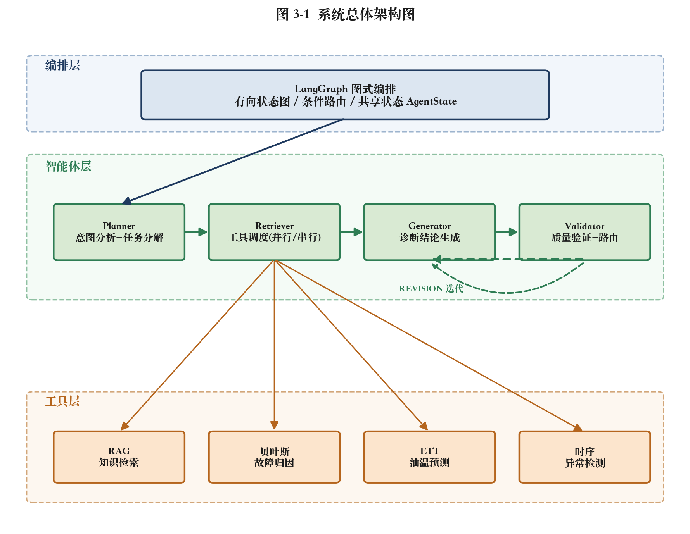
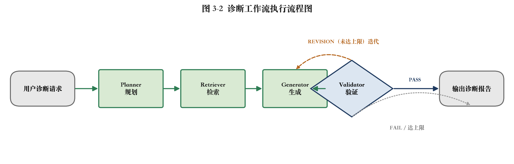

# 第一章 研究背景

电力系统是支撑现代社会运转的关键基础设施，其安全、稳定、经济运行直接关系到国民经济发展与社会民生保障。随着特高压交直流输电、新能源大规模并网以及智能电网的快速发展，电力系统的规模与复杂度持续攀升，对电网设备运行可靠性的要求也日益严苛。在电力系统的发、输、变、配各个环节中，变电环节起着电压等级变换与电能分配的枢纽作用，而电力变压器正是变电站中最核心、最关键且造价最为昂贵的电气设备之一[1]。

电力变压器承担着电压变换、功率传输与电气隔离的重要功能，是连接各电压等级电网的"咽喉"枢纽，其运行状态在很大程度上决定了整个电网的供电可靠性。然而，变压器长期处于高电压、大电流、强电磁场及复杂热应力的运行环境中，其内部绝缘系统（绝缘油与绝缘纸）在电、热、机械等多重应力的长期作用下会逐渐老化劣化，进而诱发绕组变形、匝间短路、局部放电、铁芯多点接地、过热以及绝缘老化等多种潜伏性故障[5]。一旦变压器发生严重故障，不仅会造成设备本体的巨大经济损失，还可能引发大面积停电事故，甚至危及电网安全。因此，及时、准确地对电力变压器进行状态评估与故障诊断，实现由"事后检修"向"状态检修"乃至"预测性维护"的转变，对保障电网安全运行具有重要意义[5]。

在众多故障诊断技术中，油中溶解气体分析（Dissolved Gas Analysis, DGA）因其灵敏度高、能够在不停电的情况下有效反映变压器内部潜伏性故障，已成为国际上诊断油浸式变压器内部故障最有效、最常用的手段之一[8,9]。当变压器内部发生过热或放电性故障时，绝缘油及固体绝缘材料会在故障能量作用下发生裂解，产生氢气（H₂）、甲烷（CH₄）、乙烷（C₂H₆）、乙烯（C₂H₄）、乙炔（C₂H₂）以及一氧化碳（CO）、二氧化碳（CO₂）等特征气体[4]。通过分析这些溶解气体的组分与浓度，并结合三比值法、特征气体法等判据，可对故障的类型与严重程度做出判断。我国相关行业标准 DL/T 722—2014《变压器油中溶解气体分析和判断导则》对此提供了规范的诊断依据[2,3]。然而，传统 DGA 诊断方法存在判据边界生硬、对复杂或多重故障识别能力有限、且高度依赖专家经验等不足，难以满足现代电网对故障诊断智能化、自动化与可解释性的更高要求[6,7]，这也正是本文研究的出发点。

---

# 第三章 已完成工作总结

本章对中期阶段已完成的研究与开发工作进行系统总结。整体工作围绕"**电力变压器大模型驱动多智能体故障诊断系统**"展开，按照"架构设计—智能体实现—工具研发—数据构建—系统评测"的逻辑层次依次推进，已形成"有设计、有实现、有验证"的完整闭环。

---

## 3.1 多智能体协同框架的设计与实现

针对单一大模型在复杂诊断任务中推理链过长、过程不可控、结论质量难以保障的问题，本文设计并实现了一套基于 LangGraph 的多智能体协同诊断框架。该框架将完整的诊断任务解耦为"规划—检索—生成—验证"四个职责单一的子任务，分别由四个智能体承担，并通过一个共享状态对象在智能体间传递中间结果，由 LangGraph 进行图式编排，从而将传统"一问一答"的诊断模式重构为具备任务分解、工具调用与自我修正能力的可控推理流程。

系统整体划分为编排层、智能体层与工具层三层结构。编排层基于 LangGraph 构建有向状态图，统一调度推理流程；智能体层由四个大模型驱动的智能体协同完成诊断；工具层通过统一的工具客户端提供领域能力支撑。系统总体架构如图 3-1 所示。

**图 3-1 系统总体架构图**

> 图示说明：系统自上而下分为三层。编排层为基于 LangGraph 的有向状态图（含条件路由与共享状态 AgentState）；智能体层依次为 Planner（意图分析+任务分解）、Retriever（工具调度，并行/串行）、Generator（诊断结论生成）、Validator（质量验证+路由），其中 Validator 判定 REVISION 时回退至 Generator 形成迭代闭环；工具层由 Retriever 调度 RAG 知识检索、贝叶斯故障归因、ETT 油温预测、时序异常检测四类工具。

在工作流控制方面，本文实现了由 Validator 评估结论驱动的动态路由与迭代闭环机制：Validator 对诊断草案给出 PASS（通过）、REVISION（需改进）、FAIL（失败）三级判定，当判定为 REVISION 时，工作流通过条件边携带改进建议回退至 Generator 进行重生成，直至通过验证或达到最大迭代次数上限（默认 3 次），从而在保证诊断质量的同时避免无限循环。系统的完整执行流程如图 3-2 所示。

**图 3-2 诊断工作流执行流程图**

> 图示说明：用户诊断请求依次经 Planner 规划、Retriever 检索、Generator 生成，至 Validator 验证；验证结论为 PASS 时输出诊断报告，为 REVISION 且未达迭代上限时回退至 Generator 重生成，为 REVISION 且达上限或 FAIL 时结束并输出当前结果。

此外，为保障系统在异常工况下的鲁棒性，本文建立了多级降级容错机制：当 LangGraph 不可用时自动降级为串行工作流，当大模型服务不可用时各智能体自动降级为基于规则或模板的处理方式，确保系统在外部依赖失效时仍能输出有效结果。

---

## 3.2 四类功能智能体的设计与实现

在框架基础上，本文完成了四个功能智能体的设计与实现，各智能体职责单一、可独立配置模型、可独立优化，其职责与输入输出关系如表 3-1 所示。

**表 3-1 四类智能体职责与输入输出**

| 智能体 | 核心职责 | 主要输入 | 主要输出 | 关键技术 |
|---|---|---|---|---|
| Planner | 意图分析与任务分解 | 用户诊断请求 | 结构化诊断计划（含工具决策） | LLM + ReAct 思维链 |
| Retriever | 工具调度与证据采集 | 诊断计划 | 多源检索证据、工具调用记录 | 并行/串行混合调度 |
| Generator | 诊断结论生成 | 多源证据、验证反馈 | 诊断结论与处置建议 | LLM + 迭代重生成 |
| Validator | 质量验证与路由决策 | 诊断草案 | 评分、改进建议、路由结论 | 结构化质量评估 |

其中，Planner 基于大模型与 ReAct 风格思维链对用户请求进行意图分析，并将复杂诊断任务分解为带有明确工具调用决策的结构化计划。Retriever 解析该计划并调度工具层执行，对相互独立的工具采用线程池并行调用以提升效率，对存在数据依赖的工具采用两阶段串行执行以保证上下文正确注入；当未获得有效计划时，自动降级为固定工具集检索。Generator 聚合知识检索片段、故障归因结果与油温预测等多源证据生成面向一线的诊断结论，并支持依据 Validator 反馈进行迭代优化。Validator 对生成结果进行结构化质量评估，输出量化评分与具体改进建议，并据此驱动工作流路由。

---

## 3.3 多源诊断工具的研发

为弥补通用大模型在领域知识、可解释归因与状态预判方面的不足，本文研发了四类领域工具，并通过 MCP（Model Context Protocol）风格的统一客户端完成注册与调度。各工具的输入输出与设计动因如表 3-2 所示。

**表 3-2 多源诊断工具一览**

| 工具 | 输入 | 输出 | 核心技术 | 解决的问题 |
|---|---|---|---|---|
| RAG 知识检索 | 查询文本 | Top-K 知识片段（子块+父块上下文） | Milvus 向量库 + 父子分块 | 领域知识缺失、模型幻觉 |
| 贝叶斯故障归因 | DGA 气体数据、征兆 | 故障概率排序、归因报告 | 贝叶斯网络 + 三比值法融合 | 归因可解释性差 |
| ETT 油温预测 | 数据集、回看/预测窗口 | 油温预测序列、R²、异常点 | 最小二乘回归 + 3σ 检测 | 缺乏趋势预判 |
| 时序异常检测 | 一维监测信号 | 均值、标准差、异常点索引 | 3σ 统计规则 | 实时突变识别 |

在故障归因工具中，本文构建了"故障层→征兆层"的贝叶斯概率图模型，给定观测征兆 $E$ 时按下式计算各故障的后验概率：

$$P(F \mid E) \propto P(E \mid F)\,P(F)$$

并进一步将贝叶斯后验概率与 DL/T 722-2014 三比值法规则的匹配置信度按下式加权融合，兼顾数据驱动推理与领域专家规则：

$$P_{\text{fused}} = 0.7 \times P_{\text{bayes}} + 0.3 \times C_{\text{rule}}$$

在油温预测工具中，本文基于六维负载特征 $[\text{HUFL}, \text{HULL}, \text{MUFL}, \text{MULL}, \text{LUFL}, \text{LULL}]$ 以最小二乘法拟合负载与油温的线性关系，并外推未来趋势，配合 3σ 规则检测油温异常，使系统具备从"事后诊断"向"事前预警"延伸的能力。四类工具分别从领域知识、概率归因、趋势预测与实时监测四个维度为诊断提供多源证据。

---

## 3.4 数据集构建与数据驱动的参数学习

诊断能力的可靠性来源于充分的数据与知识。本文按"离线学习—在线推断"的设计思想构建系统的数据底座：离线数据用于知识沉淀与模型训练，回答"系统如何获得诊断能力"的问题；在线数据用于实时诊断推断，回答"对当前设备做出何种判断"的问题。二者的分工与作用如表 3-3 所示。

**表 3-3 在线/离线数据的分工与作用**

| 数据类型 | 具体数据 | 对应模块 | 作用 |
|---|---|---|---|
| 离线数据 | ETT 历史时序（国家电网两站约两年负载/油温记录） | 油温预测工具 | 训练回归模型、统计异常基准 |
| 离线数据 | 领域文档（检修规程、DGA 标准、故障案例） | RAG 知识库 | 向量化构建可检索知识底座 |
| 离线数据 | 标注 DGA 历史样本 | 贝叶斯归因工具 | 统计学习先验概率与条件概率表 |
| 在线数据 | 实时 DGA 化验、油温、负载、振动等监测量 | 各推断模型 | 作为观测证据进行实时诊断 |

### 3.4.1 数据集构建

为支撑模型训练与系统评测，本文按照统一的数据规范（schema）构建了四类数据集，使其在故障标签、征兆字段与气体浓度上相互对齐，并可在后续用真实现场数据按相同规范直接替换。各数据集的构建遵循变压器故障的物理机理，依据 DL/T 722—2014 三比值法与产气特征，为每类故障生成自洽的气体分布，保证数据标签与特征的强相关性。已构建的数据集规模如表 3-4 所示。

**表 3-4 已构建数据集规模**

| 数据集 | 规模 | 用途 |
|---|---|---|
| 标注 DGA 样本集 | 5143 条 | 贝叶斯网络参数学习（先验与 CPT） |
| DGA 评测样本集 | 3000 条（含 8 类故障 + 正常） | 故障归因引擎分类性能评测 |
| 故障案例库 | 200 条 | RAG 检索的案例知识来源 |
| 端到端评测集 | 120 条 | 多智能体系统整体效果评测 |

其中，端到端评测集的每条样本均包含真实的用户查询（含设备型号、运行年限与气体浓度）、设备上下文，以及标注了预期主故障、关键诊断要点与安全提示要求的"标准答案"，从而支持对系统诊断结论的多维度自动化评估。

### 3.4.2 数据驱动的贝叶斯参数学习

针对贝叶斯网络参数传统上依赖专家经验设定、主观性强且难以泛化的问题，本文基于真实标注 DGA 数据，采用极大似然估计结合拉普拉斯平滑（Laplace add-k）的方法统计学习网络参数，包括故障先验概率 $P(F)$ 与条件概率表 $P(S \mid F)$。

故障先验概率由各故障类别的样本频率估计：

$$P(F) = \frac{N(F) + \alpha}{N + \alpha \cdot K}$$

其中 $N(F)$ 为故障 $F$ 的样本数，$N$ 为样本总数，$K$ 为故障类别数。条件概率表中，征兆 $S$ 在故障 $F$ 发生与不发生时出现的概率分别按下式估计：

$$P(S{=}\text{True} \mid F) = \frac{N(S{=}\text{True}, F) + \alpha}{N(F) + 2\alpha}, \quad P(S{=}\text{True} \mid \neg F) = \frac{N(S{=}\text{True}, \neg F) + \alpha}{N(\neg F) + 2\alpha}$$

平滑系数 $\alpha$（取 1.0）用于避免零概率导致似然连乘时的概率塌缩问题。为客观评估参数学习的有效性，本文采用留出法将标注样本按 7∶3 划分为训练集与测试集，仅在训练集上学习参数，并在测试集上对比"专家先验参数"与"数据驱动参数"的诊断准确率。学习得到的参数以独立参数文件形式持久化，供归因引擎在推断时加载，从而在保持模型结构可解释的前提下，以数据驱动方式替代专家先验，提升了归因的客观性与泛化能力。

---

## 3.5 系统评测与实验验证

为客观量化系统能力，本文设计并实现了两套相互补充的评测框架，分别从"核心归因能力"与"系统整体效果"两个层面对系统进行评估。

### 3.5.1 故障归因引擎评测

故障归因是本系统诊断可信度的核心来源，因此本文首先对其进行独立评测。该评测属确定性评测，不依赖大模型与外部网络，以带真实标签的 DGA 数据驱动归因引擎，逐样本计算预测故障与真实标签的吻合程度，所采用的评测指标及其含义如表 3-5 所示。

**表 3-5 故障归因引擎评测指标**

| 指标 | 含义 |
|---|---|
| Top-1 准确率 | 主故障预测正确的样本比例 |
| Top-3 命中率 | 真实故障落在前三候选内的比例 |
| Precision / Recall / F1 | 各故障类别的精确率、召回率与 F1（含宏平均、加权平均） |
| 混淆矩阵 | 真实标签与预测标签的分布情况 |
| 置信度校准性 | 正确与错误预测的平均置信度对比 |
| 高危故障召回率 | 分严重程度统计，评估高危故障是否漏诊 |

在 3000 条 DGA 样本（剔除正常样本后为 1803 条故障样本）上的评测结果显示，归因引擎的 **Top-3 命中率达到 88.5%**，表明引擎能够稳定地将真实故障纳入前三候选，证明所选征兆特征与故障类型具有强相关性；而 **Top-1 准确率为 37.9%**，分严重程度统计中 **critical（高危）故障的召回率达到 100%**，说明引擎对最危险故障不存在漏诊，满足电力运维的安全底线要求。

进一步分析各故障类别的识别效果（部分结果如表 3-6 所示）可以发现，局部放电（F1=0.85）、过载过热（Recall=1.00）等产气特征显著的故障识别效果良好，而绝缘老化、套管故障等产气量较低或特征重叠的故障识别效果偏弱。结合混淆矩阵分析，其根本原因在于当前贝叶斯网络的条件概率表采用人工近似设定，朴素贝叶斯的似然连乘机制存在偏向高产气故障的系统性倾向。这一结果定量地揭示了纯专家参数的局限性，为 3.4 节所述的数据驱动参数学习提供了明确的改进依据。

**表 3-6 部分故障类别识别效果**

| 故障类型 | Precision | Recall | F1 | 样本数 |
|---|---|---|---|---|
| 局部放电 | 1.00 | 0.74 | 0.85 | 274 |
| 过载过热 | 0.40 | 1.00 | 0.57 | 335 |
| 绕组匝间短路 | 0.19 | 1.00 | 0.31 | 126 |
| 绝缘老化 | 0.54 | 0.05 | 0.10 | 358 |

### 3.5.2 多智能体系统端到端评测

在归因引擎评测的基础上，本文进一步对整个多智能体系统进行端到端评测，以 120 条评测集样本驱动完整工作流（Planner→Retriever→Generator→Validator），从流程连通性、诊断准确性、内容完备性、安全合规性与自我修正活跃度等多个维度综合评估系统的整体效果。该评测采用"可注入工具"设计：故障归因始终使用真实引擎，知识检索与时序分析可在真实后端与模拟数据间切换，大模型不可用时各智能体自动降级，从而保证评测在不同部署条件下均可运行。所采用的评测指标如表 3-7 所示。

**表 3-7 端到端系统评测指标**

| 指标 | 含义 |
|---|---|
| 流程完成率 | 成功跑完完整工作流的比例 |
| 主故障命中率 | 最终诊断文本命中预期主故障的比例 |
| 关键要点覆盖率 | 诊断文本覆盖预期关键要点的平均比例 |
| 安全合规率 | 应提示安全的样本中包含安全/保护关键词的比例 |
| Validator 平均得分 | 最终验证评分均值 |
| 平均迭代轮次 | Generator 重生成次数，反映自我修正活跃度 |
| LLM 降级率 | 触发模板/规则降级的比例，反映外部依赖健康度 |

其中，流程完成率用于验证多智能体协同与降级容错机制的鲁棒性；主故障命中率与关键要点覆盖率从准确性与完备性两方面评估诊断质量；安全合规率作为面向工业应用的安全底线指标，统计应提示安全的样本中实际包含安全、停电、保护等关键词的比例；平均迭代轮次反映"生成—验证—再生成"闭环的自我修正活跃度；LLM 降级率则用于监测系统对外部大模型服务的依赖健康度。

两套评测框架相互补充：前者以确定性方式聚焦验证故障归因这一核心能力的准确性与安全性，并定量暴露了参数改进方向；后者从端到端视角验证多智能体协同、自我修正与安全合规等系统级能力，二者共同构成对本系统的完整实验验证。

---

## 3.6 本章小结

本章从框架、智能体、工具、数据与评测五个方面系统总结了中期阶段已完成的工作。本文完成了基于 LangGraph 的四智能体协同诊断框架及其动态路由与降级容错机制，实现了 Planner、Retriever、Generator、Validator 四个功能智能体，研发了 RAG 检索、贝叶斯故障归因、油温预测与时序异常检测四类领域工具，构建了在线/离线相结合的数据底座并实现了数据驱动的贝叶斯参数学习，最终通过两套评测框架对系统的核心能力与整体效果进行了量化验证，形成了"设计—实现—验证"的完整研究闭环，为后续工作奠定了坚实基础。

---

# 参考文献

[1] 谢毓城. 电力变压器手册[M]. 北京: 机械工业出版社, 2003.

[2] 国家能源局. DL/T 722—2014 变压器油中溶解气体分析和判断导则[S]. 北京: 中国电力出版社, 2015.

[3] 全国电力设备状态维修与在线监测标准化技术委员会. GB/T 7252—2016 变压器油中溶解气体分析和判断导则[S]. 北京: 中国标准出版社, 2016.

[4] 操敦奎. 变压器油中气体分析诊断与故障检查[M]. 北京: 中国电力出版社, 2005.

[5] 朱德恒, 严璋, 谈克雄, 等. 电气设备状态监测与故障诊断技术[M]. 北京: 中国电力出版社, 2009.

[6] 廖瑞金, 王谦, 骆思佳, 等. 基于油中溶解气体分析的变压器故障诊断方法综述[J]. 电力自动化设备, 2008, 28(10): 117-123.

[7] 律方成, 牛雷雷, 王胜辉, 等. 变压器故障诊断方法研究综述[J]. 高电压技术, 2020, 46(增刊): 等.

[8] IEEE. IEEE Std C57.104—2019 IEEE Guide for the Interpretation of Gases Generated in Mineral Oil-Immersed Transformers[S]. New York: IEEE, 2019.

[9] Duval M. A review of faults detectable by gas-in-oil analysis in transformers[J]. IEEE Electrical Insulation Magazine, 2002, 18(3): 8-17.
