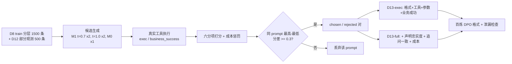

# 证据可信的变压器故障诊断多智能体系统 —— 阶段技术报告（v2）

> 版本：v2，2026-09-16（代码基线 `cf7b772`，对照起点 `baseline-v0` / `9be86da`）
> 读者：导师与课题组。默认读者熟悉大模型与智能体，不要求熟悉变压器。
> 与 v1 的关系：v1 报告（[技术报告.md](技术报告.md)）以「复现两篇论文并组合」为主线，已被本报告取代；v1 中的知识库、图谱、反思等工作在本报告中降级为工程基座，不再作为论文贡献。
> 数字口径：本文所有数字分「已验证」与「预期」两类。已验证数字均可在对应报告中找到并按 [reproduce.sh](../reproduce.sh) 或报告末尾命令复现；预期数字统一标注「目标」，是按当前基线推算的可辩护区间，不是承诺。

---

## 摘要

本项目面向电力变压器故障诊断，构建了一个由 Planner、Retriever、Reflection、Generator、Validator 五个智能体（LangGraph 编排）与五种异构工具（贝叶斯归因、文献检索、故障图谱、油温预测、时序异常）组成的诊断系统。v1 阶段完成了工程基座并通过中期答辩；v2 阶段把论文主叙事重定为「证据可信的诊断智能体」，围绕三个研究问题展开：信息不足时下一步该问什么或调什么工具（主线一：不确定性驱动的主动规划），诊断结论中的每一条声明是否有证据支撑且不违反工程约束（主线二：声明级证据约束验证），以及能否用验证信号而不是人工标注去优化 Planner（主线三：以验证信号为偏好的 DPO）。

截至本报告，三条主线的代码、数据集与离线评测全部完成并通过验收：归因引擎校准后 ECE 由 0.101 降到 0.055、Top-1 不降反升 3.0 pt；基于期望信息增益（EIG）的追问策略在 1500 条部分观测样例上，以与固定顺序相同的 Top-1（0.660 vs 0.661）将平均问询次数减少 27%（p<0.0001）；声明级核查器在 300 条故障注入集上把错误通过率从 100% 压到 3%、干净样本误报 0；DPO 偏好对构造管线在真实工具环境下验证了打分函数对六类扰动的排序方向全部正确。基线数字已产出：未微调 `qwen3.7-flash` 作为 Planner 的完整调用率 51.4%、错误恢复率 0%，工程基座（mode2）端到端任务成功率 46.0%，金标 Planner 上界 97.4%。两者之间约 51 个点的差距就是三条主线要填的空间。剩余工作全部依赖外部资源（百炼训练部署、LLM 正式评测、人工标注），脚本与请求体已就绪。

---

## 1. 背景与问题

### 1.1 应用背景

油浸式电力变压器是电网中价值最高、故障后果最严重的设备之一。现场诊断的主要信息来源是油中溶解气体分析（DGA，H2 / CH4 / C2H2 / C2H4 / C2H6 五种特征气体浓度），传统方法是 IEC 60599 / DL/T 722 三比值法等规则编码。规则法的问题是：气体缺测时规则失效、不同规则给出矛盾结论、无法给出置信度、无法告诉运维人员「还该补什么检测」。此外，诊断结论还需要引用文献、历史案例、图谱知识与油温负载等时序数据，这些证据来源异构且格式不一。

### 1.2 大模型智能体路线的机会与风险

大模型智能体天然适合把「查规则、查文献、算概率、看时序」这些动作编排起来，并用自然语言解释结论。但把它直接用于诊断有三个具体风险，也是本项目 v1 阶段的基线跑出来后暴露的真实问题（[baseline.md](baseline.md)）：

- 不会「问」：信息不足时模型倾向猜一个默认参数直接调用。基线 mode2 在 ask_user 场景 3 条全部直接用默认参数调 `ett_forecast`，追问正确率 0%。
- 不会「停」和「改」：多轮决策点上，工具已经返回有效结果时模型仍 100% 再发一次调用；看到工具报错后不会改写术语重试，错误恢复率 0%。
- 结论不可核对：v1 的 Validator 只给草案打一个整体分，不能指出哪句话没有证据、哪条建议缺少安全前提。对 200 条注入了数值篡改、伪造引用、换设备、删安全前提的草案，v1 Validator 错误通过率 100%。

### 1.3 研究问题与主叙事

据此，v2 把论文主叙事定为「证据可信的诊断智能体」，三条主线各回答一个问题：

| 主线 | 研究问题 | 对应论文章节 | 核心对照 |
|---|---|---|---|
| 一：不确定性驱动的主动规划 | 后验不确定时，下一步该问用户什么征兆，还是调哪个工具 | 第 3 章 | 随机问 / IEC 固定顺序 / EIG 贪心 / EIG 带成本 / LLM 自由追问 |
| 二：声明级证据约束验证 | 结论中每条声明是否有证据、是否违反 DATA / EVIDENCE / APPLICABILITY / SAFETY 四类工程约束 | 第 4 章 | 整体评分 Validator / 声明级核查 / 核查 + 补证重规划 |
| 三：以验证信号为偏好的 Planner 优化 | 把主线二的验证判定与真实工具执行结果变成偏好信号做 DPO，是否比 SFT 更能减少无效调用与无依据结论 | 第 5 章 | M0 基座 / M1 SFT / M4-exec / M4-full |
| 系统级增量评测 | 三项能力各贡献多少 | 第 6 章 | 五级模式逐级加能力 |

四项已定决策（2026-09-15）：主叙事改为证据可信；主线三用 DPO 不用 GRPO（偏好对可离线构造，不需要在线 rollout）；训练部署用阿里云百炼（基座 `qwen3-8b`，`efficient_sft` → `dpo_lora`）；不复现林金山三智能体流程作对照，对照组改为系统内部能力开关与通用方法基线。

---

## 2. 系统总体设计

### 2.1 运行时架构

```mermaid
flowchart TD
    U[用户问题 + DGA + 设备上下文] --> P[Planner<br/>动作: ask / call_tool / conclude]
    P -- ask --> Q[追问用户<br/>最多 K 轮]
    Q --> P
    P -- call_tool --> R[Retriever<br/>严格参数校验 + 并行执行]
    R --> F[Reflection<br/>0-3 分过滤 + 邻块补召回]
    F --> G[Generator<br/>claims JSON + 自然语言]
    G --> V[Validator<br/>ClaimChecker 四类约束]
    V -- PASS / FAIL / ABSTAIN --> E[final_answer]
    V -- contradict / DATA / SAFETY --> G
    V -- unsupported 且可补证 --> S[supplement<br/>合成补证计划]
    S --> R
    R -.-> T1[fault_attribution<br/>贝叶斯 x 三比值 + EIG 推荐]
    R -.-> T2[rag_search<br/>BM25 两路 RRF]
    R -.-> T3[kg_search<br/>90 节点 / 190 边多跳]
    R -.-> T4[ett_forecast<br/>油温预测 + 3σ]
    R -.-> T5[timeseries_anomaly]
    T1 -. uncertainty.recommendations .-> P
```

要点：Planner 的输出不再只是工具步骤列表，而是 `action ∈ {ask, call_tool, conclude}` 加 `rationale`；归因工具除后验外还返回 `uncertainty` 块（熵、Top-1 与 Top-2 差、EIG 推荐列表、建议动作），Planner 据此决定是否追问；Generator 先输出结构化 `claims`（每条带 `type` 与 `evidence[]` 引用），再渲染自然语言；Validator 内部的 ClaimChecker 逐条核对声明与证据，判定结果驱动三种路由：回 Generator 修订、回 Retriever 补证、或弃答（ABSTAIN）。每个智能体在 LLM 不可用时都有确定性降级路径，保证评测与回归可离线运行。

代码规模：`src/ scripts/ tests/ training/` 共约 2.57 万行 Python，13 个测试文件 608 项回归，42 次提交（截至 `0128d32`）。

### 2.2 五级增量系统模式

论文第 6 章的对照方式不是「有 / 无系统」，而是逐级打开能力，相邻两级只差一组开关，从而把每条主线的贡献分离出来（[system_modes.py](../src/graph/system_modes.py)，单元测试断言相邻模式的配置差集恰为一组）：

| 模式 | 名称 | 相对上一级新增 | 对应 |
|---|---|---|---|
| mode1 | `llm_only` | 无任何工具，LLM 直接回答 | 参照 |
| mode2 | `tool_base` | 五工具 + 两路检索 + 图谱 + 词法反思；归因专家参数、无 EIG；Planner 自由策略；Generator 纯文本；声明核查关 | 工程基座 |
| mode3 | `active_plan` | 归因切校准参数 + 输出 EIG 推荐；Planner 启用 ask / call_tool / conclude 主动策略 | 主线一 |
| mode4 | `claim_verify` | Generator 输出 claims；Validator 切声明级核查 + 补证路由 | 主线二 |
| mode5 | `dpo_planner` | Planner 换为百炼部署的 DPO 模型 | 主线三 |

`resolve_mode` 支持逐项覆盖，可构造交叉对照（如 mode4 + 基座 Planner、mode5 + 关闭核查），用于分离主线二与主线三的贡献。

### 2.3 工程基座（v1 资产，不作论文贡献）

| 组件 | 实现 | 已验证数字 |
|---|---|---|
| 归因引擎 | 8 类故障 × 14 类征兆朴素贝叶斯，与三比值法按类别可学习权重融合；参数由 5143 条真实 DGA 极大似然 + 拉普拉斯平滑学得 | 见 §4.1 |
| 知识库 | 182 篇领域文献 MinerU 解析 → 动态规划分块 5404 块 → BM25 子块层 + 锚点层 RRF | test 264 条 two_way R@1/3/5 = 0.402/0.629/0.742（naive 0.360/0.576/0.674） |
| 反思模块 | LexicalScorer 0-3 分过滤 + 邻块补召回 + 改写重检 | R@5 0.746 → 0.765，精度 0.177 → 0.271，金标误丢 0 |
| 故障图谱 | 8 实体 / 9 关系规则抽取，90 节点 / 190 边，带文献支持数 | 304 条问答 HitAll 100%（工具对图谱忠实）；56 条三元组 AI 预标注精度 83%，人工待填 |
| 时序工具 | ETT 数据集滑窗线性回归 + 3σ 异常；通用 3σ | 确定性，回归覆盖 |
| 工具注册 | `TOOL_SPECS` 单一数据源，严格 JSON Schema 校验，Planner / Retriever / 评测共用 | — |
| 前端 | Streamlit：五级模式切换、六项子开关、DGA 输入（支持「未检测」）、后验柱状图 / 熵曲线 / 追问轨迹 / 图谱 / 反思展示 | AppTest 冒烟通过 |

---

## 3. 数据体系与评测框架

### 3.1 数据谱系

原始来源与许可、每份派生数据的生成脚本、文件格式与字段、角色隔离规则统一记录在 [data_and_evaluation.md](data_and_evaluation.md)，此处只列谱系（编号沿用计划清单）：

| 编号 | 数据 | 规模 | 来源 / 生成 | 用途 |
|---|---|---|---|---|
| R1–R3 → D1 | 真实 DGA 记录 | 5143 条（非 normal 3729） | 三份公开汇编合并、标签映射到 8 类 | 归因参数学习、校准、D12 源 |
| D3 | 检索评测集 | 1209 组（test 264） | 由文献标题 / 图注 / 定义句自动构造 | Recall@k |
| D4 / D5 | 故障图谱与问答 | 90 节点 / 190 边；304 问答 + 56 精度抽检 | 规则抽取 | `kg_search`、追问话术、证据来源 |
| D9 | 反思评分校验集 | 298 对 | 检索结果 × 问句 | LexicalScorer 与人工 Kappa（人工待填） |
| D8 | Planner 训练集 | 3482 单轮种子 + 多轮 / 错误恢复轨迹；口语化改写后单轮 train / dev 6131 / 1157；百炼 ChatML train 7001 / dev 1301 | 真实工具执行 + `qwen3.7-flash` 改写（守卫过滤 961 条） | SFT、偏好 prompt 来源 |
| D10 | 端到端评测集 | 196 条，8 类场景 | 由 D8 test 与手工场景构造，金标 `required_actions` | 五级模式评测 |
| D11 | 故障注入评测集 | 300 条（200 注入四类各 50 + 100 干净） | 在 D10 干净底稿上自动注入 15 个子类错误 | 验证器对照 |
| D12 | 部分观测模拟集 | 1500 条（轻 / 中 / 重各 500） | 从 D1 遮蔽 1-3 种气体，seed 固定 | 主动规划对照 |
| D13 | Planner 偏好对 | 目标 ≥1200 对；管线 demo 50 / 60 对 | 候选打分 + 配对 | DPO |

治理规则：合成数据（`data/synthetic/`）只用于流程回归，`assert_not_synthetic` 在评测与训练入口硬拦；D8 test 切分种子级与文件级 sha256 封存于 `SEALED.md`，训练结束前不读取；train vs test bigram-Jaccard 泄漏检查 0 对；D13 prompt 的 `seed_source` 与 D8 test、D10 双向隔离。

### 3.2 四层评测体系

| 层 | 对象 | 指标 | 报告 |
|---|---|---|---|
| 组件：归因 | 5 折校准 | Top-1 / Top-3 / NLL / Brier / ECE、可靠性图 | [attribution_calibration.md](attribution_calibration.md) |
| 组件：检索 / 反思 / 图谱 | D3 / D9 / D5 | Recall@k、MRR、精度、金标误丢、HitAll | [kb_ablation_test.md](kb_ablation_test.md)、[reflection_eval.md](reflection_eval.md) |
| 主线专项 | D12 / D11 / D13 | 问询次数 vs Top-1、错误通过率、偏好方向 | [active_planning_eval.md](active_planning_eval.md)、[validator_eval.md](validator_eval.md)、`planner_dpo_eval.md`（待产出） |
| Planner 离线 | D8 test | 格式合法 / 工具选择 / 参数 / 完整调用 / 不必要调用 / 追问 / 错误恢复 7 指标 × 8 类别 | [planner_eval.md](planner_eval.md) |
| 系统端到端 | D10 × 五级模式 | 任务成功率四要素、无依据结论率、约束违反率、弃答率、问询与调用次数、延迟、Token | [end2end_eval.md](end2end_eval.md)、`system_modes_eval.md`（待产出） |

评测纪律：LLM 裁判与被评模型不同，且每项裁判结果附 10% 人工复核一致率；金标 Planner（Oracle）跑同一评分链路给出上界，用于区分「Planner 决策失败」与「评分口径问题」。

---

## 4. 主线一：不确定性驱动的主动诊断规划

### 4.1 归因引擎补全与校准（B-1）

对 v1 的朴素贝叶斯引擎做了三项修补：支持负观测（气体低于注意值时 `evidence[s]=False` 乘 `1-p`，缺测气体不派生，避免用 0 代入触发伪三比值规则）；公开 `posterior_only()` 返回归一化后验、熵与 Top-1/Top-2 差；融合权重由固定 0.7 改为按故障类别坐标下降学习。校准采用验证折二分（前半拟合温度 T，后半 held-out），5 折平均：

| 指标（n=3729，held-out 半折） | 校准前 | 校准后 |
|---|---|---|
| ECE（15 桶） | 0.101 | 0.055（−46%） |
| NLL | 1.061 | 0.822 |
| Top-1 | 0.635 | 0.665（+3.0 pt） |
| Top-3 | 0.915 | 0.975 |

负观测消融：关闭时 Top-1 0.596 / ECE 0.117。需要在论文中说明的一点是 `overload_overheating` 类学到融合权重 0，即该类完全依赖三比值规则。

### 4.2 期望信息增益与动作选择（B-2）

对每个未观测征兆 s 计算闭式互信息 `EIG(s) = H(F|E) − Σ_v P(s=v|E)·H(F|E, s=v)`，其中 `P(s=v|E) = Σ_F P(s=v|F)·P(F|E)`。引入分级工程获取成本（气体派生 0、现场征兆与时序工具 1、局放检测 3），价值 `VoI = EIG − λ·cost`（λ=0.05）。停止准则为熵低于 τ_H=0.8 bit、最大 VoI 低于 ε=0.02、或达到 K=3 轮。每条推荐带 `how_to_obtain`：油温与负载征兆映射为 `call_tool:ett_forecast` / `call_tool:timeseries_anomaly`，其余为 `ask_user`，并附图谱中对应 `INDICATES / DETECTED_BY` 边原文作追问依据。这样追问与工具调用统一在一个动作空间里排序，而不是两套逻辑。

一个实现细节值得记录：数据集不含 CO、温度、负载、振动、局放 7 个征兆，若直接沿用专家 CPT，这些征兆的极端条件概率会在 EIG 中压过数据学到的气体征兆；处理是把专家 CPT 向 0.5 收缩（κ=0.5），20 条手工部分观测样例的推荐一致率由 κ=1.0 时的 60% / 70% 升到 90% / 95%（Top-1 / Top-3，预期集合为 AI 预填，待人工复核）。

### 4.3 部分观测模拟器与 Planner 接入（B-3、B-4）

`partial_obs_sim.py` 从 3729 条真实非 normal 记录中按类别分层抽样，遮蔽 1 / 2 / 3 种气体构成轻 / 中 / 重三档各 500 条，`PartialObsEnv.reveal(symptom)` 返回真值并计费，同 seed 重建 sha256 一致，标签分布最大偏差 0.097%。Planner 侧新增 `system_active.txt` 提示词变体、`action` 字段校验（`ask` 必须是推荐列表内且未问过的征兆）、无 LLM 的 `decision=eig` 路径（LLM 失败自动回退），工作流增加「追问 → 回答 → 重新归因」有限循环，`answer_fn=None` 时中断留 `pending_questions` 供前端续跑。

### 4.4 对照实验（B-5）

D12 全量 1500 条，校准引擎，自适应停止：

| 策略 | 停止时 Top-1 | 平均问询 | 平均成本 |
|---|---|---|---|
| 无追问基线 | 0.592 | 0 | 0 |
| `random` | 0.641 | 2.84 | 2.63 |
| `fixed`（IEC 常规顺序） | 0.661 | 2.79 | 0.85 |
| `eig_greedy`（λ=0） | 0.661 | 2.64 | 1.78 |
| `eig_cost`（本文） | 0.660 | 2.04 | 0.26 |

`eig_cost` vs `fixed`：问询均差 −0.754（减少 27%，配对置换检验 p<0.0001），Top-1 差 −0.001（McNemar p=0.77，无显著差异）；vs `random`：问询 −0.807（p<0.0001）且 Top-1 显著更高（p=0.017）。固定预算 q=1 时 Top-1 `eig_cost` 0.642 > `fixed` 0.635 > `random` 0.617。校准的作用在此处很直接：用专家参数跑 `eig_cost`，Top-1 只有 0.383、ECE 0.130。完整 LangGraph 工作流 30 条与轻量模拟逐条一致 30/30。

已知边界：D12 只能揭示气体征兆（源数据无现场征兆字段），EIG 的优势体现为「先问哪种气体」与更早停止，Top-1 与固定顺序持平；`llm_free`（LLM 自由追问）对照已实现为 `--llm N` 选项，待正式评测时补跑。

---

## 5. 主线二：声明级证据约束验证

### 5.1 声明与证据的输出规范（C-1）

Generator 在 `claims` 模式下先输出 JSON 声明列表再渲染答案。每条声明 `{id, text, type, evidence[]}`，`type ∈ {observation, inference, recommendation, safety}`，`evidence.ref` 指向本轮证据目录中的具体对象：`call:<call_index>`（工具调用）、`kb:<chunk_id>`（文献块）、`kg:<path>`（图谱边）、`user:<round>`（用户回答），`span` 为证据原文片段。LLM 输出非法时自动回退到规则拼装声明，保证链路不断。定义见 [claim_schema.md](claim_schema.md)。

四类工程约束：DATA（数值与工具输出不一致、单位或比值编码错误）、EVIDENCE（引用不存在、片段不含该内容、历史案例冒充当前检测）、APPLICABILITY（证据的设备 / 数据集 / 时间窗与当前任务不匹配）、SAFETY（处置建议缺少支撑它的观测、与检测结果矛盾）。

验收（D10 分层 30 条，Oracle Planner + 真实工具）：JSON 合法率 100%，110 条声明全部至少一条 evidence 且 ref 全部可解析，safety 声明均双引用工具结果。本次验证的是规则路径，LLM 路径合法率待启用 LLM 后补跑。

### 5.2 约束核查器与路由（C-2、C-3）

`ClaimChecker` 分两层。确定性层不调 LLM：数值一致性按 JSON 叶值逐键比对（相对容差 0.02、绝对 0.05、百分比 ±0.15 pp）；引用存在性与 span 子串；适用性核对设备号 / 数据集名 / 时间范围与工具入参；安全前提要求停电 / 吊罩 / 更换类建议必须有对应 `observation` 支撑；另检三比值编码、后验熵、异常点数、故障名与概率错位、「无需处理」与高危检测矛盾、知识库片段冒充本次检测。语义层对通过确定性层的 `inference` 声明做 NLI（entail / contradict / unsupported），只给该声明与其引用片段，已实现待 LLM 评测。

判定规则：任一 SAFETY / DATA / APPLICABILITY 违反，或 `observation` 声明引用无效 → REVISION；`unsupported_ratio > 0.3` → REVISION；两轮修订仍不通过 → ABSTAIN（输出「证据不足，建议补充 X」）。路由新增规则型 `supplement` 节点：REVISION 且存在可补证据时构造补证计划（去重跳过同工具同参数、预检图谱实体可定位性），Retriever 累积执行后回 Generator 修订；每次路由与补证的原因、工具、额外 Token 与耗时记入 `route_log`。

验收：确定性层对 20 条构造违反样例检出 20/20、20 条合规 0 误报；D10 全量 196 条 817 条规则声明 0 误报；补证路由 30 条触发 28 次、95 次补证调用重复 0。

### 5.3 故障注入评测集与对照实验（C-4、C-5）

D11 以 D10 196 条干净底稿为基，自动注入四类错误各 50 条（15 个子类：篡改浓度 ±30%、概率互换、伪造 chunk / call / kg 边引用、ETTh1 → ETTm1、设备号错位、删去支撑「立即停电吊罩」的高乙炔观测等），加 100 条干净负样本；每条带 `snapshot` 可离线重建 `AgentState`。三组对照在 D11 全量 300 条上运行（确定性层，Token 0）：

| 设定 | 指标 | v1 整体评分 | v2_check 声明核查 | v2_route 核查 + 补证 |
|---|---|---|---|---|
| E1 原样 | 错误通过率 | 100% | 3% | 3% |
| E1 | 四类检出率 | — | 100% | 100% |
| E1 | 干净样本误报率 | 0% | 0% | 0% |
| E1 | 无依据结论率 | 5.0% | 0.2% | 0.2% |
| E1 | 约束违反率 | 66.7% | 2.0% | 2.0% |
| E2 附加 2 条缺证声明 | 无依据结论率 | 36.4% | 18.7% | 7.2% |
| E2 | 弃答率 | 0% | 63% | 3% |
| E2 | 约束违反率 | 100% | 100% | 35.7% |
| E2 | 额外调用 / 样本 | 0 | 0 | 1.60 |

残余 3% 为 `inference / recommendation` 类伪造引用在多声明底稿中占比未超阈值。E2 揭示了「只核查不补证」的代价：v2_check 没有补证能力，只能反复修订直到弃答（63%），而 v2_route 用平均 1.6 次额外调用把弃答率压到 3%。首跑时 v2_check 错误通过率 23%（换数据集 / 换设备被 0.3 阈值稀释），据此把 APPLICABILITY 纳入硬约束、`observation` 引用无效直接 REVISION，这是一次评测反过来修正判定规则的实例，已写入 schema §6。

与相关工作的差异（[chapter4_claim_verification_material.md](chapter4_claim_verification_material.md) §4.5）：MAST 把「验证失效」作为多智能体失败分类之一但不给核查方法；RT4CHART 做声明级核查但证据源是单一图表。本文证据源是异构工具输出 + 文献 + 图谱 + 用户回答，约束类型面向电力工程，且核查结果驱动补证重规划而不只是打标签。

---

## 6. 主线三：以验证信号为偏好的 Planner 优化

### 6.1 训练路线（D-1）

基座 `qwen3-8b`（Planner 无视觉输入，放弃 v1 的 Qwen3-VL-8B），两阶段：百炼 `efficient_sft`（3 epoch、batch 16、max_length 4096）得 M1，再以 M1 为底 `dpo_lora`（2 epoch、β=0.1）得 M4。训练数据为 A-2 口语化改写后重导出的百炼 ChatML（train 7001 / dev 1301 条，91.8 / 17.0 MB），`tool_calls[].id` 与 `tool_call_id` 一一对应，导出即校验。`submit_job.py` 封装 upload / create / status / deploy 全流程，默认 dry-run，请求体已按平台 API 规范核对。魔搭 ms-swift + OSS 自定义模型导入保留为百炼 DPO 不可用时的备选。

### 6.2 偏好对构造（D-2）



打分函数六分项：格式合法、工具与金标一致、参数 Schema 通过、工具业务成功、下游声明忠实度（候选轨迹送 Generator + ClaimChecker，取 `1 − unsupported_ratio`）、追问是否在 EIG 推荐列表内，加 `−0.1 × 多余调用数`。这是主线三与 ToolRL / ARTIST / Deep-DxSearch 的核心差异：奖励不只来自工具执行成败，还来自主线二的声明级验证器与主线一的推荐一致性，三条主线在这里闭环。D13-exec / D13-full 两份子集用于消融「验证信号是否有效」。

验收（管线 demo，金标 + 六类扰动候选 280 条，真实工具执行）：金标平均分 1.000，扰动候选按 no_ask 0.833 / bad_schema 0.667 / spurious_call 0.642 / extra_calls 0.606 / wrong_tool 0.533 / bad_format 0.000 排序，方向全部正确；D13-exec 50 对、D13-full 60 对，非法 0、泄漏 0。追问类样本在 exec 打分下无分差、在 full 打分下可配对，正是两份子集的消融差异所在。

### 6.3 基座失败模式（A-1，M0 = 未微调 qwen3.7-flash）

D8 test 分层 100 条：格式合法 100%、工具选择 55.0%、参数正确 61.1%、完整调用 51.4%、不必要调用 53.6%、追问正确 66.7%、错误恢复 0.0%。四类失败模式：`kg_search` 12 次中 11 次漏 `hops`、5 次漏 `direction`；多轮决策点上金标应结束时 100% 再发调用；工具报错后重复原调用而非改写术语；缺参数问题直接猜默认值。这四类分别对应 D13 扰动的 bad_schema、extra_calls、wrong_tool 与 no_ask，SFT 与偏好对可针对性覆盖。

---

## 7. 已完成工作清单与验收数字

### 7.1 阶段完成状态（截至 2026-09-17，PLAN §0.6：79 / 113 项）

| 阶段 | 状态 | 说明 |
|---|---|---|
| A 基础设施与基线 | 脚本项全部完成（A-1 / A-2 / A-5，A-4 回归 608 项） | A-3 人工标注 5 项、A-4 密钥轮换待用户 |
| B 主线一 | B-1 ~ B-6 全部完成并验收 | `llm_free` 对照待 LLM |
| C 主线二 | C-1 ~ C-6 全部完成并验收 | 语义层 LLM 判定与 10% 人工一致率待补 |
| D 主线三 | D-1 / D-2 脚本、D-5 素材完成（7 / 22） | 上传训练部署、正式候选生成与 100 对复核、D-3 DPO、D-4 矩阵待百炼 |
| E 系统评测 | E-1 五级重定义完成 | E-2 正式评测、E-3 鲁棒性待 LLM |
| F 固化 | 数据卡片、`reproduce.sh`、数据文档合并、README 架构章节完成 | 六份报告中三份待数字、架构 PNG 重绘、`v2-final` tag、已知局限、论文初稿 |

### 7.2 已验证核心数字汇总

| 项 | 数字 | 来源 |
|---|---|---|
| 归因校准 | ECE 0.101 → 0.055，Top-1 0.635 → 0.665，Top-3 0.915 → 0.975 | attribution_calibration.md |
| EIG 主动追问 | 同 Top-1 下问询 −27%（2.79 → 2.04，p<0.0001），成本 0.85 → 0.26 | active_planning_eval.md |
| 声明核查 | 错误通过率 100% → 3%，四类检出 100%，干净误报 0 | validator_eval.md |
| 补证路由 | E2 弃答率 63% → 3%，无依据结论率 36.4% → 7.2%，额外调用 1.60 / 样本 | validator_eval.md |
| 偏好打分 | 六类扰动排序方向全部正确，D13 demo 泄漏 0 | data/planner/dpo/DATA_CARD.md |
| 检索基座 | two_way R@5 0.742（naive 0.674），反思后 0.765 | baseline.md、reflection_eval.md |
| Planner 基线 M0 | 完整调用 51.4%，不必要调用 53.6%，错误恢复 0% | baseline.md |
| 端到端基线 mode2 | 任务成功率 46.0%（前 50 条），Oracle 上界 97.4%（196 条） | baseline.md、oracle_mode2.jsonl |
| 回归 | 13 个测试文件 608 项全部通过 | tests/ |

---

## 8. 预期目标

### 8.1 近期（约 1 个月，2026-10 中旬前）

- D-1 上传训练部署 M1，在同一 100 条上跑离线 7 指标；D-2 用 M1 / M0 生成正式候选 ≥1200 对并人工复核 100 对；D-3 训练部署 M4-exec / M4-full；D-4 四组矩阵各 2 seed。
- E-2 正式评测：D10 196 条 × 五级模式 × 2 次，接入 LLM 裁判并 10% 人工复核，产出 `system_modes_eval.md`。
- 人工项：D9 Kappa、图谱 56 条、D10 参考要点复核、D11 40 条抽检。

### 8.2 中期（毕业前）

论文 3–6 章实验小节以四份主线报告与五级增量表为骨架成稿；`v2-final` tag；README 架构图加 EIG 与声明核查器；如时间允许补 E-3 鲁棒性（D11 注入样本上 mode2 vs mode5 错误进入答案比例、D12 重遮蔽档 mode2 vs mode3）与 IEC TC 10 案例库外部检验。

### 8.3 量化目标（目标值，非承诺）

按当前基线与 Oracle 上界推算：

| 指标 | 当前 | 目标 | 依据 |
|---|---|---|---|
| 端到端任务成功率（D10） | mode2 46.0% | mode5 ≥ 65% | Oracle 97.4% 说明评分链路允许；基线 27 条失败中 16 条为参数缺失、6 条为该调不调，均为可训练项 |
| Planner 完整调用率（D8 test） | M0 51.4% | M4-full ≥ 75% | 参数漏填集中在 `hops / direction / dataset` 三处，SFT 可覆盖 |
| 不必要调用率 | M0 53.6% | M4-full ≤ 25% | 多轮「该停不停」占 100%，D13 `extra_calls` 扰动直接针对 |
| 追问正确率（ask_user） | mode2 0% | mode3+ ≥ 60% | EIG 推荐已闭式可算，瓶颈在 Planner 是否采纳 |
| 无依据结论率（E2 口径） | v1 36.4% | mode4+ ≤ 10% | v2_route 确定性层已到 7.2% |
| M4-full vs M4-exec | — | 至少两项核心指标显著改善 | 若未达成如实记录并分析偏好信号失效原因 |

---

## 9. 创新点归纳

不受中期报告三点表述约束，按 v2 实际产出重新归纳：

1. 校准概率模型驱动的闭式 EIG 主动诊断。与 Active Task Disambiguation、BED-LLM 等用 LLM 采样估计信息增益不同，本文在领域贝叶斯模型上闭式计算互信息，追问与工具调用统一进带工程成本的动作空间，并用校准消融证明「不校准就不能问」（Top-1 0.383 vs 0.660）。
2. 面向电力工程的声明级证据约束核查与补证重规划。声明引用异构证据源（工具 / 文献 / 图谱 / 用户），四类约束可确定性核查，核查结果驱动三向路由；D11 故障注入集把「验证器是否有用」变成可量化问题。
3. 验证信号作为偏好来源的 Planner 优化。偏好对的打分函数把主线二的声明忠实度与主线一的推荐一致性作为奖励项，D13-exec / D13-full 消融设计直接检验「验证信号是否比工具成败信号更有效」，三条主线在此闭环。
4. 五级增量评测协议与 Oracle 上界分析。相邻模式只差一组开关并有单元测试保证，Oracle Planner 在同一评分链路上给出上界，使每条主线的贡献和评分口径的噪声可以分离。
5. 数据治理与可复现性作为方法的一部分。真实数据派生、合成数据硬隔离、test 封存与泄漏检查、每份数据集有卡片、离线一键复现与 608 项回归，使所有确定性数字任何人可重跑。

第 4、5 点在论文中作为实验方法与工程贡献陈述，不单列为创新章节。

---

## 10. 已知局限与风险

- 评测集问法仍偏模板。D10 与 D8 test 由模板构造，口语化改写只覆盖 train / dev；改写模型与基线 M0 同为 `qwen3.7-flash`，存在同源偏置。E-2 之前需完成 D10 人工复核。
- DGA 数据为文献汇编标签，无法逐条追溯，8 类标签映射不代表真实故障部位；`power_transformer_fault.csv` 来源未核实，未使用，F 阶段前不能核实即移除。
- D12 只能揭示气体征兆，现场征兆不可观测，EIG 优势的完整形态未在数据上体现；征兆成本表为专家设定，报告 λ 敏感性并以 `eig_greedy` 作主结果之一。
- D11 为自动注入而非真实错误；主线二全部数字来自确定性层，语义层与 LLM 生成 claims 的合法率待验证。
- 朴素贝叶斯独立性假设可能高估 EIG；`overload_overheating` 类融合权重为 0。
- 主线三尚无任何模型数字。风险包括百炼 DPO 对 `qwen3-8b` 不可用（备选魔搭路线）、自动打分偏好方向错误（人工复核 100 对 + 0.3 分差阈值）、DPO 后模型过度保守（同时监控不必要调用率与追问正确率）。
- 正式端到端指标依赖 LLM 裁判，每项附 10% 人工一致率。
- 当前代码库中 v1 的魔搭 LoRA 训练脚本保留为备选，不再维护。

---

## 附录 A 报告与素材索引

| 文件 | 内容 |
|---|---|
| [PLAN_优化计划清单.md](../PLAN_优化计划清单.md) | v2 任务清单与进度（唯一进度源） |
| [PROJECT_OVERVIEW.md](../PROJECT_OVERVIEW.md) | 目录结构、模块职责、快速定位 |
| [data_and_evaluation.md](data_and_evaluation.md) | 数据来源、许可、格式、评测体系 |
| [baseline.md](baseline.md) | A-1 三组基线与失败模式 |
| [attribution_calibration.md](attribution_calibration.md) | B-1 校准 |
| [eig_sanity_check.md](eig_sanity_check.md) | B-2 20 条手工样例 |
| [active_planning_eval.md](active_planning_eval.md) | B-5 对照实验 |
| [claim_schema.md](claim_schema.md) | C-1 / C-2 声明与约束定义 |
| [claims_acceptance.md](claims_acceptance.md)、[claim_checker_acceptance.md](claim_checker_acceptance.md)、[route_acceptance.md](route_acceptance.md) | C-1 ~ C-3 验收 |
| [validator_eval.md](validator_eval.md) | C-5 对照实验 |
| [planner_eval.md](planner_eval.md) | Planner 离线 7 指标（M0 列） |
| [end2end_eval.md](end2end_eval.md) | 五级模式端到端（冒烟） |
| [chapter3_active_planning_material.md](chapter3_active_planning_material.md)、[chapter4_claim_verification_material.md](chapter4_claim_verification_material.md)、[chapter5_planner_dpo_material.md](chapter5_planner_dpo_material.md) | 论文 3 / 4 / 5 章素材 |
| [training/planner_bailian/README.md](../training/planner_bailian/README.md) | 百炼训练路线与任务记录 |

## 附录 B 复现

```bash
pip3 install -r requirements.txt
cp config.example.yaml config.yaml            # 填 api_key（离线复现可不填）
bash reproduce.sh                             # 离线全流程：dga kb kg reflection planner_data d10 B C D E test
for f in tests/test_*.py; do python3 "$f" | tail -2; done   # 608 项回归
```

需要 LLM 的部分（A-1 基线、E-2 正式评测）与需要百炼的部分（D-1 ~ D-4）命令分别见 [baseline.md](baseline.md) §5 与 [training/planner_bailian/README.md](../training/planner_bailian/README.md)。
