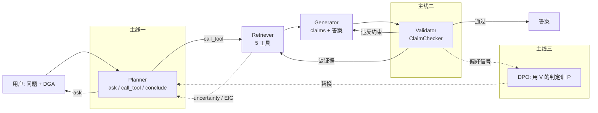

# 项目速览卡（一页）

> 2026-09-16 · 代码基线 `cf7b772` 之后 · 5 分钟读完。详情见 [技术报告_v2.md](技术报告_v2.md)，看数据怎么流转见 [walkthrough_traces.md](walkthrough_traces.md)。

## 一句话

用五个智能体加五个工具做变压器故障诊断，论文讲的不是「系统能诊断」，而是「诊断过程和结论是否可信」：不确定时会不会问、每句结论有没有证据、能不能用验证结果反过来训 Planner。

## 一张图

## 五级模式（第 6 章主表的列）

`mode1 llm_only` → `mode2 tool_base`（工程基座）→ `mode3 active_plan`（+主线一）→ `mode4 claim_verify`（+主线二）→ `mode5 dpo_planner`（+主线三）。相邻只差一组开关，有单元测试保证。

## 十个数（全部已验证，可复现）

| # | 数字 | 含义 | 出处 |
|---|---|---|---|
| 1 | 46.0% → 97.4% | 基线 mode2 端到端成功率 vs 金标 Planner 上界，中间 51 pt 是三条主线要填的 | baseline.md |
| 2 | 0% / 0% | 基线在 ask_user 场景的追问正确率 / 工具报错后的恢复率，「不会问、不会改」 | baseline.md |
| 3 | 100% | 基线在多轮决策点「该停不停」的比例 | baseline.md |
| 4 | 0.101 → 0.055 | 归因引擎校准前后 ECE，Top-1 同时 +3.0 pt | attribution_calibration.md |
| 5 | −27%（p<0.0001） | EIG 追问相对 IEC 固定顺序减少的问询次数，Top-1 持平 | active_planning_eval.md |
| 6 | 0.383 vs 0.660 | 不校准 / 校准的引擎跑同一 EIG 策略的 Top-1，「不校准就不能问」 | active_planning_eval.md |
| 7 | 100% → 3% | v1 Validator vs 声明核查的错误通过率，干净样本误报 0 | validator_eval.md |
| 8 | 63% → 3% | 只核查 vs 核查 + 补证的弃答率，代价是每样本 1.6 次额外调用 | validator_eval.md |
| 9 | 6 类扰动排序全对 | 偏好打分函数对 no_ask / bad_schema / extra_calls 等扰动的方向全部正确 | data/planner/dpo/DATA_CARD.md |
| 10 | 608 / 13 | 回归测试项数 / 文件数，`reproduce.sh` 离线全部可跑 | tests/ |

## 五个待办（按依赖顺序）

| # | 事项 | 需要 | 产出 |
|---|---|---|---|
| 1 | D-1 上传训练 SFT → 部署 M1 | 百炼账号 | 主线三第一个模型数字 |
| 2 | D-2 → D-3 正式候选、100 对人工复核、DPO 训练 M4 | 百炼 + 约 2 小时人工 | `planner_dpo_eval.md` |
| 3 | E-2 五级正式评测（196 × 5 × 2）+ LLM 裁判 | 约几十元 LLM | `system_modes_eval.md`，论文第 6 章主表 |
| 4 | 人工标注：D9 Kappa、图谱 56 条、D10 参考要点复核 | 约 4 小时人工 | 反思与图谱的可信数字，E-2 前置 |
| 5 | 撤销重建历史泄漏的百炼 API Key（`sk-9acc…`） | 5 分钟 | 安全 |

## 三个风险（答辩时会被问）

评测集问法仍偏模板且改写模型与基线同源；D12 只能揭示气体征兆，EIG 优势的完整形态未在数据上体现；主线三尚无任何模型数字，百炼 DPO 若不可用需切魔搭备选。

## 去哪找

进度看 [PLAN_优化计划清单.md](../PLAN_优化计划清单.md) 的 `[ ]` 项；改代码看 [PROJECT_OVERVIEW.md](../PROJECT_OVERVIEW.md) §9；数据看 [data_and_evaluation.md](data_and_evaluation.md)；跑一遍看 `bash reproduce.sh`。
